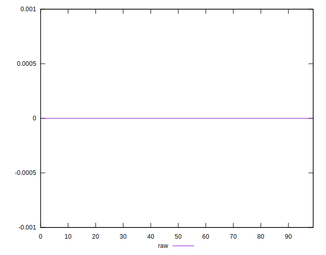
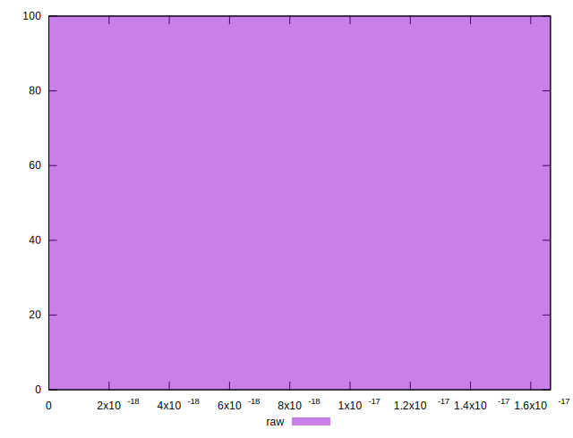

# //meta/score-difference/samples/pages+cached+noadtech+nomedia

[→ Parent](../..)


## Raw


```yaml
p90min: 0
p90max: 1.6653345369377347e-17
p90range: 1.6653345369377347e-17
p90mean: 8.858162430519865e-19
median: 0
p90stdev: 3.737262823630995e-18
mad: 0
stdevBySn: 0
lfitCenter: 6.818711863847227e-19
lfitStdev: 1.6392145056331328e-18
mfitCenter: 6.818711863847227e-19
mfitStdev: 2.05445071606992e-18
mfitConfidence: 2.05445071606992e-19
p90skewness: 3.9819818903758057
p90eccentricity: 0.9999999999999983
p90discretization: 47
outlandishness: 2.2620160000000005

```

