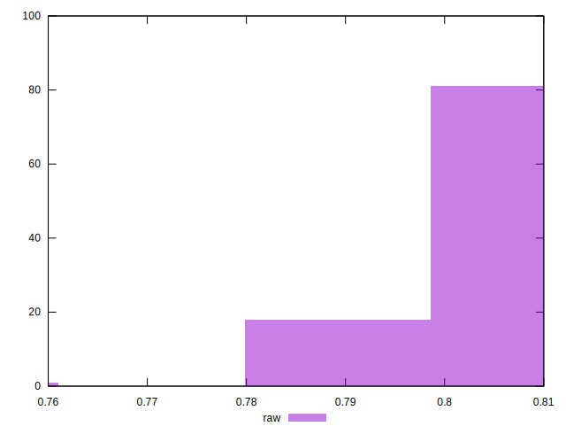

# //meta/score/samples/pages+cached+noadtech+nomedia+nocss

[→ Parent](../..)


## Raw


```yaml
p90min: 0.79
p90max: 0.81
p90range: 0.020000000000000018
p90mean: 0.8058510638297881
median: 0.81
p90stdev: 0.007636638236103458
mad: 0
stdevBySn: 0
lfitCenter: 0.806970536426762
lfitStdev: 0.006267367192099366
mfitCenter: 0.806970536426762
mfitStdev: 0.0078549799135095
mfitConfidence: 0.00078549799135095
p90skewness: -1.434530447970226
p90eccentricity: 1.0000000000000018
p90discretization: 31.333333333333332
outlandishness: 0.9983848111518477

```

