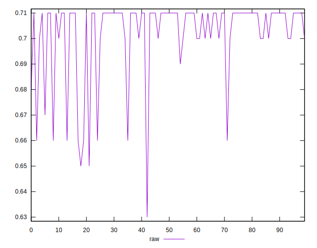
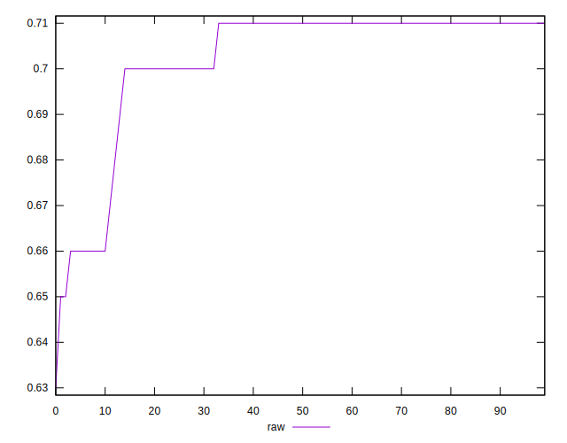
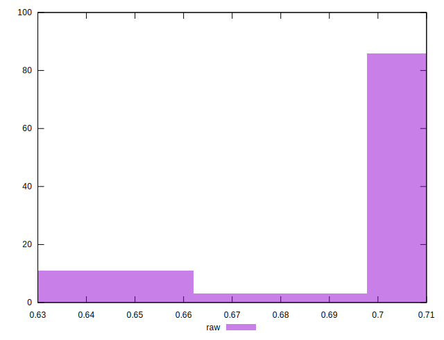

# //meta/score/samples/pages+cached+noadtech+nomedia

[→ Parent](../..)


## Raw


```yaml
p90min: 0.66
p90max: 0.71
p90range: 0.04999999999999993
p90mean: 0.7027659574468093
median: 0.71
p90stdev: 0.0145429850984128
mad: 0
stdevBySn: 0
lfitCenter: 0.7045434958321285
lfitStdev: 0.010276855526114969
mfitCenter: 0.7045434958321285
mfitStdev: 0.012880128330989346
mfitConfidence: 0.0012880128330989347
p90skewness: -2.2514607003028093
p90eccentricity: 1.0000000000000007
p90discretization: 15.666666666666666
outlandishness: 0.9955484105725396

```

