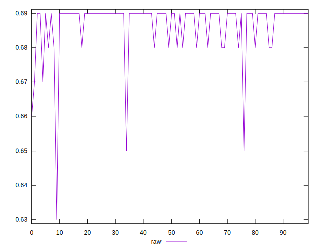
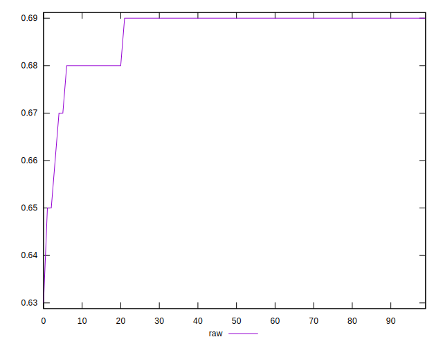
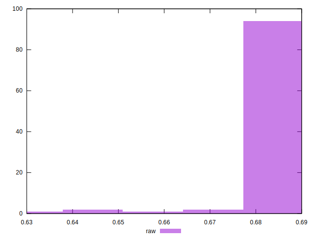

# //meta/score/samples/pages+cached+noadtech

[→ Parent](../..)


## Raw


```yaml
p90min: 0.66
p90max: 0.69
p90range: 0.029999999999999916
p90mean: 0.6876595744680843
median: 0.69
p90stdev: 0.00534461986684272
mad: 0
stdevBySn: 0
lfitCenter: 0.687967888915043
lfitStdev: 0.004429900468218177
mfitCenter: 0.687967888915043
mfitStdev: 0.005552056889305111
mfitConfidence: 0.0005552056889305111
p90skewness: -2.643884831439556
p90eccentricity: 0.9999999999999996
p90discretization: 23.5
outlandishness: 0.9963399887265957

```

