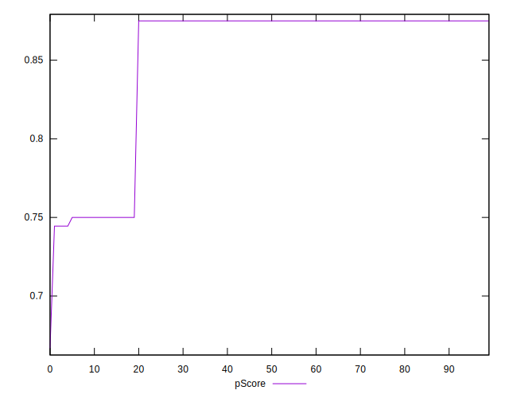
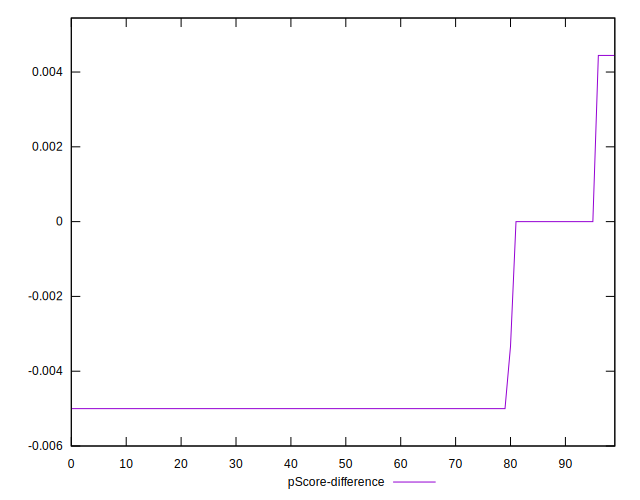

# //offscreen-images/samples/pages+cached

[→ Parent](../..)


## Raw


```yaml
p90min: 150
p90max: 310
p90range: 160
p90mean: 177.3404255319149
median: 150
p90stdev: 58.20315725725312
mad: 0
stdevBySn: 0
lfitCenter: 169.2279491466192
lfitStdev: 42.3073043342305
mfitCenter: 169.2279491466192
mfitStdev: 53.02434268715577
mfitConfidence: 5.302434268715578
p90skewness: 1.6606017363687446
p90eccentricity: 1.0000000000000013
p90discretization: 31.333333333333332
outlandishness: 1.0520827638671428

```


## Score


```yaml
p90min: 0.74
p90max: 0.88
p90range: 0.14
p90mean: 0.856276595744681
median: 0.88
p90stdev: 0.0505077209718747
mad: 0
stdevBySn: 0
lfitCenter: 0.8635419291280793
lfitStdev: 0.036212734276713586
mfitCenter: 0.8635419291280793
mfitStdev: 0.04538593186552399
mfitConfidence: 0.004538593186552399
p90skewness: -1.6613480006201122
p90eccentricity: 0.9999999999999994
p90discretization: 31.333333333333332
outlandishness: 0.9918962212826106

```


## Raw Estimate


## Score Estimate


## P Score


```yaml
p90min: 0.7444444444444445
p90max: 0.875
p90range: 0.13055555555555554
p90mean: 0.8522754137115839
median: 0.875
p90stdev: 0.04836939696582725
mad: 0
stdevBySn: 0
lfitCenter: 0.859225876487948
lfitStdev: 0.03470784319956868
mfitCenter: 0.859225876487948
mfitStdev: 0.043499830601520455
mfitConfidence: 0.004349983060152046
p90skewness: -1.6593567513023328
p90eccentricity: 0.9999999999999983
p90discretization: 31.333333333333332
outlandishness: 0.9921986250958298

```


## Score Difference


```yaml
p90min: 0
p90max: 0
p90range: 0
p90mean: 0
median: 0
p90stdev: 0
mad: 0
stdevBySn: 0
lfitCenter: 0
lfitStdev: 0
mfitCenter: 0
mfitStdev: 0
mfitConfidence: 0
p90skewness: .nan
p90eccentricity: .nan
p90discretization: 94
outlandishness: .nan

```


## P Score Difference


```yaml
p90min: -0.0050000000000000044
p90max: 0.004444444444444473
p90range: 0.009444444444444478
p90mean: -0.004083924349881801
median: -0.0050000000000000044
p90stdev: 0.002031902516269409
mad: 0
stdevBySn: 0
lfitCenter: -0.0043291492799769505
lfitStdev: 0.001476074507917208
mfitCenter: -0.0043291492799769505
mfitStdev: 0.0018499850503651907
mfitConfidence: 0.00018499850503651908
p90skewness: 2.007733506921245
p90eccentricity: 1.000000000000002
p90discretization: 23.5
outlandishness: 0.8912890138036903

```

