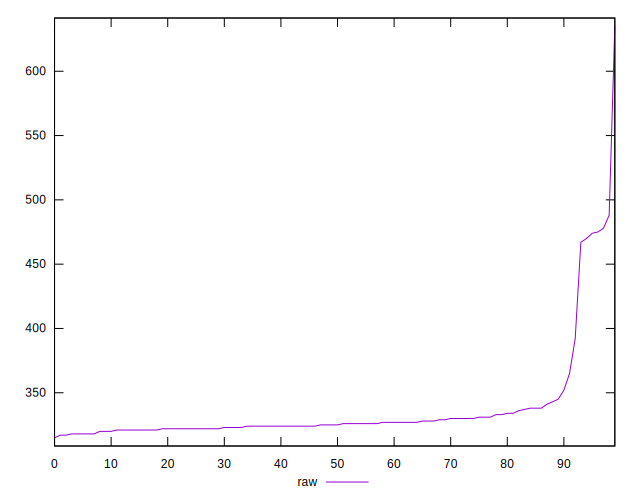
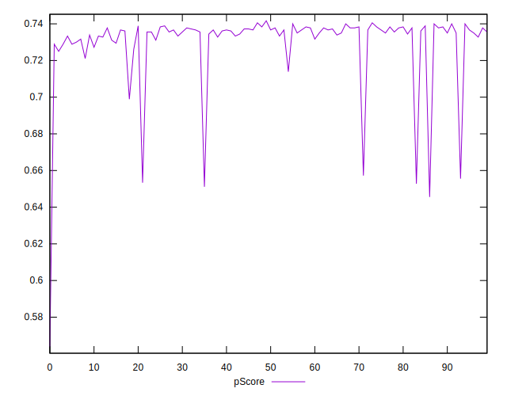

# //render-blocking-resources/samples/pages+cached+noadtech+nomedia

[→ Parent](../..)


## Raw


```yaml
p90min: 318
p90max: 475
p90range: 157
p90mean: 333.67021276595744
median: 325
p90stdev: 30.698738035561117
mad: 4
stdevBySn: 5.963000000000001
lfitCenter: 332.5642870611265
lfitStdev: 17.06726431250341
mfitCenter: 332.5642870611265
mfitStdev: 21.390643669685012
mfitConfidence: 2.139064366968501
p90skewness: 3.913401705387325
p90eccentricity: 1
p90discretization: 3.357142857142857
outlandishness: 1.0331152356401612

```


## Score


```yaml
p90min: 0.65
p90max: 0.74
p90range: 0.08999999999999997
p90mean: 0.7327659574468087
median: 0.74
p90stdev: 0.017709491103561542
mad: 0
stdevBySn: 0
lfitCenter: 0.7337930553461907
lfitStdev: 0.01131679218589731
mfitCenter: 0.7337930553461907
mfitStdev: 0.014183495649918719
mfitConfidence: 0.0014183495649918718
p90skewness: -3.6978571858576785
p90eccentricity: 0.9999999999999984
p90discretization: 13.428571428571429
outlandishness: 0.991377552234456

```


## Raw Estimate


## Score Estimate


## P Score


```yaml
p90min: 0.6527777777777778
p90max: 0.74
p90range: 0.0872222222222222
p90mean: 0.731294326241135
median: 0.7361111111111112
p90stdev: 0.017054854464200613
mad: 0.0022222222222221255
stdevBySn: 0.0033127777777777665
lfitCenter: 0.7319087294104857
lfitStdev: 0.009481813506945972
mfitCenter: 0.7319087294104857
mfitStdev: 0.011883690927602324
mfitConfidence: 0.0011883690927602323
p90skewness: -3.9134017053873715
p90eccentricity: 1.0000000000000004
p90discretization: 3.357142857142857
outlandishness: 0.9916914722968059

```


## Score Difference


```yaml
p90min: 0
p90max: 0
p90range: 0
p90mean: 0
median: 0
p90stdev: 0
mad: 0
stdevBySn: 0
lfitCenter: 5.166535369026208e-19
lfitStdev: 1.2890316797319448e-18
mfitCenter: 5.166535369026208e-19
mfitStdev: 1.6155616292812394e-18
mfitConfidence: 1.6155616292812395e-19
p90skewness: .nan
p90eccentricity: .nan
p90discretization: 94
outlandishness: .inf

```


## P Score Difference


```yaml
p90min: -0.0050000000000000044
p90max: 0.0038888888888889417
p90range: 0.008888888888888946
p90mean: -0.0014184397163120516
median: -0.0022222222222222365
p90stdev: 0.0026040433257178376
mad: 0.0016666666666666496
stdevBySn: 0.0026502222222222396
lfitCenter: -0.0015793957838915599
lfitStdev: 0.002150049115032204
mfitCenter: -0.0015793957838915599
mfitStdev: 0.00269468695450405
mfitConfidence: 0.000269468695450405
p90skewness: 0.6366854514619378
p90eccentricity: 1
p90discretization: 5.222222222222222
outlandishness: 0.9058280624999991

```

