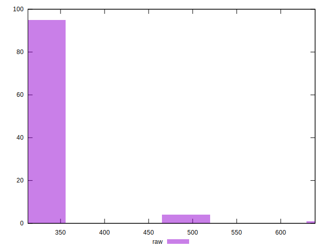

# //render-blocking-resources/samples/pages+cached+noadtech

[→ Parent](../..)


## Raw


```yaml
p90min: 316
p90max: 475
p90range: 159
p90mean: 327.2659574468085
median: 322.5
p90stdev: 22.23959260873374
mad: 3.5
stdevBySn: 4.7704
lfitCenter: 328.3036091495283
lfitStdev: 12.645429685324562
mfitCenter: 328.3036091495283
mfitStdev: 15.848695812994002
mfitConfidence: 1.5848695812994003
p90skewness: 6.095918157565086
p90eccentricity: 1.0000000000000007
p90discretization: 4.476190476190476
outlandishness: 1.037962421541388

```


## Score


```yaml
p90min: 0.65
p90max: 0.74
p90range: 0.08999999999999997
p90mean: 0.7354255319148937
median: 0.74
p90stdev: 0.013342054262785369
mad: 0
stdevBySn: 0
lfitCenter: 0.73536944084029
lfitStdev: 0.00911050355200804
mfitCenter: 0.73536944084029
mfitStdev: 0.01141832291128436
mfitConfidence: 0.001141832291128436
p90skewness: -5.573821350119337
p90eccentricity: 1.0000000000000002
p90discretization: 31.333333333333332
outlandishness: 0.9904352479010637

```


## Raw Estimate


## Score Estimate


## P Score


```yaml
p90min: 0.6527777777777778
p90max: 0.7411111111111112
p90range: 0.08833333333333337
p90mean: 0.7348522458628839
median: 0.7375
p90stdev: 0.012355329227074306
mad: 0.0019444444444444153
stdevBySn: 0.0026502222222222396
lfitCenter: 0.7342757726947067
lfitStdev: 0.007025238714069046
mfitCenter: 0.7342757726947067
mfitStdev: 0.008804831007218695
mfitConfidence: 0.0008804831007218695
p90skewness: -6.095918157565069
p90eccentricity: 0.9999999999999992
p90discretization: 4.476190476190476
outlandishness: 0.9907166120141647

```


## Score Difference


```yaml
p90min: 0
p90max: 0
p90range: 0
p90mean: 0
median: 0
p90stdev: 0
mad: 0
stdevBySn: 0
lfitCenter: 0
lfitStdev: 0
mfitCenter: 0
mfitStdev: 0
mfitConfidence: 0
p90skewness: .nan
p90eccentricity: .nan
p90discretization: 94
outlandishness: .nan

```


## P Score Difference


```yaml
p90min: -0.004444444444444473
p90max: 0.004444444444444473
p90range: 0.008888888888888946
p90mean: -0.00047872340425531365
median: -0.0011111111111110628
p90stdev: 0.0023634233759620353
mad: 0.0016666666666665941
stdevBySn: 0.0026502222222222396
lfitCenter: -0.0006179957860956922
lfitStdev: 0.0019262272995520205
mfitCenter: -0.0006179957860956922
mfitStdev: 0.0024141679086408445
mfitConfidence: 0.00024141679086408445
p90skewness: 0.5177332187481808
p90eccentricity: 0.9999999999999999
p90discretization: 4.947368421052632
outlandishness: 0.9502639231824397

```

