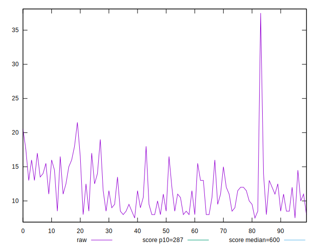
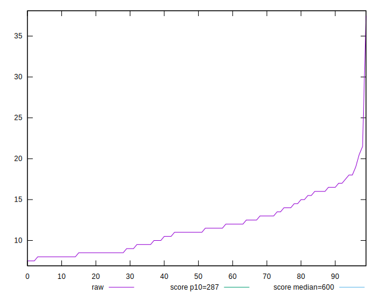
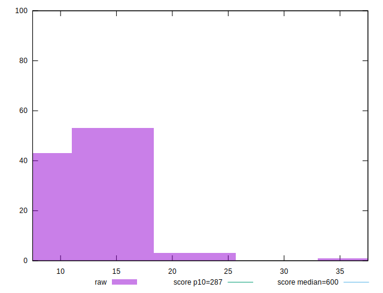
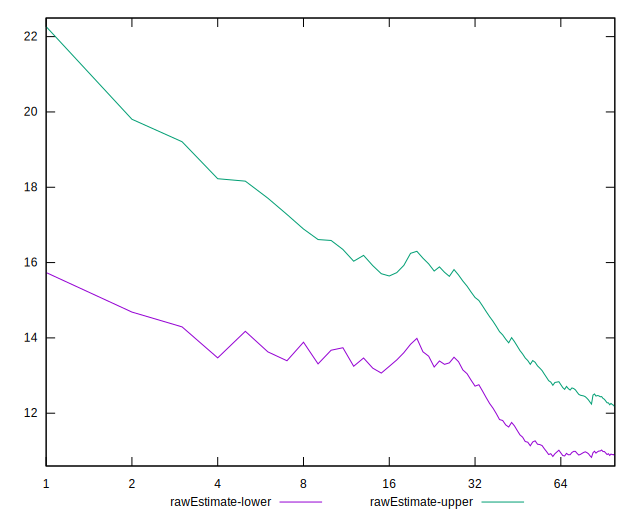
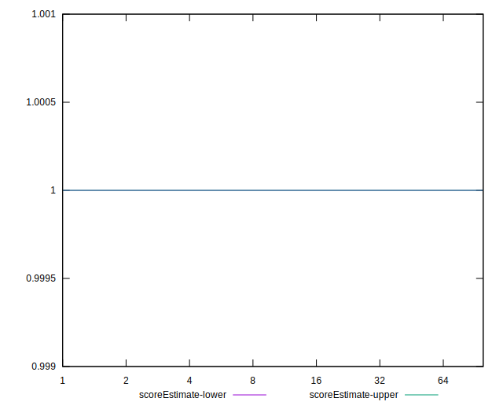
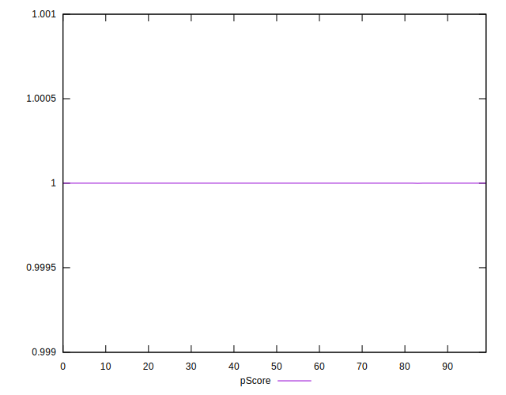
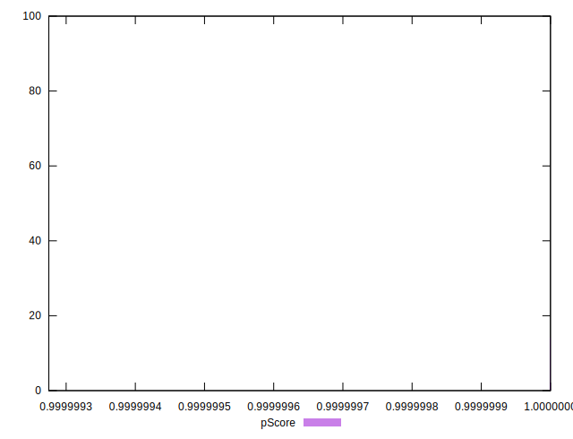
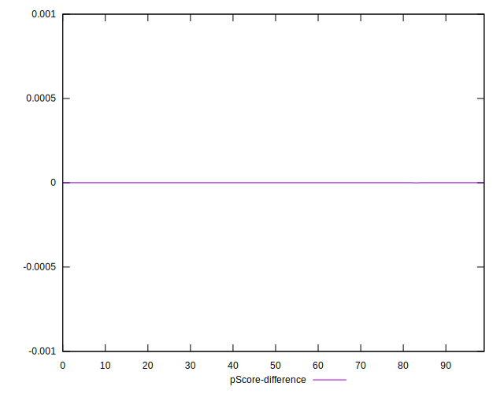
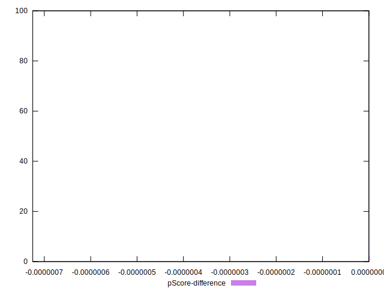

# //total-blocking-time/samples/pages+cached+noadtech+nomedia+nocss

[→ Parent](../..)


## Raw


```yaml
p90min: 8
p90max: 19
p90range: 11
p90mean: 11.542553191489361
median: 11
p90stdev: 2.9801288477678813
mad: 2.5
stdevBySn: 3.5778000000000003
lfitCenter: 11.514769305474283
lfitStdev: 2.6506538769577745
mfitCenter: 11.514769305474283
mfitStdev: 3.3221019804641596
mfitConfidence: 0.33221019804641594
p90skewness: 0.6075077534759545
p90eccentricity: 1.0000000000000007
p90discretization: 4.2727272727272725
outlandishness: 1.0575421082630763

```


## Score


```yaml
p90min: 1
p90max: 1
p90range: 0
p90mean: 1
median: 1
p90stdev: 0
mad: 0
stdevBySn: 0
lfitCenter: 1
lfitStdev: 0
mfitCenter: 1
mfitStdev: 0
mfitConfidence: 0
p90skewness: .nan
p90eccentricity: .nan
p90discretization: 94
outlandishness: 1

```


## Raw Estimate


## Score Estimate


## P Score


```yaml
p90min: 0.9999999990087218
p90max: 0.9999999999999686
p90range: 9.912467513473189e-10
p90mean: 0.9999999999455611
median: 0.9999999999981568
p90stdev: 1.4323713098550394e-10
mad: 1.811772953885793e-12
stdevBySn: 2.182302472064635e-12
lfitCenter: 0.9999999965663676
lfitStdev: 8.419650882831013e-9
mfitCenter: 0.9999999965663676
mfitStdev: 1.0552467493331382e-8
mfitConfidence: 1.0552467493331382e-9
p90skewness: -4.158483467297407
p90eccentricity: 1.000000000000702
p90discretization: 4.2727272727272725
outlandishness: 0.9999999853890422

```


## Score Difference


```yaml
p90min: 0
p90max: 0
p90range: 0
p90mean: 0
median: 0
p90stdev: 0
mad: 0
stdevBySn: 0
lfitCenter: 0
lfitStdev: 0
mfitCenter: 0
mfitStdev: 0
mfitConfidence: 0
p90skewness: .nan
p90eccentricity: .nan
p90discretization: 94
outlandishness: .nan

```


## P Score Difference


```yaml
p90min: -9.912781706589158e-10
p90max: -3.141931159689193e-14
p90range: 9.912467513473189e-10
p90mean: -5.44387773630658e-11
median: -1.843192265482685e-12
p90stdev: 1.432371309855036e-10
mad: 1.811772953885793e-12
stdevBySn: 2.182302472064635e-12
lfitCenter: -3.433632180884437e-9
lfitStdev: 8.419650639921114e-9
mfitCenter: -3.433632180884437e-9
mfitStdev: 1.0552467188888972e-8
mfitConfidence: 1.0552467188888972e-9
p90skewness: -4.158483665193891
p90eccentricity: 1.0000000000000009
p90discretization: 4.2727272727272725
outlandishness: 18278.021417726326

```

