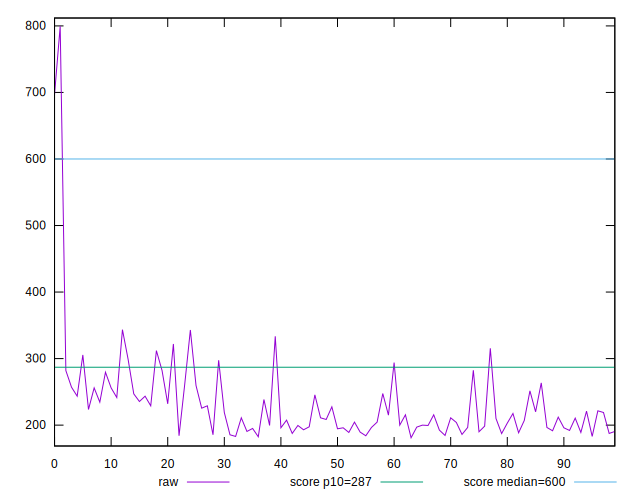
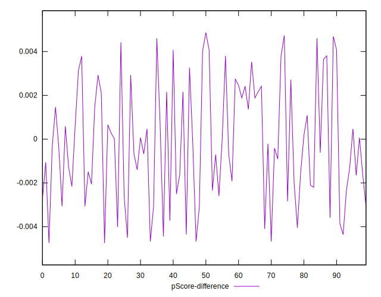

# //total-blocking-time/samples/pages

[→ Parent](../..)


## Raw


```yaml
p90min: 183.0000000000009
p90max: 343
p90range: 159.9999999999991
p90mean: 224.18944148936168
median: 211
p90stdev: 38.76898520188971
mad: 21
stdevBySn: 30.262225000000274
lfitCenter: 224.65459218843694
lfitStdev: 37.7802371144039
mfitCenter: 224.65459218843694
mfitStdev: 47.35050533426026
mfitConfidence: 4.735050533426026
p90skewness: 1.233705204738012
p90eccentricity: 1.0000000000000002
p90discretization: 1.146341463414634
outlandishness: 1.0950579194694157

```


## Score


```yaml
p90min: 0.83
p90max: 0.98
p90range: 0.15000000000000002
p90mean: 0.9522340425531911
median: 0.97
p90stdev: 0.0331069914618916
mad: 0.010000000000000009
stdevBySn: 0.011926000000000011
lfitCenter: 0.9509866780693461
lfitStdev: 0.03348639494307781
mfitCenter: 0.9509866780693461
mfitStdev: 0.04196897223212066
mfitConfidence: 0.004196897223212067
p90skewness: -1.6882157559352784
p90eccentricity: 1.0000000000000009
p90discretization: 6.266666666666667
outlandishness: 0.9742622881230967

```


## Raw Estimate


## Score Estimate


## P Score


```yaml
p90min: 0.8344220039730638
p90max: 0.9804705348577973
p90range: 0.14604853088473357
p90mean: 0.9520392092776386
median: 0.9653261517305216
p90stdev: 0.03301541983482225
mad: 0.012325719697781068
stdevBySn: 0.017396367478373292
lfitCenter: 0.9508347736793478
lfitStdev: 0.033503184508090714
mfitCenter: 0.9508347736793478
mfitStdev: 0.041990014831331884
mfitConfidence: 0.004199001483133189
p90skewness: -1.6933892867401201
p90eccentricity: 0.9999999999999996
p90discretization: 1.146341463414634
outlandishness: 0.9743336810611202

```


## Score Difference


```yaml
p90min: 0
p90max: 1.1102230246251565e-16
p90range: 1.1102230246251565e-16
p90mean: 1.4173059888831785e-17
median: 0
p90stdev: 3.7049293045681974e-17
mad: 0
stdevBySn: 0
lfitCenter: 9.431450304026069e-18
lfitStdev: 2.1632802671473907e-17
mfitCenter: 9.431450304026069e-18
mfitStdev: 2.7112697445196717e-17
mfitConfidence: 2.7112697445196717e-18
p90skewness: 2.23151849572168
p90eccentricity: 0.9999999999999971
p90discretization: 47
outlandishness: 1.3806250000000002

```


## P Score Difference


```yaml
p90min: -0.0046738482694783645
p90max: 0.004607288318270952
p90range: 0.009281136587749317
p90mean: -0.00016932913581827976
median: -0.00035920269325295795
p90stdev: 0.0026672508139806727
mad: 0.0024189050855110417
stdevBySn: 0.0030777697602093136
lfitCenter: -0.0002123173825556008
lfitStdev: 0.0022998396894810522
mfitCenter: -0.0002123173825556008
mfitStdev: 0.002882421599286308
mfitConfidence: 0.0002882421599286308
p90skewness: 0.11805032120159442
p90eccentricity: 1.0000000000000007
p90discretization: 1.1325301204819278
outlandishness: 0.869340999381084

```

