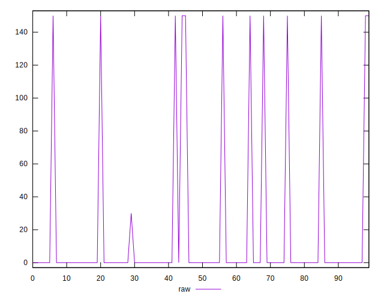
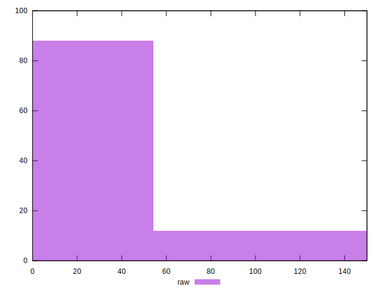
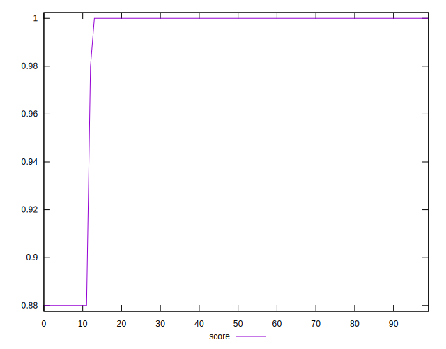

# //unminified-css/samples/pages+cached

[→ Parent](../..)


## Raw


```yaml
p90min: 0
p90max: 150
p90range: 150
p90mean: 14.680851063829786
median: 0
p90stdev: 44.139578603286246
mad: 0
stdevBySn: 0
lfitCenter: 9.947648813252068
lfitStdev: 23.15267775160278
mfitCenter: 9.947648813252068
mfitStdev: 29.017578371992535
mfitConfidence: 2.9017578371992534
p90skewness: 2.726287210833311
p90eccentricity: 1.000000000000004
p90discretization: 31.333333333333332
outlandishness: 1.5538164461247639

```


## Score


```yaml
p90min: 0.88
p90max: 1
p90range: 0.12
p90mean: 0.9882978723404255
median: 1
p90stdev: 0.0352992766447597
mad: 0
stdevBySn: 0
lfitCenter: 0.9920676970917225
lfitStdev: 0.01846205636238306
mfitCenter: 0.9920676970917225
mfitStdev: 0.023138756266173465
mfitConfidence: 0.0023138756266173465
p90skewness: -2.7324654915236906
p90eccentricity: 1.0000000000000022
p90discretization: 31.333333333333332
outlandishness: 0.994144227419091

```


## Raw Estimate


## Score Estimate


## P Score


```yaml
p90min: 0.875
p90max: 1
p90range: 0.125
p90mean: 0.9877659574468084
median: 1
p90stdev: 0.036782982169405246
mad: 0
stdevBySn: 0
lfitCenter: 0.9917102926556235
lfitStdev: 0.01929389812633542
mfitCenter: 0.9917102926556235
mfitStdev: 0.02418131530999349
mfitConfidence: 0.002418131530999349
p90skewness: -2.7262872108332936
p90eccentricity: 1.0000000000000022
p90discretization: 31.333333333333332
outlandishness: 0.9939026991264768

```


## Score Difference


```yaml
p90min: 0
p90max: 0
p90range: 0
p90mean: 0
median: 0
p90stdev: 0
mad: 0
stdevBySn: 0
lfitCenter: 0
lfitStdev: 0
mfitCenter: 0
mfitStdev: 0
mfitConfidence: 0
p90skewness: .nan
p90eccentricity: .nan
p90discretization: 94
outlandishness: .nan

```


## P Score Difference


```yaml
p90min: -0.0050000000000000044
p90max: 0
p90range: 0.0050000000000000044
p90mean: -0.0005319148936170217
median: 0
p90stdev: 0.0015416358240627065
mad: 0
stdevBySn: 0
lfitCenter: -0.0003574044360990668
lfitStdev: 0.0008318417639524412
mfitCenter: -0.0003574044360990668
mfitStdev: 0.001042559043820125
mfitConfidence: 0.0001042559043820125
p90skewness: -2.5532425695667196
p90eccentricity: 1.000000000000002
p90discretization: 47
outlandishness: 1.4932840000000005

```

