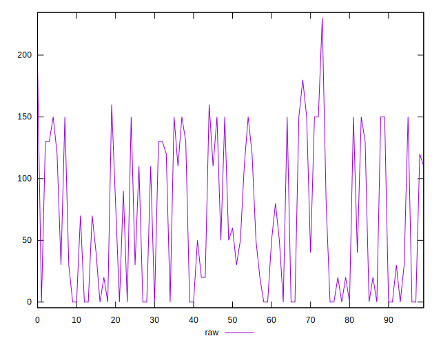
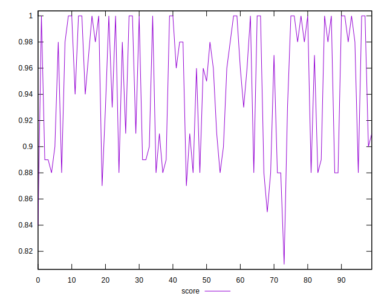
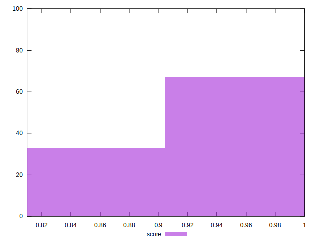
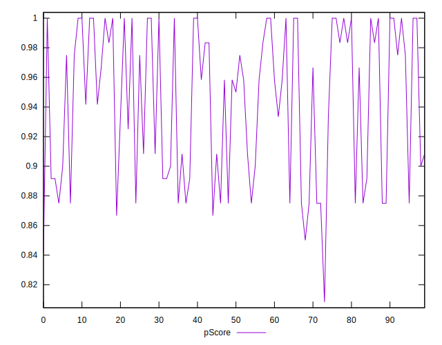
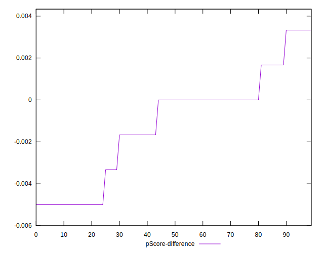

# //unused-css-rules/samples/pages

[→ Parent](../..)


## Raw


```yaml
p90min: 0
p90max: 160
p90range: 160
p90mean: 66.59574468085107
median: 50
p90stdev: 60.32806043218431
mad: 50
stdevBySn: 59.63
lfitCenter: 64.36586684001702
lfitStdev: 61.01217818189928
mfitCenter: 64.36586684001702
mfitStdev: 76.46742554073145
mfitConfidence: 7.646742554073145
p90skewness: 0.2597818590884098
p90eccentricity: 0.9999999999999996
p90discretization: 6.714285714285714
outlandishness: 1.0610974532760358

```


## Score


```yaml
p90min: 0.87
p90max: 1
p90range: 0.13
p90mean: 0.9457446808510639
median: 0.96
p90stdev: 0.04902212617467112
mad: 0.040000000000000036
stdevBySn: 0.047704000000000045
lfitCenter: 0.9474292431711211
lfitStdev: 0.05057545037187764
mfitCenter: 0.9474292431711211
mfitStdev: 0.06338692701595534
mfitConfidence: 0.006338692701595534
p90skewness: -0.23830194217585365
p90eccentricity: 1.0000000000000007
p90discretization: 7.833333333333333
outlandishness: 0.996313864366504

```


## Raw Estimate


## Score Estimate


## P Score


```yaml
p90min: 0.8666666666666667
p90max: 1
p90range: 0.1333333333333333
p90mean: 0.9445035460992909
median: 0.9583333333333334
p90stdev: 0.0502733836934869
mad: 0.04166666666666663
stdevBySn: 0.04969166666666663
lfitCenter: 0.9463617776333196
lfitStdev: 0.050843481818249325
mfitCenter: 0.9463617776333196
mfitStdev: 0.06372285461727611
mfitConfidence: 0.006372285461727611
p90skewness: -0.2597818590884038
p90eccentricity: 1.0000000000000007
p90discretization: 6.714285714285714
outlandishness: 0.9964664272303748

```


## Score Difference


```yaml
p90min: 0
p90max: 0
p90range: 0
p90mean: 0
median: 0
p90stdev: 0
mad: 0
stdevBySn: 0
lfitCenter: 1.5916911634687915e-18
lfitStdev: 3.932577909407442e-18
mfitCenter: 1.5916911634687915e-18
mfitStdev: 4.928755494914505e-18
mfitConfidence: 4.928755494914504e-19
p90skewness: .nan
p90eccentricity: .nan
p90discretization: 94
outlandishness: .inf

```


## P Score Difference


```yaml
p90min: -0.0050000000000000044
p90max: 0.0033333333333332993
p90range: 0.008333333333333304
p90mean: -0.0011879432624113501
median: 0
p90stdev: 0.0025569441491991164
mad: 0.0016666666666666496
stdevBySn: 0.0019876666666667126
lfitCenter: -0.001019865114818436
lfitStdev: 0.002235180265598011
mfitCenter: -0.001019865114818436
mfitStdev: 0.0028013830291414724
mfitConfidence: 0.00028013830291414725
p90skewness: -0.22353786892185099
p90eccentricity: 1.0000000000000007
p90discretization: 11.75
outlandishness: 0.96449988861662

```

