# //unused-javascript/samples/pages+cached+noadtech+nomedia+nocss

[→ Parent](../..)


## Raw


```yaml
p90min: 1050
p90max: 1060
p90range: 10
p90mean: 1050.212765957447
median: 1050
p90stdev: 1.4430489325798441
mad: 0
stdevBySn: 0
lfitCenter: 1051.5658506001953
lfitStdev: 3.8286470565765263
mfitCenter: 1051.5658506001953
mfitStdev: 4.79849748762719
mfitConfidence: 0.479849748762719
p90skewness: 6.634888026970213
p90eccentricity: 0.9999999999999982
p90discretization: 47
outlandishness: 1.0058878958652926

```

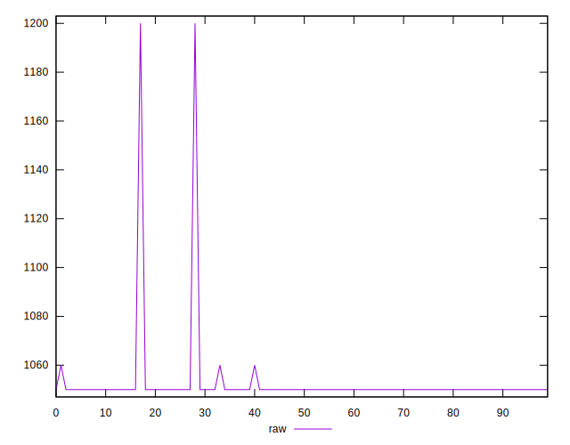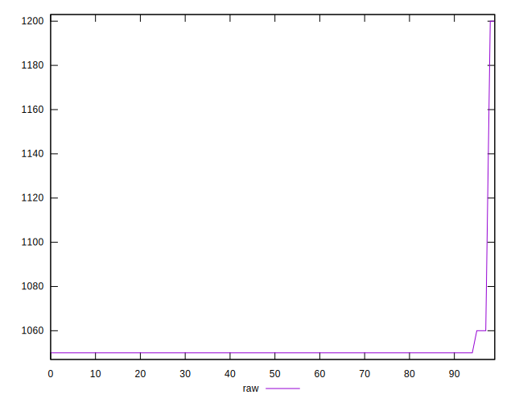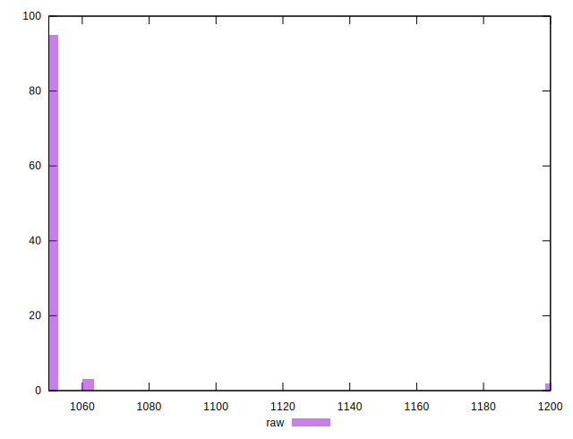
## Score


```yaml
p90min: 0.46
p90max: 0.46
p90range: 0
p90mean: 0.4600000000000007
median: 0.46
p90stdev: 6.661338147750939e-16
mad: 0
stdevBySn: 0
lfitCenter: 0.4599056891433511
lfitStdev: 0.0002341727301520551
mfitCenter: 0.4599056891433511
mfitStdev: 0.0002934919935686625
mfitConfidence: 0.00002934919935686625
p90skewness: -1
p90eccentricity: 1
p90discretization: 94
outlandishness: 0.9991306238185255

```

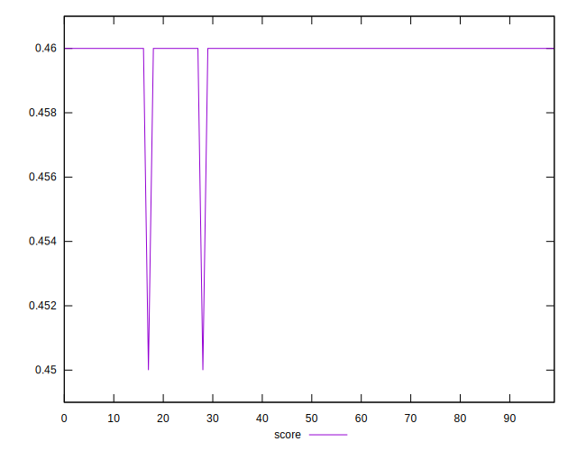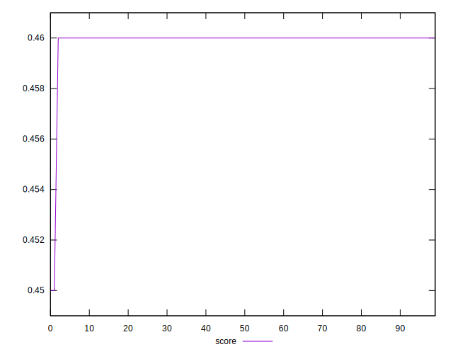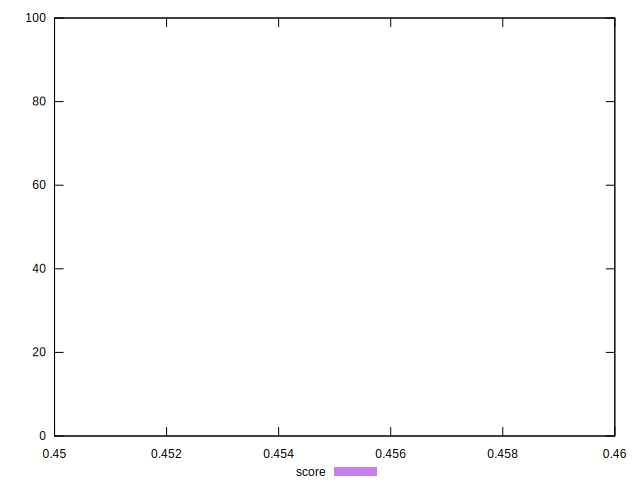
## Raw Estimate

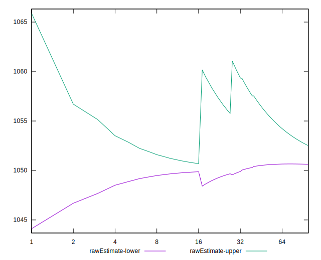
## Score Estimate

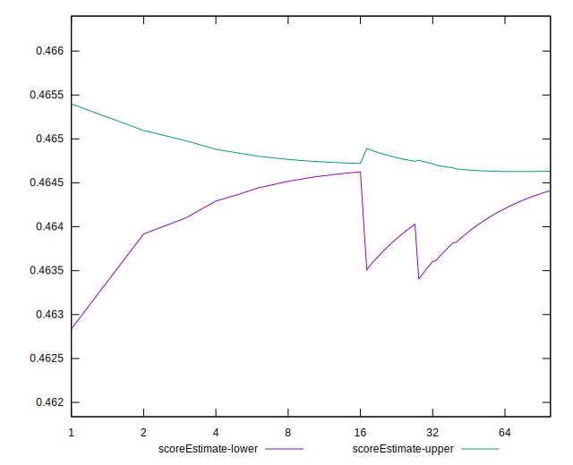
## P Score


```yaml
p90min: 0.46352941176470586
p90max: 0.4647058823529412
p90range: 0.0011764705882353343
p90mean: 0.46468085106382895
median: 0.4647058823529412
p90stdev: 0.00016977046265645804
mad: 0
stdevBySn: 0
lfitCenter: 0.4645216646352712
lfitStdev: 0.0004504290654795102
mfitCenter: 0.4645216646352712
mfitStdev: 0.0005645291161913325
mfitConfidence: 0.00005645291161913325
p90skewness: -6.634888026955305
p90eccentricity: 0.9999999999999979
p90discretization: 47
outlandishness: 0.9984373702494681

```

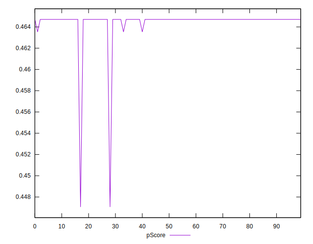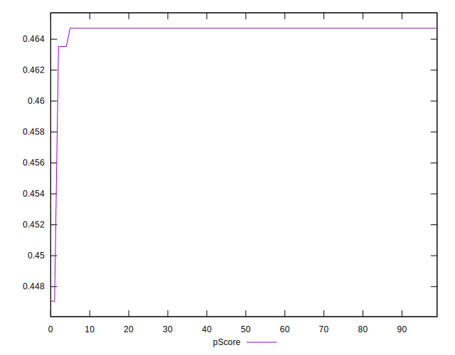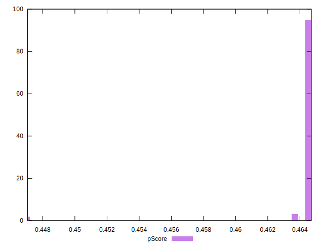
## Score Difference


```yaml
p90min: 0
p90max: 0
p90range: 0
p90mean: 0
median: 0
p90stdev: 0
mad: 0
stdevBySn: 0
lfitCenter: 0
lfitStdev: 0
mfitCenter: 0
mfitStdev: 0
mfitConfidence: 0
p90skewness: .nan
p90eccentricity: .nan
p90discretization: 94
outlandishness: .nan

```


## P Score Difference


```yaml
p90min: 0.0035294117647058365
p90max: 0.004705882352941171
p90range: 0.0011764705882353343
p90mean: 0.004680851063829781
median: 0.004705882352941171
p90stdev: 0.00016977046265645812
mad: 0
stdevBySn: 0
lfitCenter: 0.004615975491920002
lfitStdev: 0.00021983044791874473
mfitCenter: 0.004615975491920002
mfitStdev: 0.00027551660846619806
mfitConfidence: 0.000027551660846619805
p90skewness: -6.634888026970375
p90eccentricity: 0.999999999999998
p90discretization: 47
outlandishness: 0.9314830392633474

```

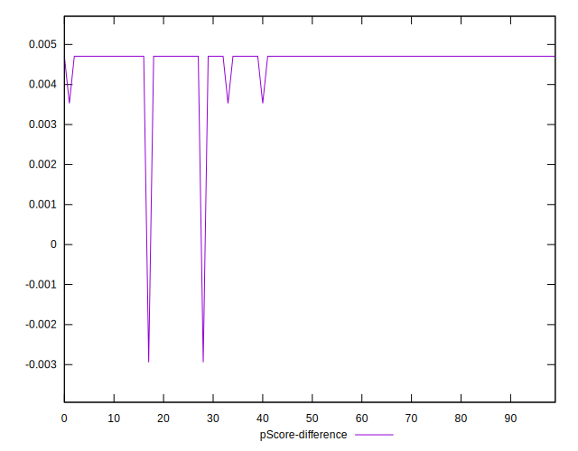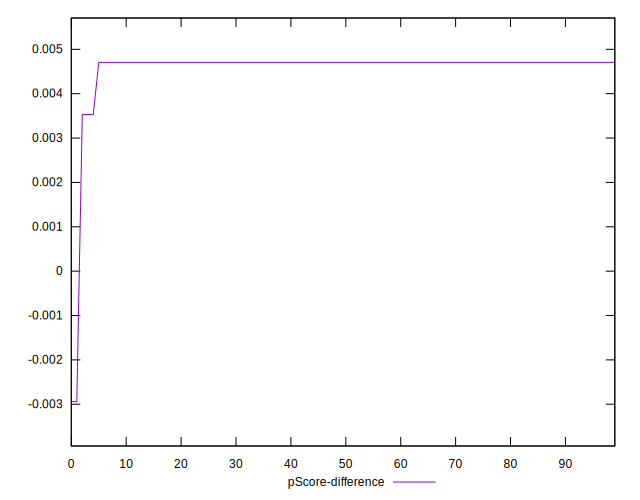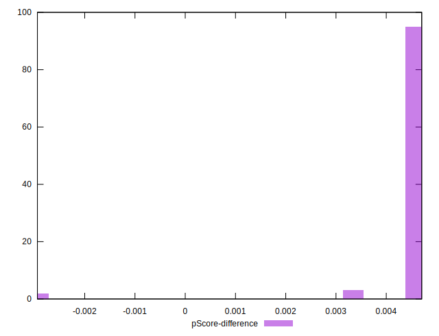