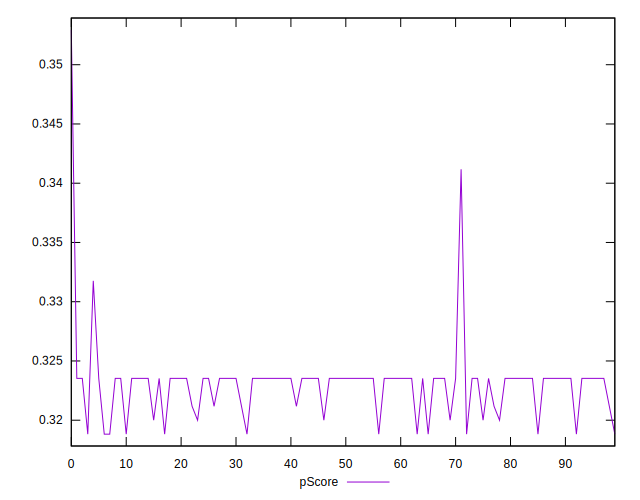

# //unused-javascript/samples/pages+cached+noadtech+nomedia

[→ Parent](../..)


## Raw


```yaml
p90min: 2250
p90max: 2290
p90range: 40
p90mean: 2257.446808510638
median: 2250
p90stdev: 14.06188224839005
mad: 0
stdevBySn: 0
lfitCenter: 2252.9400641648904
lfitStdev: 11.724910791619836
mfitCenter: 2252.9400641648904
mfitStdev: 14.694996468686943
mfitConfidence: 1.4694996468686943
p90skewness: 1.5148354642364739
p90eccentricity: 1.0000000000000009
p90discretization: 23.5
outlandishness: 0.9965063555046055

```


## Score


```yaml
p90min: 0.32
p90max: 0.32
p90range: 0
p90mean: 0.32000000000000023
median: 0.32
p90stdev: 2.220446049250313e-16
mad: 0
stdevBySn: 0
lfitCenter: 0.32028421366478804
lfitStdev: 0.0007022043002748151
mfitCenter: 0.32028421366478804
mfitStdev: 0.0008800825777037409
mfitConfidence: 0.00008800825777037409
p90skewness: -1
p90eccentricity: 1
p90discretization: 94
outlandishness: 1.0037535156250001

```


## Raw Estimate


## Score Estimate


## P Score


```yaml
p90min: 0.31882352941176473
p90max: 0.32352941176470584
p90range: 0.004705882352941115
p90mean: 0.3226533166458076
median: 0.32352941176470584
p90stdev: 0.0016543390880458665
mad: 0
stdevBySn: 0
lfitCenter: 0.32318352186295424
lfitStdev: 0.001379401269602155
mfitCenter: 0.32318352186295424
mfitStdev: 0.001728823113962946
mfitConfidence: 0.00017288231139629462
p90skewness: -1.514835464237121
p90eccentricity: 1.0000000000000002
p90discretization: 23.5
outlandishness: 1.0028802711641924

```


## Score Difference


```yaml
p90min: 0
p90max: 0
p90range: 0
p90mean: 0
median: 0
p90stdev: 0
mad: 0
stdevBySn: 0
lfitCenter: 2.583267684513104e-19
lfitStdev: 6.445158398659724e-19
mfitCenter: 2.583267684513104e-19
mfitStdev: 8.077808146406197e-19
mfitConfidence: 8.077808146406197e-20
p90skewness: .nan
p90eccentricity: .nan
p90discretization: 94
outlandishness: .inf

```


## P Score Difference


```yaml
p90min: -0.0011764705882352788
p90max: 0.0035294117647058365
p90range: 0.004705882352941115
p90mean: 0.0026032540675844473
median: 0.0035294117647058365
p90stdev: 0.0016559952493256083
mad: 0
stdevBySn: 0
lfitCenter: 0.0028769222577145863
lfitStdev: 0.001319377482486556
mfitCenter: 0.0028769222577145863
mfitStdev: 0.0016535944529200515
mfitConfidence: 0.00016535944529200516
p90skewness: -1.4334333887103552
p90eccentricity: 1.0000000000000016
p90discretization: 15.666666666666666
outlandishness: 0.9353121671597633

```

