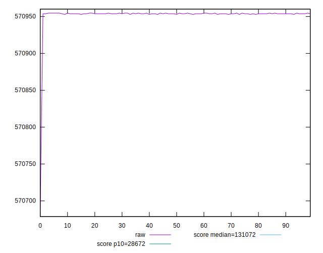
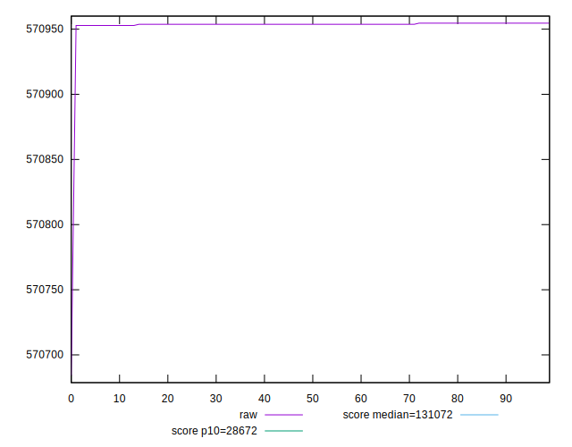
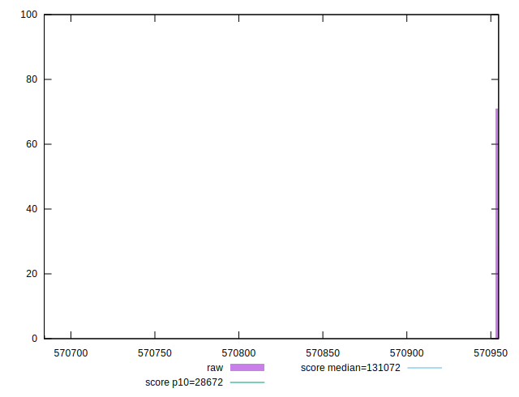
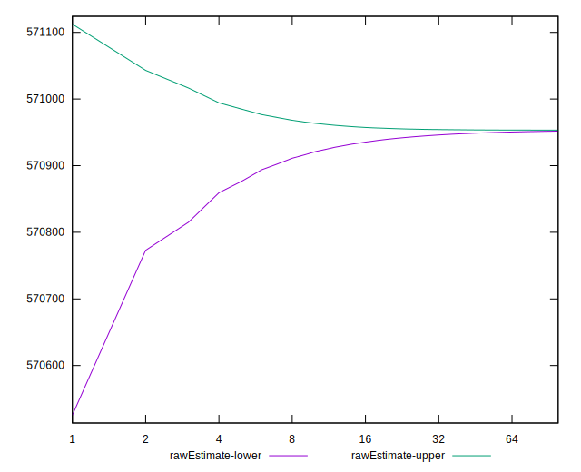
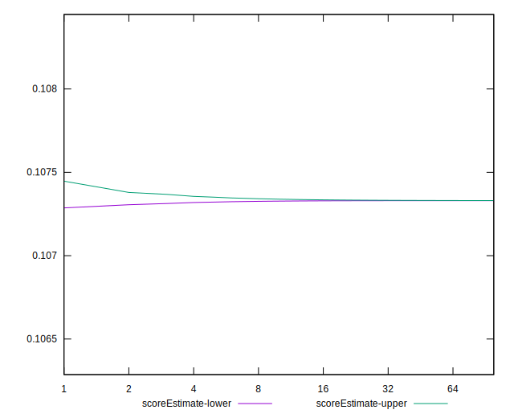
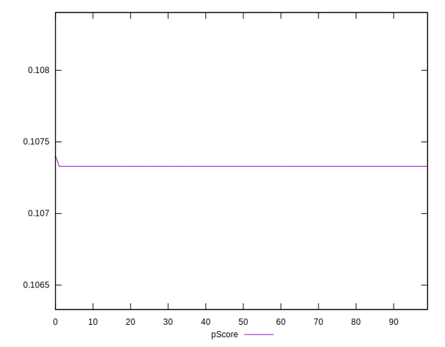
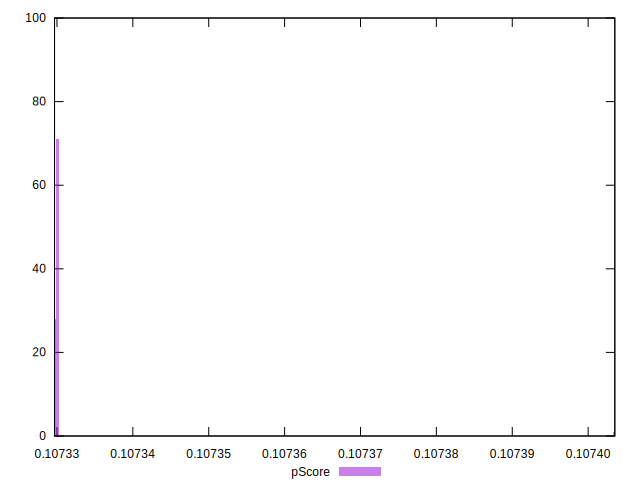
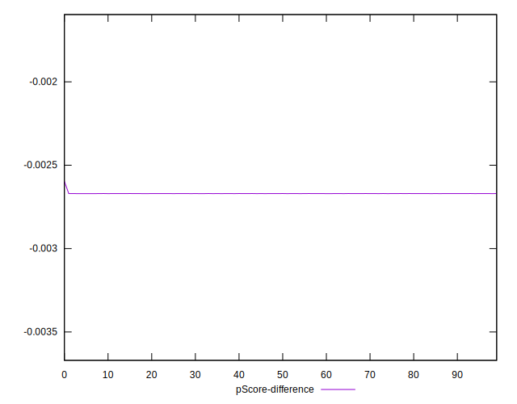
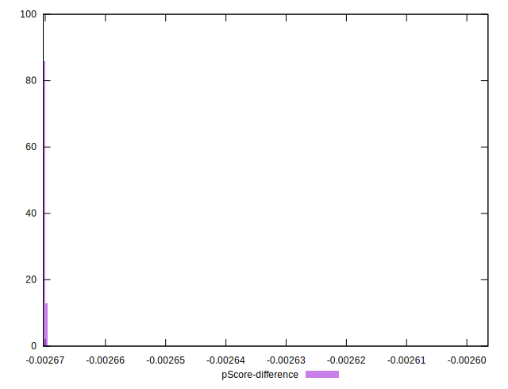

# //uses-long-cache-ttl/samples/pages+cached+noadtech+nomedia

[→ Parent](../..)


## Raw


```yaml
p90min: 570952.85
p90max: 570954.6166666667
p90range: 1.7666666667209938
p90mean: 570953.8648936178
median: 570953.7333333334
p90stdev: 0.5305861654791375
mad: 0
stdevBySn: 0
lfitCenter: 570952.5853743065
lfitStdev: 3.1316468663044534
mfitCenter: 570952.5853743065
mfitStdev: 3.9249372945685947
mfitConfidence: 0.39249372945685945
p90skewness: -0.07186584830807274
p90eccentricity: 0.9999999999999989
p90discretization: 31.333333333333332
outlandishness: 0.9999905588848608

```


## Score


```yaml
p90min: 0.11
p90max: 0.11
p90range: 0
p90mean: 0.10999999999999997
median: 0.11
p90stdev: 2.7755575615628914e-17
mad: 0
stdevBySn: 0
lfitCenter: 0.10999999999999995
lfitStdev: 0
mfitCenter: 0.10999999999999995
mfitStdev: 0
mfitConfidence: 0
p90skewness: 1
p90eccentricity: 1
p90discretization: 94
outlandishness: 0.9999999999999996

```


## Raw Estimate


## Score Estimate


## P Score


```yaml
p90min: 0.10732967930565729
p90max: 0.10733016132038486
p90range: 4.820147275763631e-7
p90mean: 0.10732988441807197
median: 0.10732992031263955
p90stdev: 1.4476428842495966e-7
mad: 0
stdevBySn: 0
lfitCenter: 0.10733023368565708
lfitStdev: 8.548467465710003e-7
mfitCenter: 0.10733023368565708
mfitStdev: 0.000001071391513793675
mfitConfidence: 1.071391513793675e-7
p90skewness: 0.07187051100907511
p90eccentricity: 1.0000000000000007
p90discretization: 31.333333333333332
outlandishness: 1.0000137095059918

```


## Score Difference


```yaml
p90min: 0
p90max: 0
p90range: 0
p90mean: 0
median: 0
p90stdev: 0
mad: 0
stdevBySn: 0
lfitCenter: 0
lfitStdev: 0
mfitCenter: 0
mfitStdev: 0
mfitConfidence: 0
p90skewness: .nan
p90eccentricity: .nan
p90discretization: 94
outlandishness: .nan

```


## P Score Difference


```yaml
p90min: -0.002670320694342712
p90max: -0.0026698386796151358
p90range: 4.820147275763631e-7
p90mean: -0.0026701155819280837
median: -0.002670079687360452
p90stdev: 1.4476428842495963e-7
mad: 0
stdevBySn: 0
lfitCenter: -0.002669766314342933
lfitStdev: 8.548467465510767e-7
mfitCenter: -0.002669766314342933
mfitStdev: 0.0000010713915137687045
mfitConfidence: 1.0713915137687044e-7
p90skewness: 0.07187051059565805
p90eccentricity: 0.9999999999999989
p90discretization: 31.333333333333332
outlandishness: 0.9994490006565652

```

