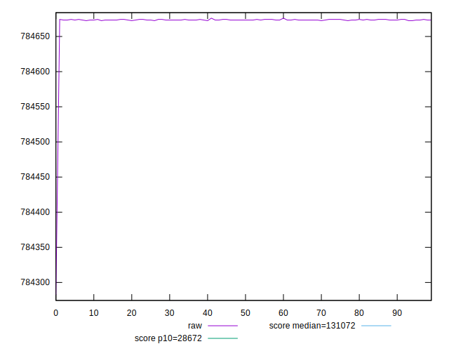
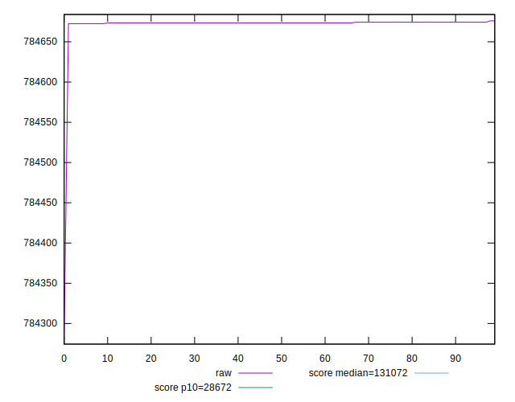
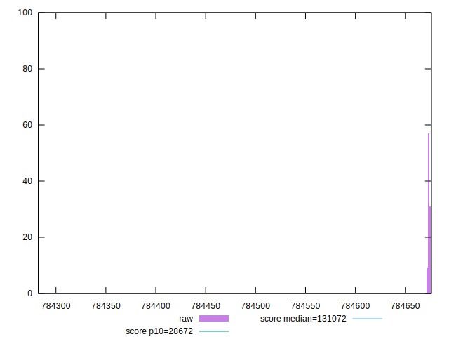
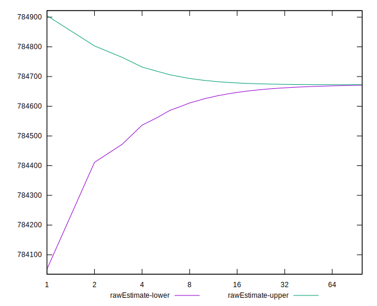
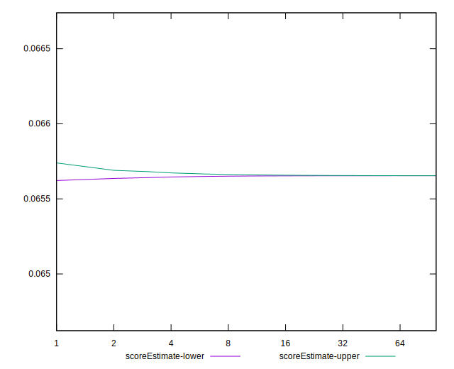
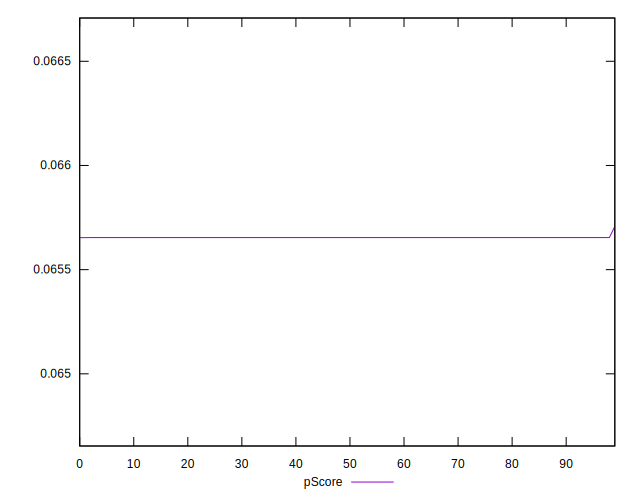
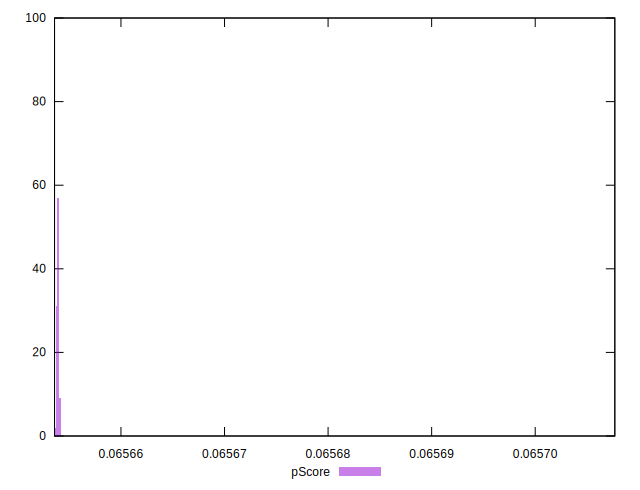
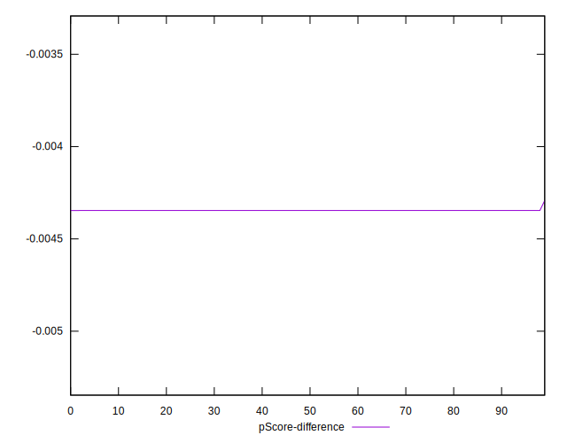
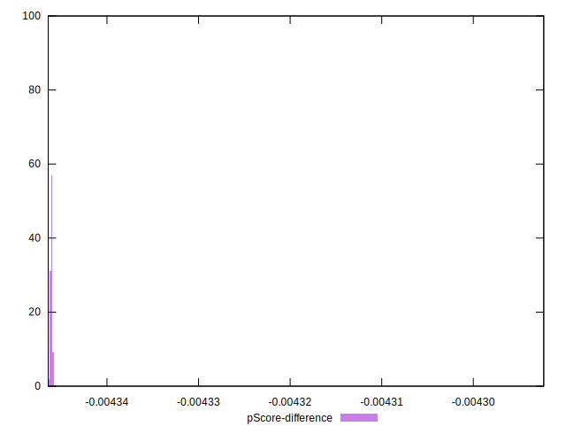

# //uses-long-cache-ttl/samples/pages+cached+noadtech

[→ Parent](../..)


## Raw


```yaml
p90min: 784672.5166666666
p90max: 784674.2833333333
p90range: 1.7666666667209938
p90mean: 784673.6161347512
median: 784673.4
p90stdev: 0.5103100858634595
mad: 0
stdevBySn: 0
lfitCenter: 784671.7737833803
lfitStdev: 4.543347185539118
mfitCenter: 784671.7737833803
mfitStdev: 5.694241264098554
mfitConfidence: 0.5694241264098554
p90skewness: -0.0775549324692889
p90eccentricity: 0.9999999999999991
p90discretization: 31.333333333333332
outlandishness: 0.9999901106436802

```


## Score


```yaml
p90min: 0.07
p90max: 0.07
p90range: 0
p90mean: 0.07000000000000008
median: 0.07
p90stdev: 6.938893903907228e-17
mad: 0
stdevBySn: 0
lfitCenter: 0.07000000000000009
lfitStdev: 0
mfitCenter: 0.07000000000000009
mfitStdev: 0
mfitConfidence: 0
p90skewness: -1
p90eccentricity: 1
p90discretization: 94
outlandishness: 1.0000000000000004

```


## Raw Estimate


## Score Estimate


## P Score


```yaml
p90min: 0.06565382824508414
p90max: 0.06565407083927921
p90range: 2.425941950656707e-7
p90mean: 0.06565391986301058
median: 0.06565394954202658
p90stdev: 7.007444951434201e-8
mad: 0
stdevBySn: 0
lfitCenter: 0.06565417299164794
lfitStdev: 6.242342557071518e-7
mfitCenter: 0.06565417299164794
mfitStdev: 7.823616184616378e-7
mfitConfidence: 7.823616184616379e-8
p90skewness: 0.07755837125662673
p90eccentricity: 1.0000000000000004
p90discretization: 31.333333333333332
outlandishness: 1.0000162395147338

```


## Score Difference


```yaml
p90min: 0
p90max: 0
p90range: 0
p90mean: 0
median: 0
p90stdev: 0
mad: 0
stdevBySn: 0
lfitCenter: 0
lfitStdev: 0
mfitCenter: 0
mfitStdev: 0
mfitConfidence: 0
p90skewness: .nan
p90eccentricity: .nan
p90discretization: 94
outlandishness: .nan

```


## P Score Difference


```yaml
p90min: -0.004346171754915862
p90max: -0.004345929160720796
p90range: 2.425941950656707e-7
p90mean: -0.004346080136989434
median: -0.004346050457973427
p90stdev: 7.007444951434208e-8
mad: 0
stdevBySn: 0
lfitCenter: -0.004345827008352109
lfitStdev: 6.242342556533038e-7
mfitCenter: -0.004345827008352109
mfitStdev: 7.823616183941493e-7
mfitConfidence: 7.823616183941493e-8
p90skewness: 0.07755837118236013
p90eccentricity: 0.9999999999999994
p90discretization: 31.333333333333332
outlandishness: 0.9997546943343032

```

