# //uses-rel-preconnect/samples/pages+cached+noadtech+nomedia

[→ Parent](../..)


## Raw


```yaml
p90min: 0
p90max: 156.110999584198
p90range: 156.110999584198
p90mean: 33.88047872705663
median: 0
p90stdev: 58.070996195210036
mad: 0
stdevBySn: 0
lfitCenter: 25.254416365748924
lfitStdev: 51.6342878747387
mfitCenter: 25.254416365748924
mfitStdev: 64.7139830287463
mfitConfidence: 6.47139830287463
p90skewness: 1.1475162096181724
p90eccentricity: 0.9999999999999979
p90discretization: 3.76
outlandishness: 1.2698915379183877

```

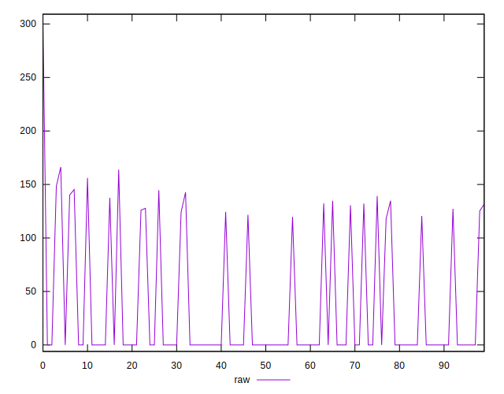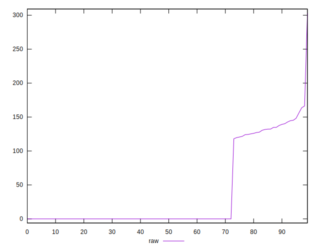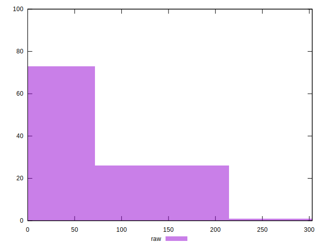
## Score


```yaml
p90min: 0.87
p90max: 1
p90range: 0.13
p90mean: 0.9719148936170214
median: 1
p90stdev: 0.04816365266209198
mad: 0
stdevBySn: 0
lfitCenter: 0.9790476232280108
lfitStdev: 0.04283848964223748
mfitCenter: 0.9790476232280108
mfitStdev: 0.053690084743885105
mfitConfidence: 0.005369008474388511
p90skewness: -1.151107038271844
p90eccentricity: 0.9999999999999994
p90discretization: 18.8
outlandishness: 0.9925751295513826

```

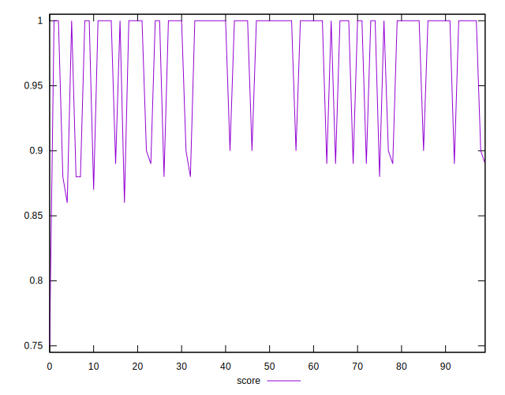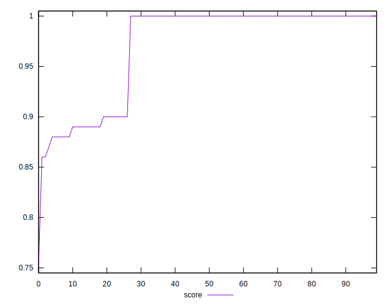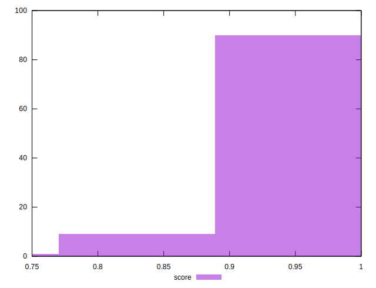
## Raw Estimate

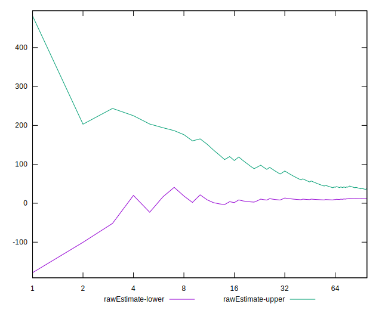
## Score Estimate

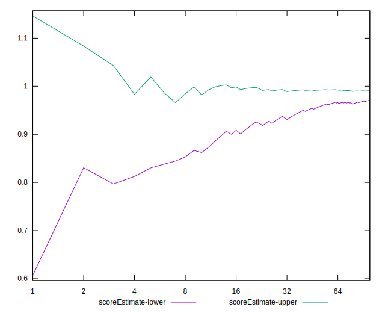
## P Score


```yaml
p90min: 0.8699075003465017
p90max: 1
p90range: 0.13009249965349834
p90mean: 0.9717662677274528
median: 1
p90stdev: 0.048392496829341644
mad: 0
stdevBySn: 0
lfitCenter: 0.9789586447843697
lfitStdev: 0.04302041182594877
mfitCenter: 0.9789586447843697
mfitStdev: 0.0539180903888512
mfitConfidence: 0.00539180903888512
p90skewness: -1.1475162096181726
p90eccentricity: 1.0000000000000024
p90discretization: 3.76
outlandishness: 0.9926575783619334

```

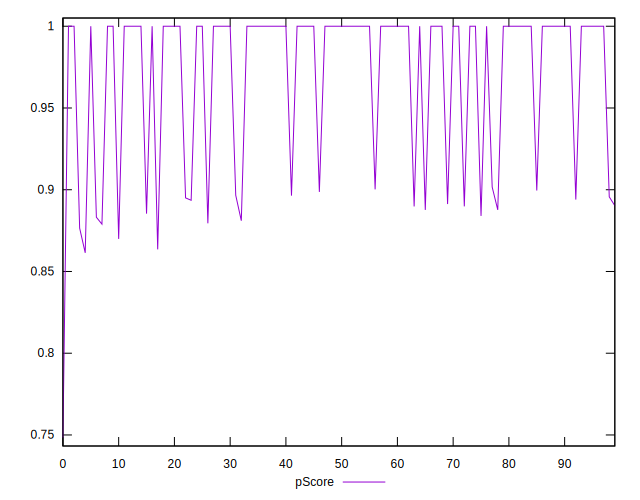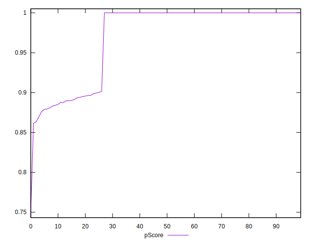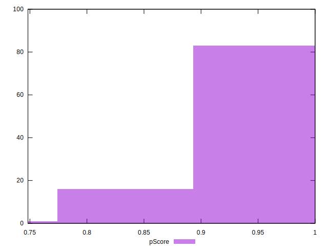
## Score Difference


```yaml
p90min: 0
p90max: 0
p90range: 0
p90mean: 0
median: 0
p90stdev: 0
mad: 0
stdevBySn: 0
lfitCenter: 0
lfitStdev: 0
mfitCenter: 0
mfitStdev: 0
mfitConfidence: 0
p90skewness: .nan
p90eccentricity: .nan
p90discretization: 94
outlandishness: .nan

```


## P Score Difference


```yaml
p90min: -0.003638333479563438
p90max: 0.003501666784286539
p90range: 0.007140000263849977
p90mean: -0.00008842789077308145
median: 0
p90stdev: 0.0009412887211279991
mad: 0
stdevBySn: 0
lfitCenter: -0.00005978989356973081
lfitStdev: 0.0004402809649818281
mfitCenter: -0.00005978989356973081
mfitStdev: 0.0005518103583578909
mfitConfidence: 0.00005518103583578909
p90skewness: -0.718437465289928
p90eccentricity: 1.0000000000000016
p90discretization: 4.2727272727272725
outlandishness: 1.4878996149909423

```

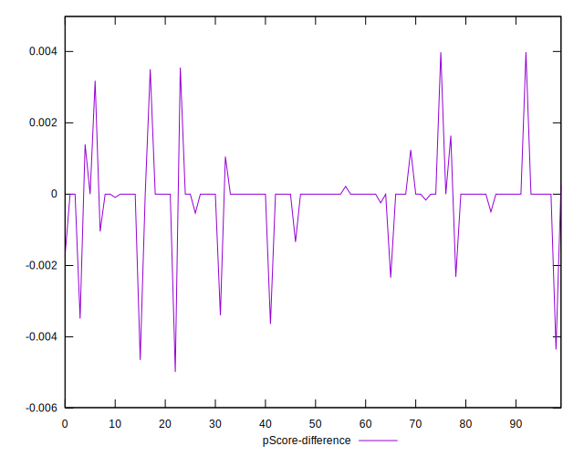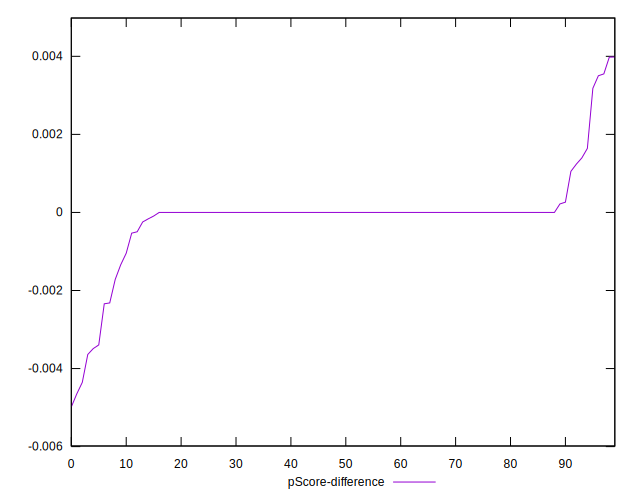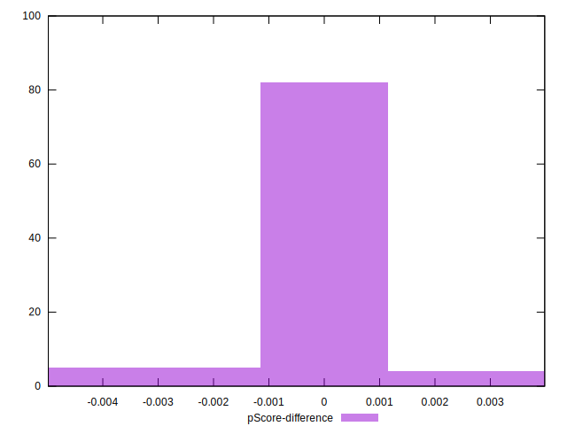