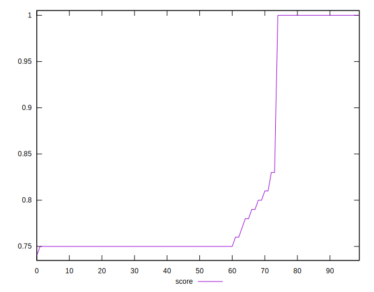
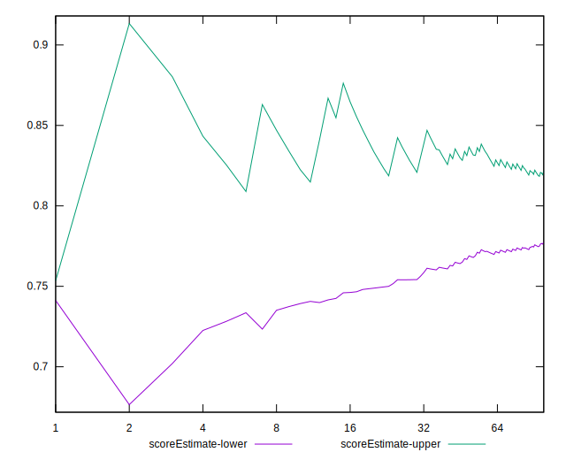
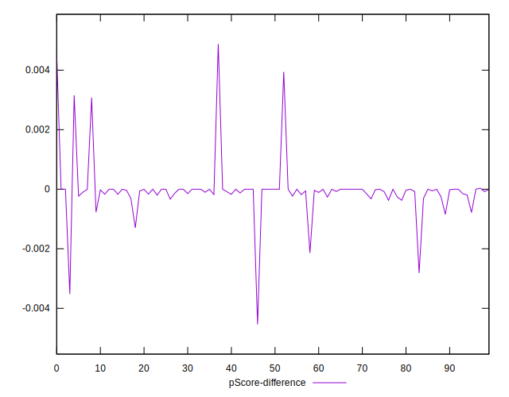

# //uses-rel-preconnect/samples/pages+cached

[→ Parent](../..)


## Raw


```yaml
p90min: 0
p90max: 300.668
p90range: 300.668
p90mean: 219.57254254763177
median: 300
p90stdev: 126.61217830244377
mad: 0.41800000000000637
stdevBySn: 0.49969940000001334
lfitCenter: 240.4229276619116
lfitStdev: 107.93652649240761
mfitCenter: 240.4229276619116
mfitStdev: 135.27837472178632
mfitConfidence: 13.527837472178632
p90skewness: -1.1111799802915405
p90eccentricity: 0.9999999999999997
p90discretization: 1.7407407407407407
outlandishness: 0.9634016085529572

```


## Score


```yaml
p90min: 0.75
p90max: 1
p90range: 0.25
p90mean: 0.8171276595744683
median: 0.75
p90stdev: 0.10541329340475655
mad: 0
stdevBySn: 0
lfitCenter: 0.7997394986474432
lfitStdev: 0.08971684008125283
mfitCenter: 0.7997394986474432
mfitStdev: 0.1124433841422534
mfitConfidence: 0.01124433841422534
p90skewness: 1.1124649609113564
p90eccentricity: 1.0000000000000016
p90discretization: 10.444444444444445
outlandishness: 1.008271166256631

```


## Raw Estimate


## Score Estimate


## P Score


```yaml
p90min: 0.7496288888888889
p90max: 1
p90range: 0.2503711111111111
p90mean: 0.8170538977587704
median: 0.75
p90stdev: 0.10549036195855542
mad: 0.00023222222222218925
stdevBySn: 0.00027761077777774284
lfitCenter: 0.7996843556039545
lfitStdev: 0.08992726704545274
mfitCenter: 0.7996843556039545
mfitStdev: 0.11270711523162291
mfitConfidence: 0.01127071152316229
p90skewness: 1.1112821689390586
p90eccentricity: 0.9999999999999999
p90discretization: 1.7407407407407407
outlandishness: 1.0083662275525738

```


## Score Difference


```yaml
p90min: 0
p90max: 0
p90range: 0
p90mean: 0
median: 0
p90stdev: 0
mad: 0
stdevBySn: 0
lfitCenter: 1.0470608452365924e-18
lfitStdev: 2.5998395675404994e-18
mfitCenter: 1.0470608452365924e-18
mfitStdev: 3.2584156880294808e-18
mfitConfidence: 3.258415688029481e-19
p90skewness: .nan
p90eccentricity: .nan
p90discretization: 94
outlandishness: .inf

```


## P Score Difference


```yaml
p90min: -0.002139999866485609
p90max: 0.0031558330853780348
p90range: 0.005295832951863644
p90mean: -0.00006401299894842616
median: -5.555555555591951e-7
p90stdev: 0.0005519870236516182
mad: 0.00003597237481012261
stdevBySn: 0.000045053777777808125
lfitCenter: -0.00004217490879708578
lfitStdev: 0.0002986013506330787
mfitCenter: -0.00004217490879708578
mfitStdev: 0.0003742412945465177
mfitConfidence: 0.00003742412945465177
p90skewness: 3.297742493835732
p90eccentricity: 0.9999999999999994
p90discretization: 1.88
outlandishness: 0.30567897969885277

```

