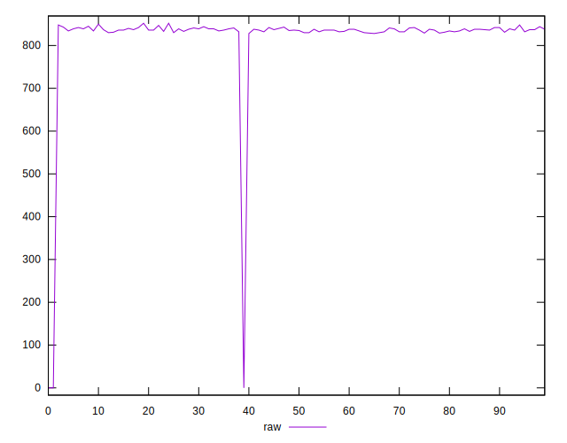
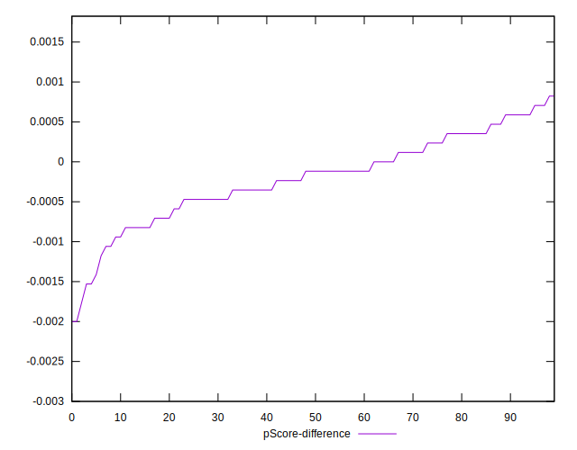

# //uses-rel-preload/samples/pages

[→ Parent](../..)


## Raw


```yaml
p90min: 828
p90max: 848
p90range: 20
p90mean: 836.4468085106383
median: 836
p90stdev: 4.5537382849245
mad: 3
stdevBySn: 4.7704
lfitCenter: 824.630771581594
lfitStdev: 29.6345302035942
mfitCenter: 824.630771581594
mfitStdev: 37.14137569424103
mfitConfidence: 3.7141375694241026
p90skewness: 0.27250224449237587
p90eccentricity: 1.0000000000000009
p90discretization: 4.7
outlandishness: 0.9419360900206653

```


## Score


```yaml
p90min: 0.49
p90max: 0.49
p90range: 0
p90mean: 0.4900000000000001
median: 0.49
p90stdev: 1.1102230246251565e-16
mad: 0
stdevBySn: 0
lfitCenter: 0.4973117065253006
lfitStdev: 0.01806497153556095
mfitCenter: 0.4973117065253006
mfitStdev: 0.02264108423850306
mfitConfidence: 0.002264108423850306
p90skewness: -1
p90eccentricity: 1
p90discretization: 94
outlandishness: 1.063423948354853

```


## Raw Estimate


## Score Estimate


## P Score


```yaml
p90min: 0.4884705882352941
p90max: 0.4908235294117647
p90range: 0.002352941176470613
p90mean: 0.4898297872340426
median: 0.4898823529411765
p90stdev: 0.0005357339158734747
mad: 0.0003529411764706114
stdevBySn: 0.0005612235294117575
lfitCenter: 0.49712324782743705
lfitStdev: 0.018071744124174588
mfitCenter: 0.49712324782743705
mfitStdev: 0.022649572419567297
mfitConfidence: 0.0022649572419567296
p90skewness: -0.2725022444934939
p90eccentricity: 1
p90discretization: 4.7
outlandishness: 1.0632466098760467

```


## Score Difference


```yaml
p90min: 0
p90max: 0
p90range: 0
p90mean: 0
median: 0
p90stdev: 0
mad: 0
stdevBySn: 0
lfitCenter: 0
lfitStdev: 0
mfitCenter: 0
mfitStdev: 0
mfitConfidence: 0
p90skewness: .nan
p90eccentricity: .nan
p90discretization: 94
outlandishness: .nan

```


## P Score Difference


```yaml
p90min: -0.0015294117647058902
p90max: 0.0007058823529411673
p90range: 0.0022352941176470575
p90mean: -0.0001952440550688229
median: -0.00011764705882350013
p90stdev: 0.00050806734567125
mad: 0.0003529411764706114
stdevBySn: 0.0005612235294117575
lfitCenter: -0.00019625505377767166
lfitStdev: 0.00041879033299514886
mfitCenter: -0.00019625505377767166
mfitStdev: 0.0005248758454420385
mfitConfidence: 0.00005248758454420385
p90skewness: -0.38411661625211085
p90eccentricity: 0.9999999999999999
p90discretization: 4.947368421052632
outlandishness: 1.242653270874449

```

