# //uses-text-compression/samples/pages+cached+noadtech

[→ Parent](../..)


## Raw


```yaml
p90min: 2460
p90max: 2740
p90range: 280
p90mean: 2672.021276595745
median: 2700
p90stdev: 56.20213873484088
mad: 0
stdevBySn: 0
lfitCenter: 2679.118149733053
lfitStdev: 47.27282399442139
mfitCenter: 2679.118149733053
mfitStdev: 59.24769868265327
mfitConfidence: 5.924769868265328
p90skewness: -1.4475803128162275
p90eccentricity: 1.000000000000002
p90discretization: 10.444444444444445
outlandishness: 0.9966934254692853

```

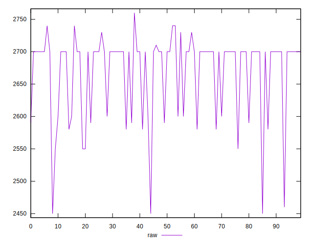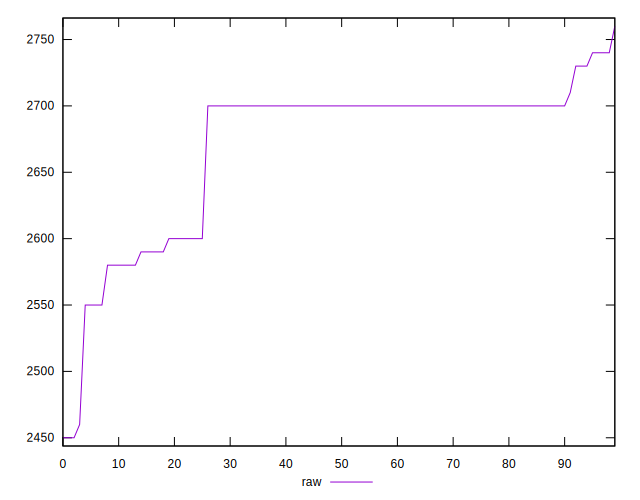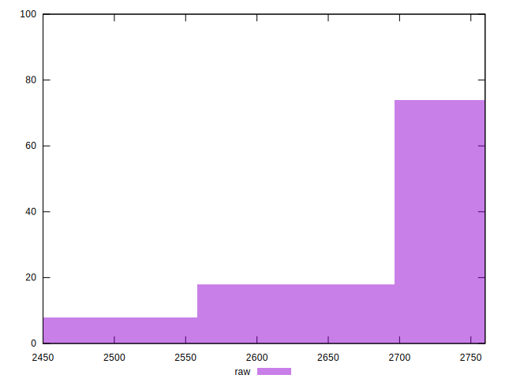
## Score


```yaml
p90min: 0.27
p90max: 0.3
p90range: 0.02999999999999997
p90mean: 0.2730851063829785
median: 0.27
p90stdev: 0.006018870280772604
mad: 0
stdevBySn: 0
lfitCenter: 0.27230332662150186
lfitStdev: 0.004881780449322581
mfitCenter: 0.27230332662150186
mfitStdev: 0.0061184044585630044
mfitConfidence: 0.0006118404458563004
p90skewness: 2.0844133351603142
p90eccentricity: 1.0000000000000022
p90discretization: 23.5
outlandishness: 1.0045083812113502

```

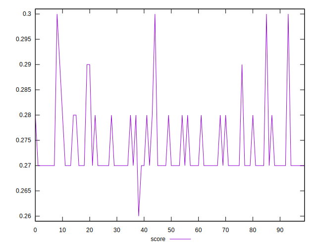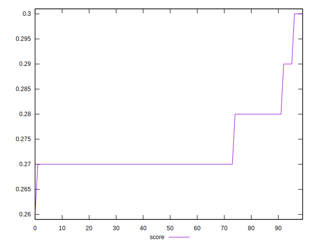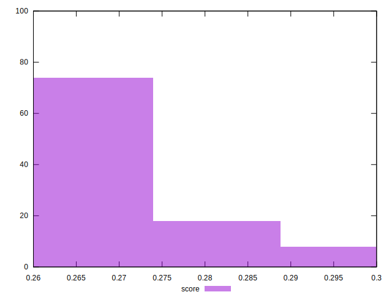
## Raw Estimate

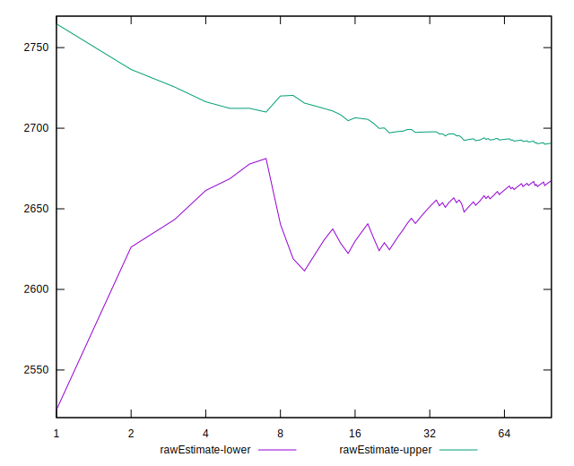
## Score Estimate

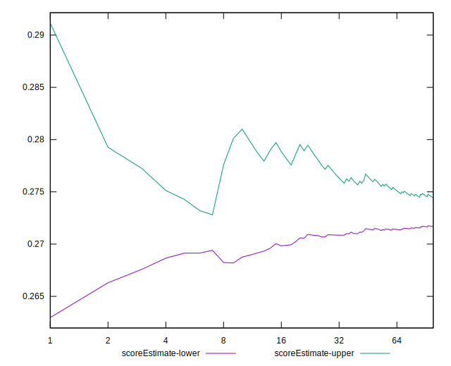
## P Score


```yaml
p90min: 0.26588235294117646
p90max: 0.2988235294117647
p90range: 0.03294117647058825
p90mean: 0.2738798498122652
median: 0.27058823529411763
p90stdev: 0.006612016321745981
mad: 0
stdevBySn: 0
lfitCenter: 0.27304492356081744
lfitStdev: 0.005561508705226188
mfitCenter: 0.27304492356081744
mfitStdev: 0.006970317492077034
mfitConfidence: 0.0006970317492077033
p90skewness: 1.4475803128162186
p90eccentricity: 1.0000000000000016
p90discretization: 10.444444444444445
outlandishness: 1.0038019892329346

```

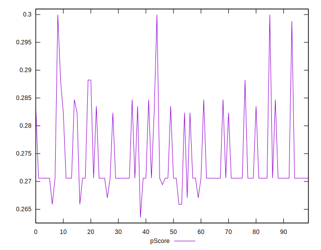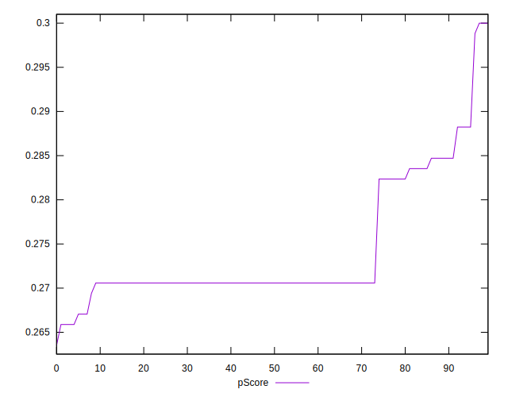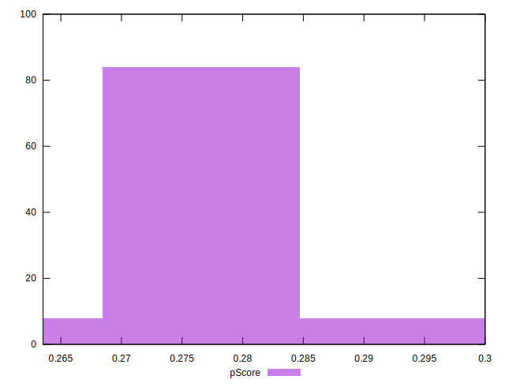
## Score Difference


```yaml
p90min: 0
p90max: 0
p90range: 0
p90mean: 0
median: 0
p90stdev: 0
mad: 0
stdevBySn: 0
lfitCenter: 0
lfitStdev: 0
mfitCenter: 0
mfitStdev: 0
mfitConfidence: 0
p90skewness: .nan
p90eccentricity: .nan
p90discretization: 94
outlandishness: .nan

```


## P Score Difference


```yaml
p90min: -0.004117647058823559
p90max: 0.004705882352941115
p90range: 0.008823529411764675
p90mean: 0.0007259073842302566
median: 0.0005882352941176117
p90stdev: 0.001494611125219205
mad: 0
stdevBySn: 0
lfitCenter: 0.000668291308018251
lfitStdev: 0.0007625840196173222
mfitCenter: 0.000668291308018251
mfitStdev: 0.0009557573336389943
mfitConfidence: 0.00009557573336389943
p90skewness: 0.056234130293036456
p90eccentricity: 1.0000000000000027
p90discretization: 8.545454545454545
outlandishness: 0.929894441141493

```

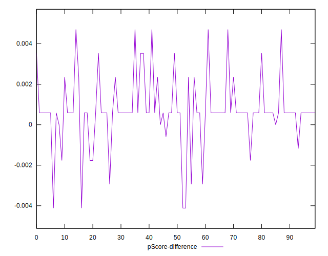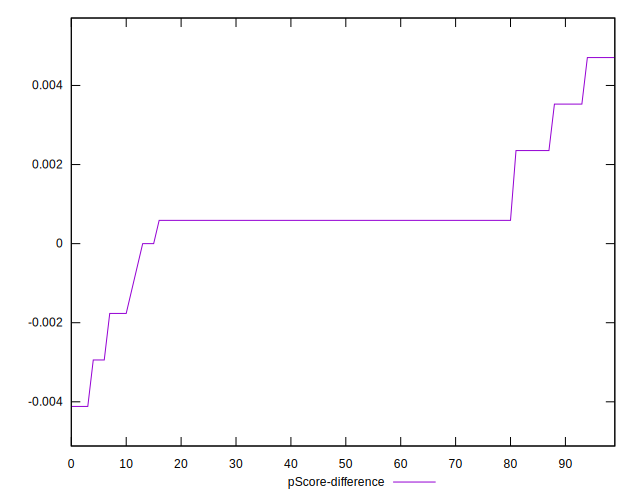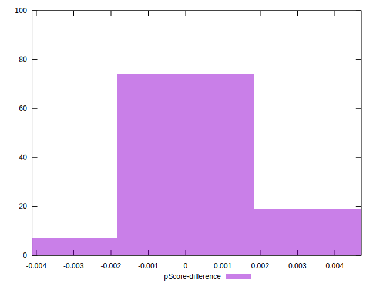