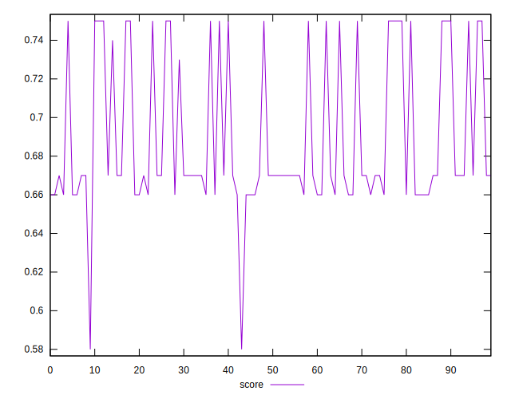
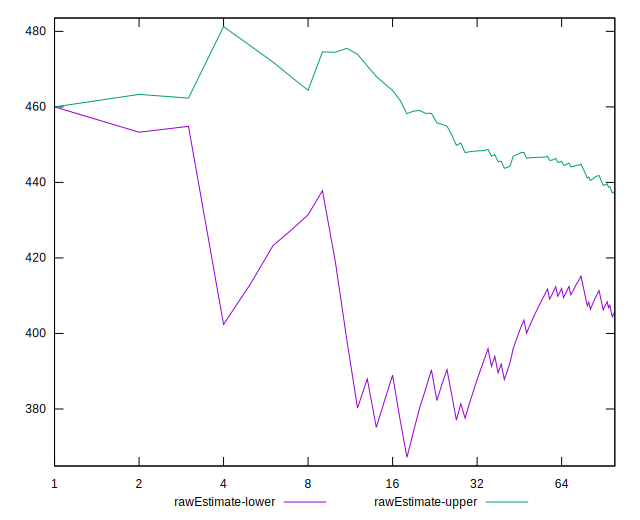
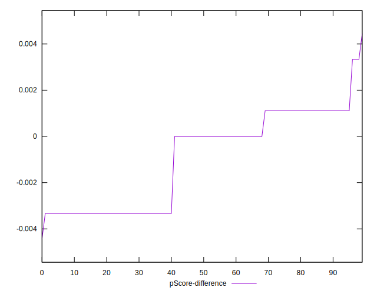

# //uses-webp-images/samples/pages+cached

[→ Parent](../..)


## Raw


```yaml
p90min: 300
p90max: 460
p90range: 160
p90mean: 410.21276595744683
median: 450
p90stdev: 69.22025781770448
mad: 10
stdevBySn: 11.926000000000002
lfitCenter: 421.6755870520475
lfitStdev: 64.55168070535797
mfitCenter: 421.6755870520475
mfitStdev: 80.90353409690992
mfitConfidence: 8.090353409690993
p90skewness: -0.9346616396709674
p90eccentricity: 1.0000000000000002
p90discretization: 18.8
outlandishness: 1.0053078545748608

```


## Score


```yaml
p90min: 0.66
p90max: 0.75
p90range: 0.08999999999999997
p90mean: 0.6897872340425533
median: 0.67
p90stdev: 0.03781192886761934
mad: 0.010000000000000009
stdevBySn: 0.011926000000000011
lfitCenter: 0.683988427794253
lfitStdev: 0.03480462780479961
mfitCenter: 0.683988427794253
mfitStdev: 0.04362113211565293
mfitConfidence: 0.004362113211565293
p90skewness: 0.9102718930189838
p90eccentricity: 0.9999999999999991
p90discretization: 18.8
outlandishness: 0.9980083954486175

```


## Raw Estimate


## Score Estimate


## P Score


```yaml
p90min: 0.6611111111111111
p90max: 0.75
p90range: 0.0888888888888889
p90mean: 0.6887706855791961
median: 0.6666666666666666
p90stdev: 0.038455698787613624
mad: 0.005555555555555536
stdevBySn: 0.006625555555555533
lfitCenter: 0.6824024516377517
lfitStdev: 0.03586204483631023
mfitCenter: 0.6824024516377517
mfitStdev: 0.044946407831616936
mfitConfidence: 0.004494640783161694
p90skewness: 0.934661639670994
p90eccentricity: 0.9999999999999988
p90discretization: 18.8
outlandishness: 0.9982468648061317

```


## Score Difference


```yaml
p90min: 0
p90max: 0
p90range: 0
p90mean: 0
median: 0
p90stdev: 0
mad: 0
stdevBySn: 0
lfitCenter: 0
lfitStdev: 0
mfitCenter: 0
mfitStdev: 0
mfitConfidence: 0
p90skewness: .nan
p90eccentricity: .nan
p90discretization: 94
outlandishness: .nan

```


## P Score Difference


```yaml
p90min: -0.0033333333333334103
p90max: 0.0033333333333332993
p90range: 0.00666666666666671
p90mean: -0.000992907801418485
median: 0
p90stdev: 0.001994661150414947
mad: 0.0011111111111110628
stdevBySn: 0.0013251111111110536
lfitCenter: -0.0008830986985136193
lfitStdev: 0.0021820271410468222
mfitCenter: -0.0008830986985136193
mfitStdev: 0.002734765466631943
mfitConfidence: 0.0002734765466631943
p90skewness: -0.17063239182644027
p90eccentricity: 1.0000000000000009
p90discretization: 23.5
outlandishness: 0.8835999999999999

```

