# //bootup-time/samples/agenda

[→ Parent](../..)


## Raw


```yaml
p90min: 71.32399999999998
p90max: 1899.6559999999986
p90range: 1828.3319999999985
p90mean: 773.9796170212763
median: 188.974
p90stdev: 732.8669557662911
mad: 118.524
stdevBySn: 165.1262034
lfitCenter: 729.790418753555
lfitStdev: 861.3218079845213
mfitCenter: 729.790418753555
mfitStdev: 1079.506799811393
mfitConfidence: 107.9506799811393
p90skewness: 0.207018634227835
p90eccentricity: 1
p90discretization: 1
outlandishness: 1.0429407853306114

```

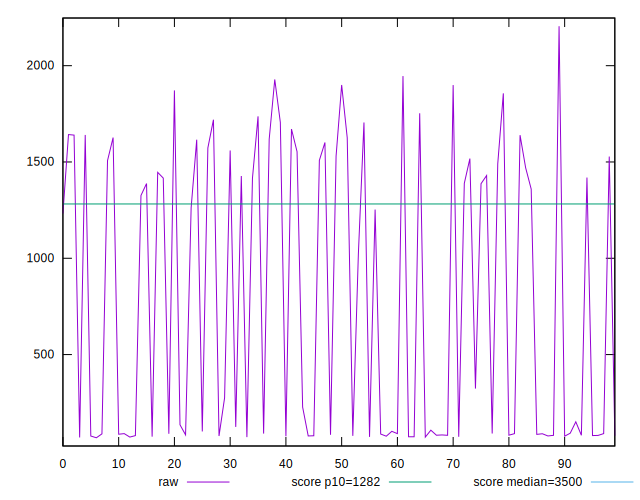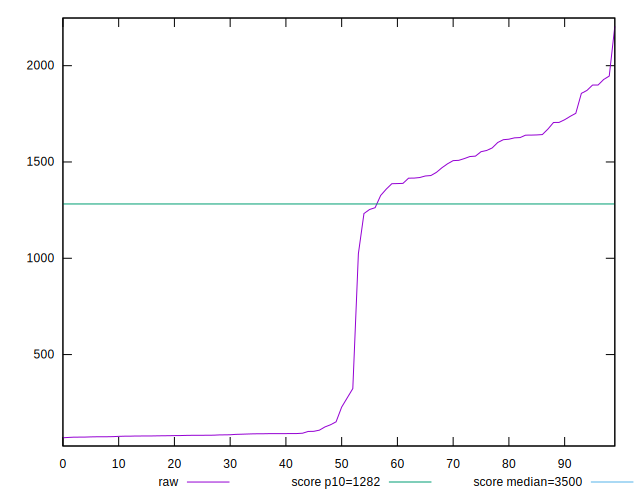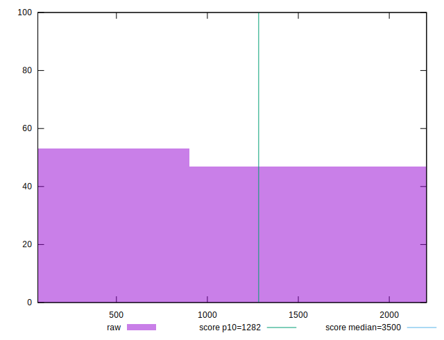
## Score


```yaml
p90min: 0.78
p90max: 1
p90range: 0.21999999999999997
p90mean: 0.9303191489361704
median: 1
p90stdev: 0.07795869238529224
mad: 0
stdevBySn: 0
lfitCenter: 0.9371204981520806
lfitStdev: 0.08721189382016374
mfitCenter: 0.9371204981520806
mfitStdev: 0.10930389957685575
mfitConfidence: 0.010930389957685575
p90skewness: -0.39212254667684693
p90eccentricity: 1.0000000000000016
p90discretization: 6.266666666666667
outlandishness: 0.9933056950605769

```

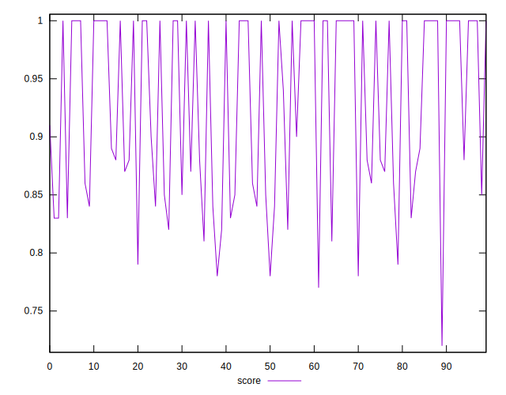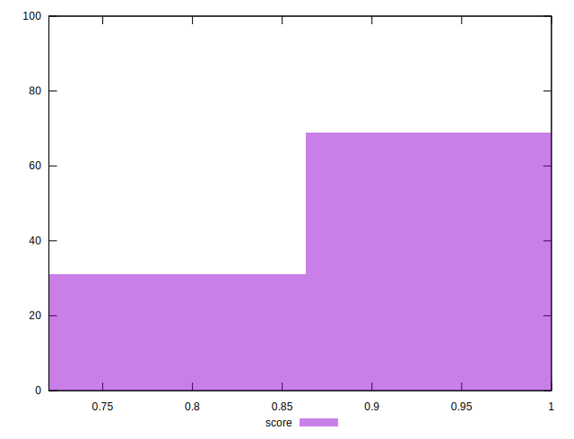
## Raw Estimate

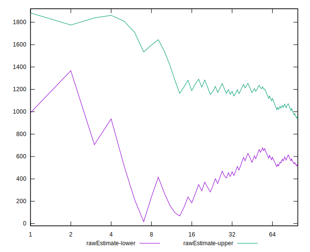
## Score Estimate

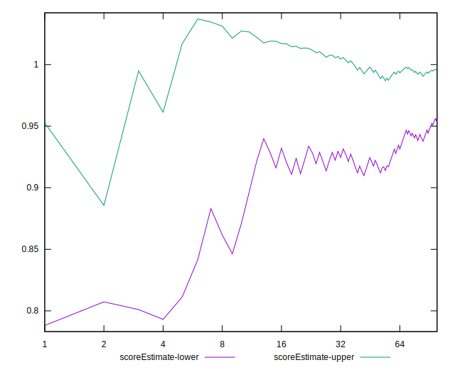
## P Score


```yaml
p90min: 0.7822334373970437
p90max: 0.9999996610325127
p90range: 0.21776622363546905
p90mean: 0.9303757818492993
median: 0.9998640422399425
p90stdev: 0.07783295440215598
mad: 0.00013568851829531825
stdevBySn: 0.0002250040344677836
lfitCenter: 0.937161497248683
lfitStdev: 0.08713095116231588
mfitCenter: 0.937161497248683
mfitStdev: 0.10920245299936106
mfitConfidence: 0.010920245299936106
p90skewness: -0.3884027399265408
p90eccentricity: 1.0000000000000009
p90discretization: 1
outlandishness: 0.9933395217097526

```

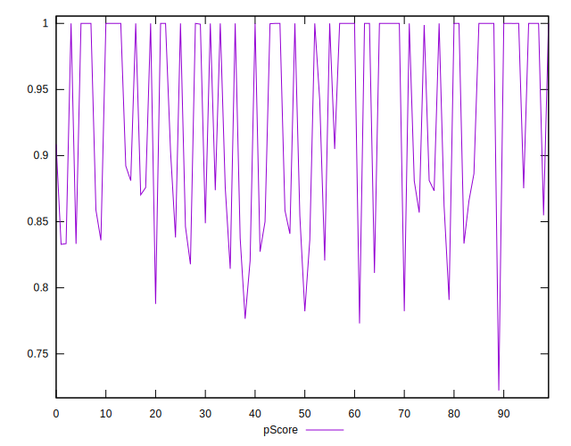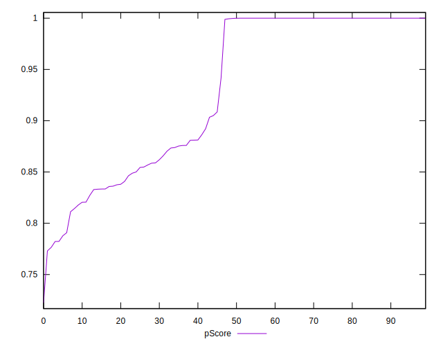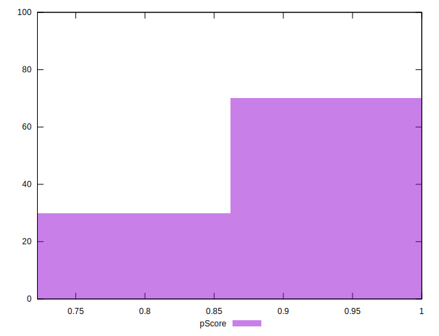
## Score Difference


```yaml
p90min: 0
p90max: 1.1102230246251565e-16
p90range: 1.1102230246251565e-16
p90mean: 7.086529944415892e-18
median: 0
p90stdev: 2.7139343474843178e-17
mad: 0
stdevBySn: 0
lfitCenter: 5.186597246566366e-18
lfitStdev: 1.239351332211875e-17
mfitCenter: 5.186597246566366e-18
mfitStdev: 1.553296547324935e-17
mfitConfidence: 1.553296547324935e-18
p90skewness: 3.5685919470917966
p90eccentricity: 0.999999999999997
p90discretization: 47
outlandishness: 1.9881000000000004

```

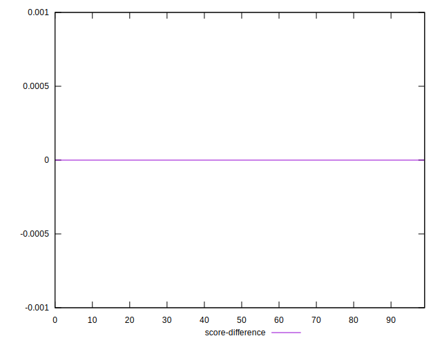
## P Score Difference


```yaml
p90min: -0.00411094221496433
p90max: 0.004345827116014722
p90range: 0.008456769330979053
p90mean: 0.00006425140057143398
median: -7.031478440611139e-7
p90stdev: 0.0017079124245635957
mad: 0.00002998500762235734
stdevBySn: 0.00005854652617390159
lfitCenter: 0.000056540969436687106
lfitStdev: 0.0009516230420800136
mfitCenter: 0.000056540969436687106
mfitStdev: 0.0011926826132341922
mfitConfidence: 0.00011926826132341921
p90skewness: -0.11040177232068928
p90eccentricity: 1.0000000000000002
p90discretization: 1
outlandishness: 1.2638312510970522

```

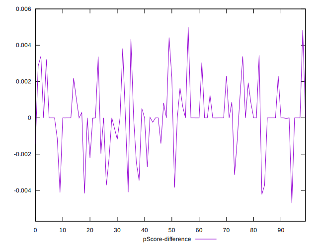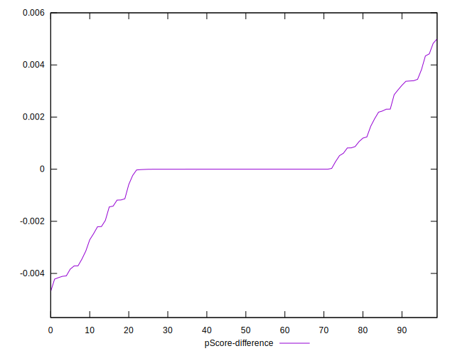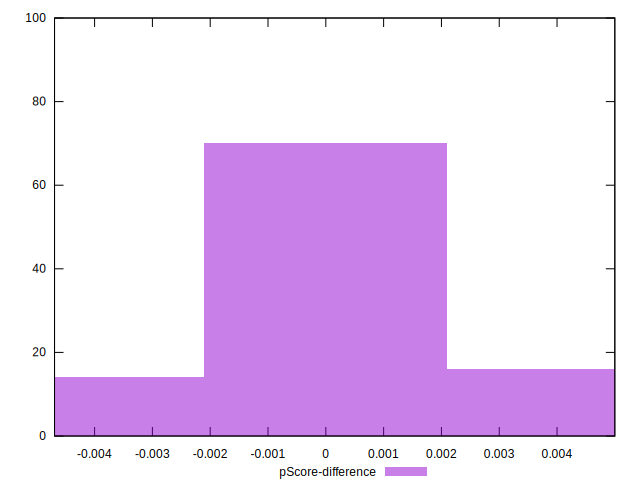