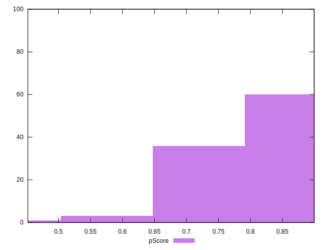

# //bootup-time/samples/astro

[→ Parent](../..)


## Raw


```yaml
p90min: 1380.9240000000002
p90max: 2633.100000000001
p90range: 1252.1760000000006
p90mean: 1855.2524680851059
median: 1776.0299999999988
p90stdev: 300.2413202571197
mad: 190.45800000000065
stdevBySn: 289.75409600000046
lfitCenter: 1839.5308671757712
lfitStdev: 255.5889395617649
mfitCenter: 1839.5308671757712
mfitStdev: 320.33323161656983
mfitConfidence: 32.03332316165698
p90skewness: 0.8525305531744896
p90eccentricity: 1.0000000000000004
p90discretization: 1
outlandishness: 1.0218573478639388

```


## Score


```yaml
p90min: 0.64
p90max: 0.88
p90range: 0.24
p90mean: 0.7909574468085105
median: 0.805
p90stdev: 0.05840192996184668
mad: 0.03500000000000003
stdevBySn: 0.059629999999999926
lfitCenter: 0.7941700362699469
lfitStdev: 0.04939237463831393
mfitCenter: 0.7941700362699469
mfitStdev: 0.06190416147207302
mfitConfidence: 0.006190416147207302
p90skewness: -0.8376203735688793
p90eccentricity: 1.0000000000000002
p90discretization: 3.76
outlandishness: 0.9912766731082064

```


## Raw Estimate


## Score Estimate


## P Score


```yaml
p90min: 0.6417551345056247
p90max: 0.8823276854998308
p90range: 0.24057255099420605
p90mean: 0.7910869708059166
median: 0.806651330246952
p90stdev: 0.05844128606049223
mad: 0.03755431871702358
stdevBySn: 0.05637453544461504
lfitCenter: 0.7943841911475406
lfitStdev: 0.04956678913352049
mfitCenter: 0.7943841911475406
mfitStdev: 0.06212275762488811
mfitConfidence: 0.0062122757624888105
p90skewness: -0.8389903947711526
p90eccentricity: 0.9999999999999997
p90discretization: 1
outlandishness: 0.9913054713851177

```


## Score Difference


```yaml
p90min: 0
p90max: 1.1102230246251565e-16
p90range: 1.1102230246251565e-16
p90mean: 2.0078501509178364e-17
median: 0
p90stdev: 4.2731899614831024e-17
mad: 0
stdevBySn: 0
lfitCenter: 1.3567625800737407e-17
lfitStdev: 2.9852880796997654e-17
mfitCenter: 1.3567625800737407e-17
mfitStdev: 3.7415037580120177e-17
mfitConfidence: 3.741503758012018e-18
p90skewness: 1.6583699784683517
p90eccentricity: 1.0000000000000018
p90discretization: 47
outlandishness: 1.222975778546713

```


## P Score Difference


```yaml
p90min: -0.004417607115665523
p90max: 0.004559169409653507
p90range: 0.00897677652531903
p90mean: 0.00014368468309280957
median: 0.00014098588246036492
p90stdev: 0.0025976119882658182
mad: 0.0023864268879050243
stdevBySn: 0.003120878383268155
lfitCenter: 0.00018751481031665796
lfitStdev: 0.002320768023665841
mfitCenter: 0.00018751481031665796
mfitStdev: 0.0029086513764169605
mfitConfidence: 0.00029086513764169607
p90skewness: -0.12421589958942685
p90eccentricity: 0.9999999999999994
p90discretization: 1
outlandishness: 0.954784454592094

```

