# //bootup-time/samples/card

[→ Parent](../..)


## Raw


```yaml
p90min: 79.60799999999996
p90max: 2097.1759999999995
p90range: 2017.5679999999995
p90mean: 933.8348817204298
median: 1314.1639999999998
p90stdev: 735.5191592430102
mad: 542.5919999999992
stdevBySn: 779.0015495999988
lfitCenter: 963.3273339649497
lfitStdev: 830.4032464167633
mfitCenter: 963.3273339649497
mfitStdev: 1040.7561294540694
mfitConfidence: 104.59992665641516
p90skewness: -0.1589464812743393
p90eccentricity: 0.9999999999999999
p90discretization: 1
outlandishness: 1.0298255347761256

```

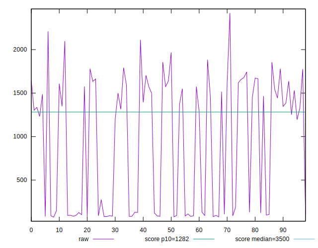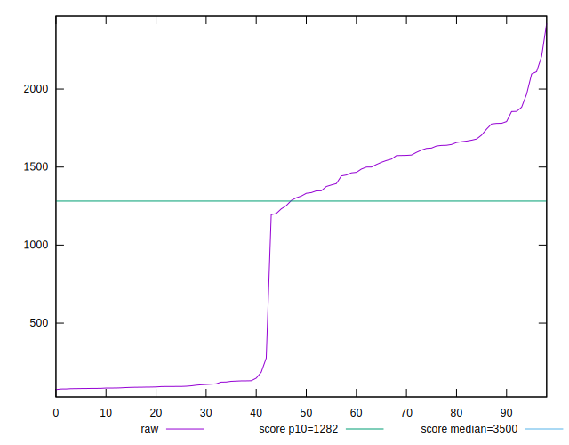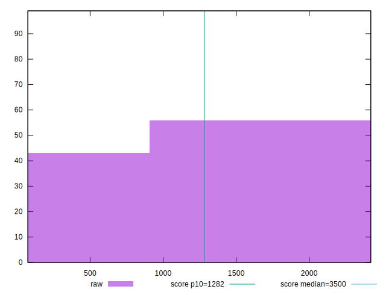
## Score


```yaml
p90min: 0.74
p90max: 1
p90range: 0.26
p90mean: 0.9136559139784948
median: 0.89
p90stdev: 0.08021188266671489
mad: 0.09999999999999998
stdevBySn: 0.131186
lfitCenter: 0.9135376295170707
lfitStdev: 0.08444958934648213
mfitCenter: 0.9135376295170707
mfitStdev: 0.10584186432493708
mfitConfidence: 0.01063750760840967
p90skewness: -0.09749215911071031
p90eccentricity: 0.9999999999999989
p90discretization: 5.8125
outlandishness: 0.9924536899596539

```

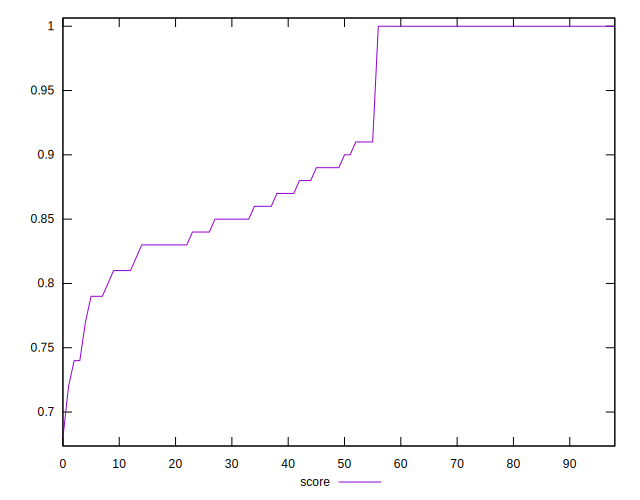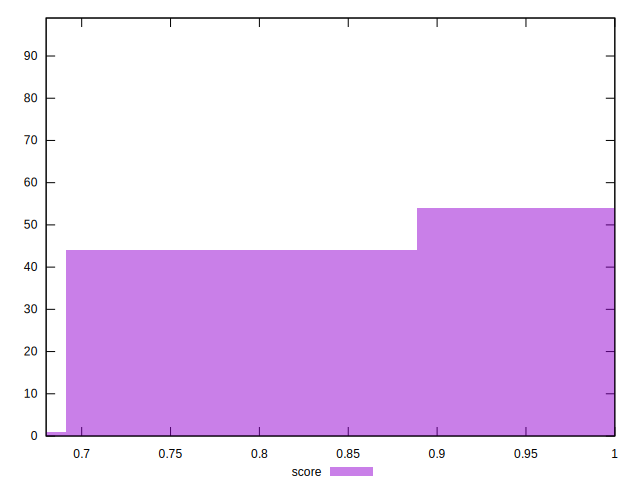
## Raw Estimate

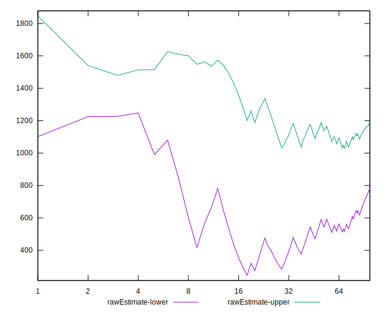
## Score Estimate

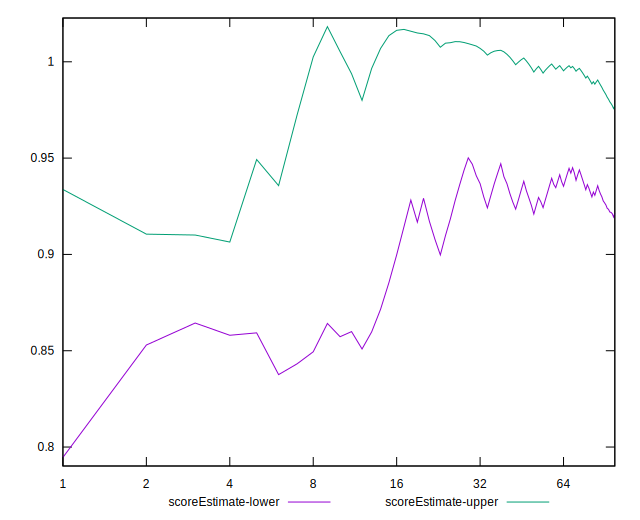
## P Score


```yaml
p90min: 0.7432948358364138
p90max: 0.9999993083726344
p90range: 0.25670447253622064
p90mean: 0.9134694912555148
median: 0.8943378850421462
p90stdev: 0.0803840252852938
mad: 0.10362280599079476
stdevBySn: 0.12571979203400202
lfitCenter: 0.9134198066953603
lfitStdev: 0.08460146338163664
mfitCenter: 0.9134198066953603
mfitStdev: 0.10603221020047893
mfitConfidence: 0.010656638088699488
p90skewness: -0.0955904701316544
p90eccentricity: 0.9999999999999997
p90discretization: 1
outlandishness: 0.9925360396330453

```

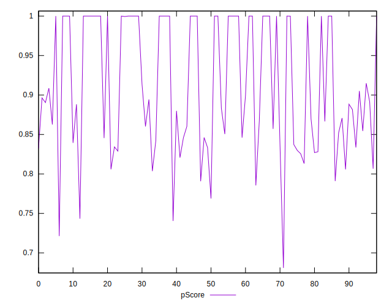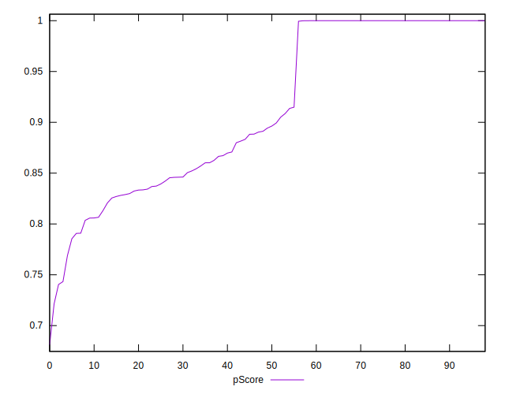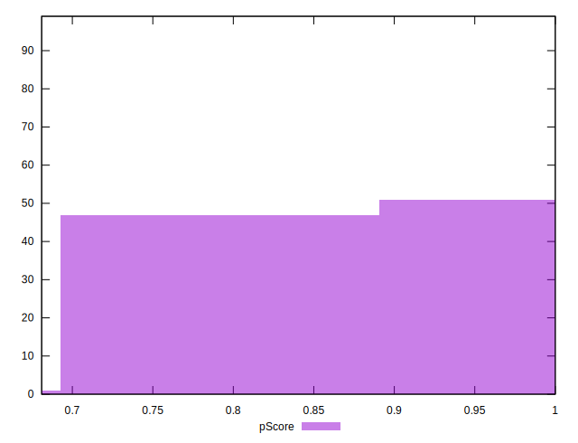
## Score Difference


```yaml
p90min: 0
p90max: 1.1102230246251565e-16
p90range: 1.1102230246251565e-16
p90mean: 8.356517389651716e-18
median: 0
p90stdev: 2.929041512651593e-17
mad: 0
stdevBySn: 0
lfitCenter: 5.9119360217413935e-18
lfitStdev: 1.4029913081542223e-17
mfitCenter: 5.9119360217413935e-18
mfitStdev: 1.7583888428098198e-17
mfitConfidence: 1.7672472809537554e-18
p90skewness: 3.219799626459925
p90eccentricity: 0.9999999999999988
p90discretization: 46.5
outlandishness: 1.8009407619797226

```

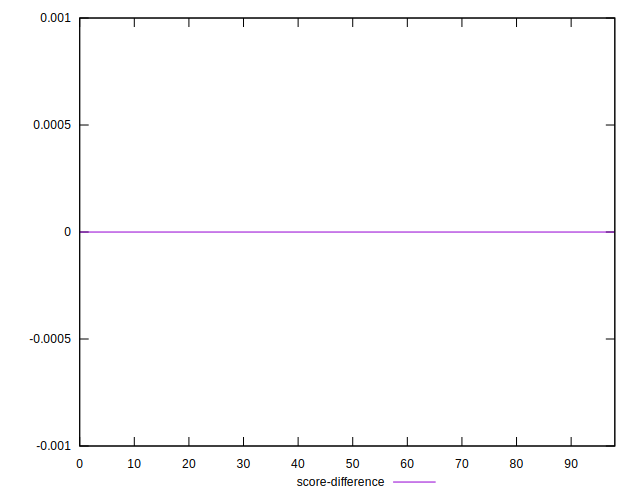
## P Score Difference


```yaml
p90min: -0.004447301000179316
p90max: 0.004265874494905009
p90range: 0.008713175495084324
p90mean: -0.00015290603501707213
median: -0.0000018465354529872968
p90stdev: 0.0018720049989033511
mad: 0.0004805676142006776
stdevBySn: 0.0006508353492758247
lfitCenter: -0.00010261429606481296
lfitStdev: 0.0011057769427550374
mfitCenter: -0.00010261429606481296
mfitStdev: 0.0013858858764669382
mfitConfidence: 0.00013928677134829299
p90skewness: -0.2221008449079415
p90eccentricity: 1
p90discretization: 1
outlandishness: 0.9364043180393495

```

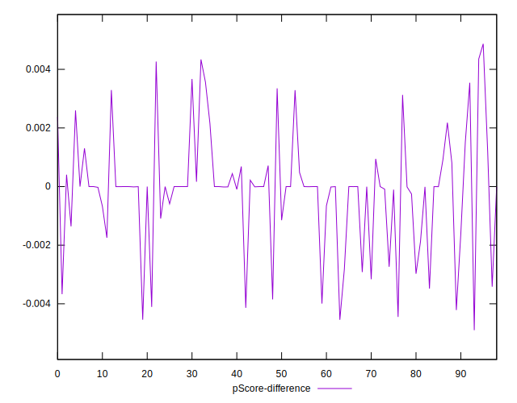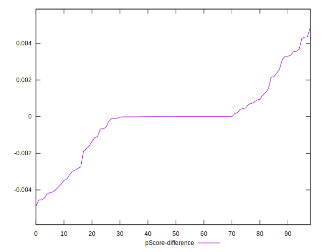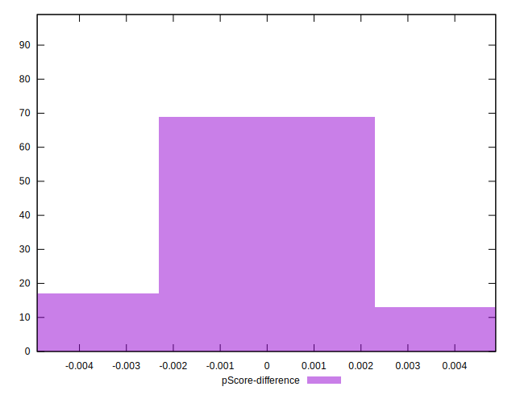