# //bootup-time/samples/music

[→ Parent](../..)


## Raw


```yaml
p90min: 1233.0480000000002
p90max: 2374.5919999999987
p90range: 1141.5439999999985
p90mean: 1682.119148936169
median: 1677.369999999999
p90stdev: 252.63019074368472
mad: 189.02399999999955
stdevBySn: 274.00939080000086
lfitCenter: 1677.9086370407024
lfitStdev: 202.35754655029265
mfitCenter: 1677.9086370407024
mfitStdev: 253.617574139162
mfitConfidence: 25.3617574139162
p90skewness: 0.4503379479166881
p90eccentricity: 0.9999999999999997
p90discretization: 1
outlandishness: 1.0053258049323148

```

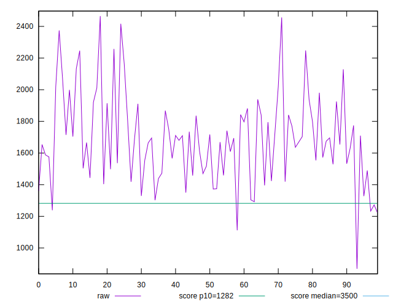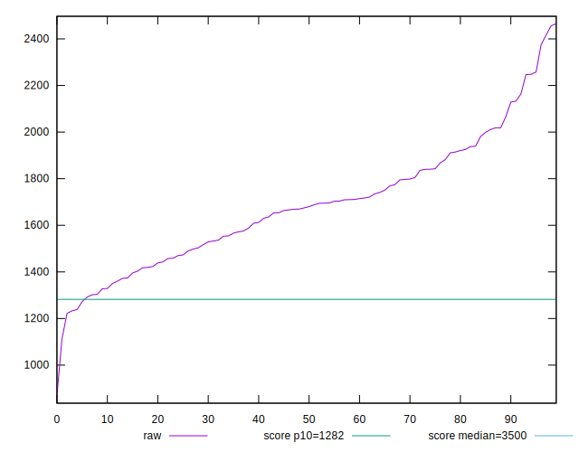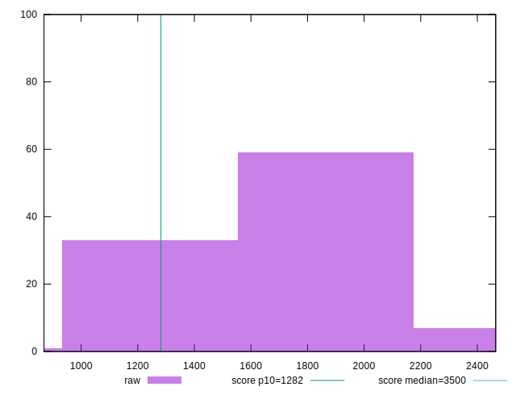
## Score


```yaml
p90min: 0.69
p90max: 0.91
p90range: 0.22000000000000008
p90mean: 0.8244680851063827
median: 0.83
p90stdev: 0.04941394887217265
mad: 0.039999999999999925
stdevBySn: 0.059629999999999926
lfitCenter: 0.8253146029520051
lfitStdev: 0.040142609686561685
mfitCenter: 0.8253146029520051
mfitStdev: 0.05031130027953127
mfitConfidence: 0.005031130027953127
p90skewness: -0.48520024293858366
p90eccentricity: 1.0000000000000004
p90discretization: 4.476190476190476
outlandishness: 0.9969262366101969

```

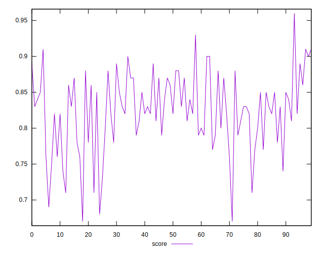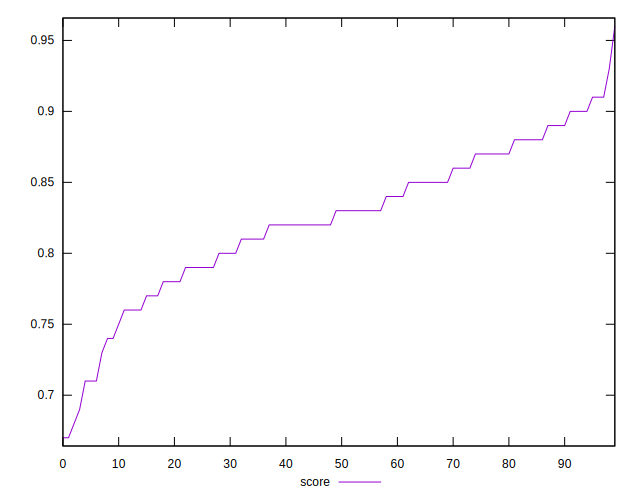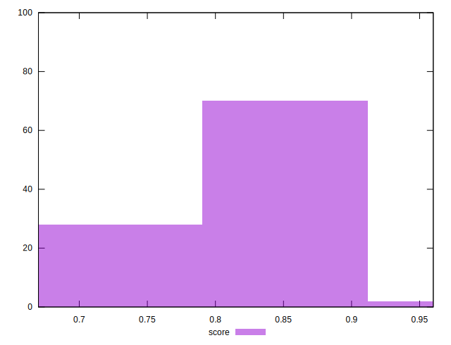
## Raw Estimate

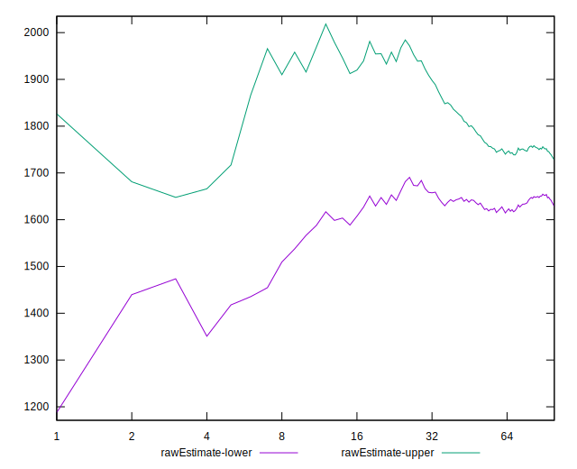
## Score Estimate

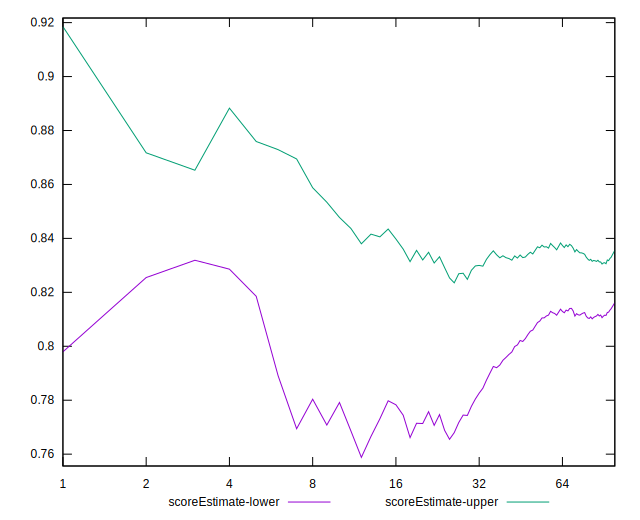
## P Score


```yaml
p90min: 0.6897043671746339
p90max: 0.9084431830230231
p90range: 0.21873881584838917
p90mean: 0.824446756497596
median: 0.8260196102412947
p90stdev: 0.048864680362569385
mad: 0.036795795834289324
stdevBySn: 0.053534941924879814
lfitCenter: 0.8253454123156064
lfitStdev: 0.03903959458327876
mfitCenter: 0.8253454123156064
mfitStdev: 0.04892887585552321
mfitConfidence: 0.004892887585552321
p90skewness: -0.4999014109849131
p90eccentricity: 0.9999999999999994
p90discretization: 1
outlandishness: 0.9971651228277391

```

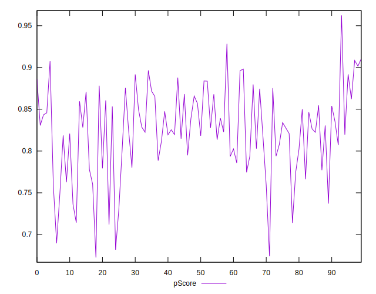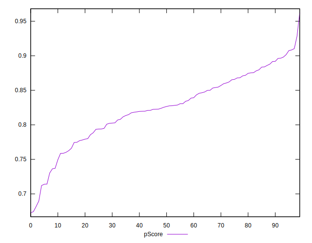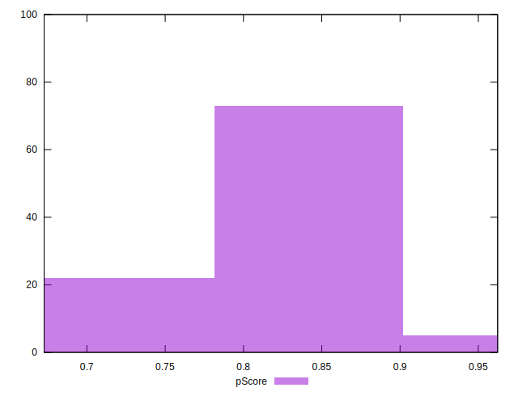
## Score Difference


```yaml
p90min: 0
p90max: 1.1102230246251565e-16
p90range: 1.1102230246251565e-16
p90mean: 2.2440678157316992e-17
median: 0
p90stdev: 4.4585106500773644e-17
mad: 0
stdevBySn: 0
lfitCenter: 1.5397107487514543e-17
lfitStdev: 3.3242308844122565e-17
mfitCenter: 1.5397107487514543e-17
mfitStdev: 4.1663055673270035e-17
mfitConfidence: 4.166305567327004e-18
p90skewness: 1.483476239912853
p90eccentricity: 1.0000000000000004
p90discretization: 47
outlandishness: 1.1846603878116344

```

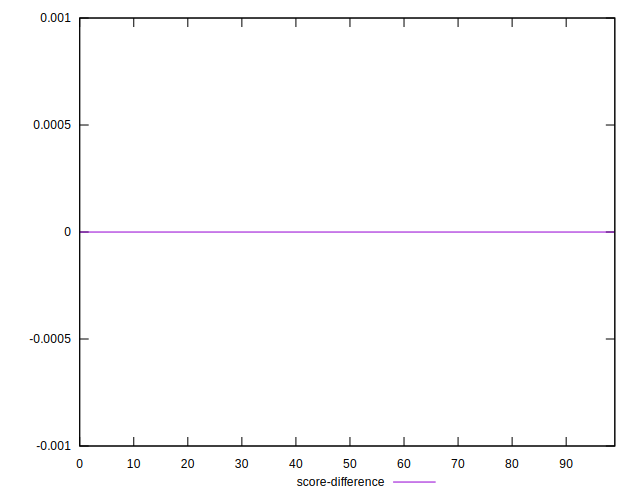
## P Score Difference


```yaml
p90min: -0.0045106192721514615
p90max: 0.004679004810140275
p90range: 0.009189624082291736
p90mean: 0.00008055610974587664
median: -0.0002087135679029739
p90stdev: 0.002657702873616279
mad: 0.0023124647138105248
stdevBySn: 0.0030731368117746104
lfitCenter: 0.00004251689130036233
lfitStdev: 0.002365907205289082
mfitCenter: 0.00004251689130036233
mfitStdev: 0.0029652249509491474
mfitConfidence: 0.00029652249509491474
p90skewness: 0.06602388869380844
p90eccentricity: 1.0000000000000007
p90discretization: 1
outlandishness: 0.9213759735780478

```

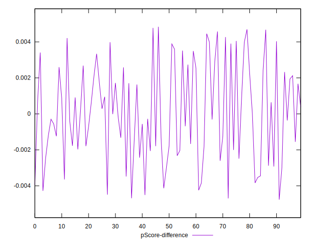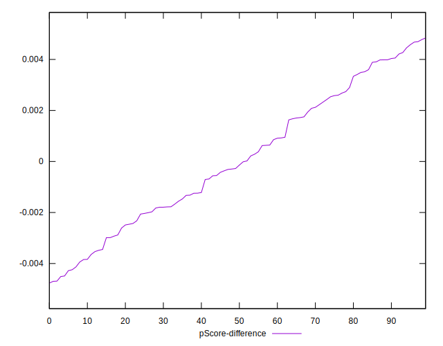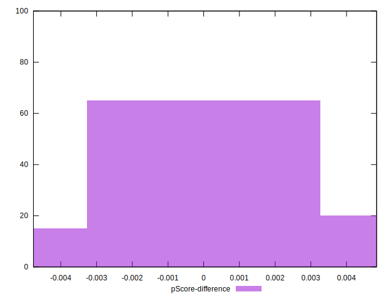