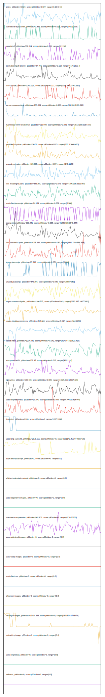

# //correlation/astro

[→ Parent](../..)

[0. score, p90stdev=0.027, score:p90stdev=0.027, range=[0.16:0.41]](../../meta/score/samples/astro)  
[1. cumulative-layout-shift, p90stdev=0.485, score:p90stdev=0.319, range=[0.02:1.563]](../../cumulative-layout-shift/samples/astro/)  
[2. uses-http2, p90stdev=309.314, score:p90stdev=0.201, range=[0:1190]](../../uses-http2/samples/astro/)  
[3. estimated-input-latency, p90stdev=87.704, score:p90stdev=0.119, range=[64.4:1366.4]](../../estimated-input-latency/samples/astro/)  
[4. first-cpu-idle, p90stdev=2302.526, score:p90stdev=0.117, range=[5769.343:15361.995]](../../first-cpu-idle/samples/astro/)  
[5. server-response-time, p90stdev=155.884, score:p90stdev=0.103, range=[51.334:1483.043]](../../server-response-time/samples/astro/)  
[6. mainthread-work-breakdown, p90stdev=520.569, score:p90stdev=0.092, range=[2513.168:6587.556]](../../mainthread-work-breakdown/samples/astro/)  
[7. total-blocking-time, p90stdev=250.56, score:p90stdev=0.075, range=[700.5:3040.483]](../../total-blocking-time/samples/astro/)  
[8. unused-css-rules, p90stdev=129.885, score:p90stdev=0.074, range=[140:1120]](../../unused-css-rules/samples/astro/)  
[9. first-meaningful-paint, p90stdev=849.201, score:p90stdev=0.072, range=[4106.396:9200.987]](../../first-meaningful-paint/samples/astro/)  
[10. unminified-javascript, p90stdev=74.139, score:p90stdev=0.059, range=[0:300]](../../unminified-javascript/samples/astro/)  
[11. bootup-time, p90stdev=300.241, score:p90stdev=0.058, range=[1285.028:3846.344]](../../bootup-time/samples/astro/)  
[12. first-contentful-paint, p90stdev=235.462, score:p90stdev=0.057, range=[2541.379:4588.346]](../../first-contentful-paint/samples/astro/)  
[13. legacy-javascript, p90stdev=63.593, score:p90stdev=0.051, range=[0:390]](../../legacy-javascript/samples/astro/)  
[14. unused-javascript, p90stdev=376.204, score:p90stdev=0.045, range=[2850:4950]](../../unused-javascript/samples/astro/)  
[15. largest-contentful-paint, p90stdev=1396.507, score:p90stdev=0.043, range=[2983.967:18077.682]](../../largest-contentful-paint/samples/astro/)  
[16. render-blocking-resources, p90stdev=318.684, score:p90stdev=0.042, range=[564:2286]](../../render-blocking-resources/samples/astro/)  
[17. speed-index, p90stdev=1204.941, score:p90stdev=0.042, range=[8176.543:13620.416]](../../speed-index/samples/astro/)  
[18. max-potential-fid, p90stdev=132.95, score:p90stdev=0.018, range=[461:2192]](../../max-potential-fid/samples/astro/)  
[19. interactive, p90stdev=590.469, score:p90stdev=0.009, range=[14825.977:18067.326]](../../interactive/samples/astro/)  
[20. uses-rel-preconnect, p90stdev=15.105, score:p90stdev=0.009, range=[300.09:424.958]](../../uses-rel-preconnect/samples/astro/)  
[21. dom-size, p90stdev=0.263, score:p90stdev=0, range=[1287:1288]](../../dom-size/samples/astro/)  
[22. uses-long-cache-ttl, p90stdev=2678.655, score:p90stdev=0, range=[961149.456:974823.436]](../../uses-long-cache-ttl/samples/astro/)  
[23. uses-passive-event-listeners, p90stdev=NaN, score:p90stdev=0, range=[NaN:NaN]](../../uses-passive-event-listeners/samples/astro/)  
[24. no-document-write, p90stdev=NaN, score:p90stdev=0, range=[NaN:NaN]](../../no-document-write/samples/astro/)  
[25. duplicated-javascript, p90stdev=0, score:p90stdev=0, range=[0:0]](../../duplicated-javascript/samples/astro/)  
[26. efficient-animated-content, p90stdev=0, score:p90stdev=0, range=[0:0]](../../efficient-animated-content/samples/astro/)  
[27. uses-responsive-images, p90stdev=0, score:p90stdev=0, range=[0:0]](../../uses-responsive-images/samples/astro/)  
[28. uses-text-compression, p90stdev=562.931, score:p90stdev=0, range=[6720:10700]](../../uses-text-compression/samples/astro/)  
[29. uses-optimized-images, p90stdev=0, score:p90stdev=0, range=[0:0]](../../uses-optimized-images/samples/astro/)  
[30. uses-webp-images, p90stdev=0, score:p90stdev=0, range=[0:0]](../../uses-webp-images/samples/astro/)  
[31. unminified-css, p90stdev=0, score:p90stdev=0, range=[0:0]](../../unminified-css/samples/astro/)  
[32. offscreen-images, p90stdev=0, score:p90stdev=0, range=[0:0]](../../offscreen-images/samples/astro/)  
[33. total-byte-weight, p90stdev=13414.663, score:p90stdev=0, range=[1631594:1748974]](../../total-byte-weight/samples/astro/)  
[34. preload-lcp-image, p90stdev=0, score:p90stdev=0, range=[0:0]](../../preload-lcp-image/samples/astro/)  
[35. unsized-images, p90stdev=NaN, score:p90stdev=0, range=[NaN:NaN]](../../unsized-images/samples/astro/)  
[36. third-party-summary, p90stdev=NaN, score:p90stdev=0, range=[NaN:NaN]](../../third-party-summary/samples/astro/)  
[37. font-display, p90stdev=NaN, score:p90stdev=0, range=[NaN:NaN]](../../font-display/samples/astro/)  
[38. uses-rel-preload, p90stdev=0, score:p90stdev=0, range=[0:0]](../../uses-rel-preload/samples/astro/)  
[39. redirects, p90stdev=0, score:p90stdev=0, range=[0:0]](../../redirects/samples/astro/)  
[40. timing-budget, p90stdev=NaN, score:p90stdev=NaN, range=[NaN:NaN]](../../timing-budget/samples/astro/)  
[41. metrics, p90stdev=NaN, score:p90stdev=NaN, range=[NaN:NaN]](../../metrics/samples/astro/)  
[42. screenshot-thumbnails, p90stdev=NaN, score:p90stdev=NaN, range=[NaN:NaN]](../../screenshot-thumbnails/samples/astro/)  
