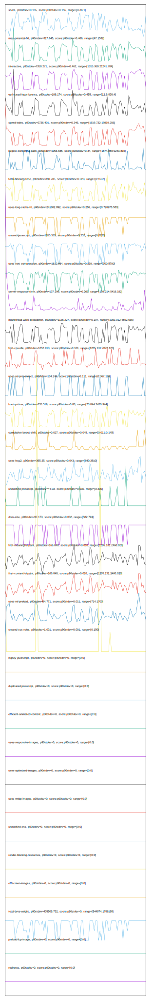

# //correlation/card

[→ Parent](../..)

[0. score, p90stdev=0.155, score:p90stdev=0.155, range=[0.36:1]](../../meta/score/samples/card)  
[1. third-party-summary, p90stdev=NaN, score:p90stdev=0.48, range=[NaN:NaN]](../../third-party-summary/samples/card/)  
[2. max-potential-fid, p90stdev=317.645, score:p90stdev=0.466, range=[47:1532]](../../max-potential-fid/samples/card/)  
[3. interactive, p90stdev=7350.271, score:p90stdev=0.462, range=[1315.369:21241.784]](../../interactive/samples/card/)  
[4. estimated-input-latency, p90stdev=106.174, score:p90stdev=0.455, range=[12.8:838.4]](../../estimated-input-latency/samples/card/)  
[5. speed-index, p90stdev=2736.401, score:p90stdev=0.346, range=[1619.732:19819.256]](../../speed-index/samples/card/)  
[6. largest-contentful-paint, p90stdev=1953.835, score:p90stdev=0.34, range=[1874.859:9243.816]](../../largest-contentful-paint/samples/card/)  
[7. total-blocking-time, p90stdev=380.705, score:p90stdev=0.323, range=[0:1537]](../../total-blocking-time/samples/card/)  
[8. uses-long-cache-ttl, p90stdev=241002.892, score:p90stdev=0.286, range=[0:726973.533]](../../uses-long-cache-ttl/samples/card/)  
[9. unused-javascript, p90stdev=1055.585, score:p90stdev=0.252, range=[0:3220]](../../unused-javascript/samples/card/)  
[10. uses-text-compression, p90stdev=1610.664, score:p90stdev=0.239, range=[300:5700]](../../uses-text-compression/samples/card/)  
[11. server-response-time, p90stdev=137.199, score:p90stdev=0.203, range=[159.214:5418.182]](../../server-response-time/samples/card/)  
[12. mainthread-work-breakdown, p90stdev=1128.227, score:p90stdev=0.197, range=[1082.012:4592.636]](../../mainthread-work-breakdown/samples/card/)  
[13. first-cpu-idle, p90stdev=1352.913, score:p90stdev=0.161, range=[1285.131:7072.123]](../../first-cpu-idle/samples/card/)  
[14. uses-rel-preconnect, p90stdev=134.249, score:p90stdev=0.111, range=[0:367.198]](../../uses-rel-preconnect/samples/card/)  
[15. bootup-time, p90stdev=735.519, score:p90stdev=0.08, range=[73.844:2420.944]](../../bootup-time/samples/card/)  
[16. cumulative-layout-shift, p90stdev=0.027, score:p90stdev=0.045, range=[0.011:0.145]](../../cumulative-layout-shift/samples/card/)  
[17. uses-http2, p90stdev=365.25, score:p90stdev=0.043, range=[640:2810]](../../uses-http2/samples/card/)  
[18. unminified-javascript, p90stdev=44.03, score:p90stdev=0.035, range=[0:300]](../../unminified-javascript/samples/card/)  
[19. dom-size, p90stdev=97.173, score:p90stdev=0.032, range=[582:794]](../../dom-size/samples/card/)  
[20. first-meaningful-paint, p90stdev=166.848, score:p90stdev=0.018, range=[1285.131:2468.828]](../../first-meaningful-paint/samples/card/)  
[21. first-contentful-paint, p90stdev=166.848, score:p90stdev=0.018, range=[1285.131:2468.828]](../../first-contentful-paint/samples/card/)  
[22. uses-rel-preload, p90stdev=94.771, score:p90stdev=0.011, range=[714:1700]](../../uses-rel-preload/samples/card/)  
[23. unused-css-rules, p90stdev=1.031, score:p90stdev=0.001, range=[0:150]](../../unused-css-rules/samples/card/)  
[24. uses-passive-event-listeners, p90stdev=NaN, score:p90stdev=0, range=[NaN:NaN]](../../uses-passive-event-listeners/samples/card/)  
[25. no-document-write, p90stdev=NaN, score:p90stdev=0, range=[NaN:NaN]](../../no-document-write/samples/card/)  
[26. legacy-javascript, p90stdev=0, score:p90stdev=0, range=[0:0]](../../legacy-javascript/samples/card/)  
[27. duplicated-javascript, p90stdev=0, score:p90stdev=0, range=[0:0]](../../duplicated-javascript/samples/card/)  
[28. efficient-animated-content, p90stdev=0, score:p90stdev=0, range=[0:0]](../../efficient-animated-content/samples/card/)  
[29. uses-responsive-images, p90stdev=0, score:p90stdev=0, range=[0:0]](../../uses-responsive-images/samples/card/)  
[30. uses-optimized-images, p90stdev=0, score:p90stdev=0, range=[0:0]](../../uses-optimized-images/samples/card/)  
[31. uses-webp-images, p90stdev=0, score:p90stdev=0, range=[0:0]](../../uses-webp-images/samples/card/)  
[32. unminified-css, p90stdev=0, score:p90stdev=0, range=[0:0]](../../unminified-css/samples/card/)  
[33. render-blocking-resources, p90stdev=0, score:p90stdev=0, range=[0:0]](../../render-blocking-resources/samples/card/)  
[34. offscreen-images, p90stdev=0, score:p90stdev=0, range=[0:0]](../../offscreen-images/samples/card/)  
[35. total-byte-weight, p90stdev=435508.732, score:p90stdev=0, range=[544874:1786188]](../../total-byte-weight/samples/card/)  
[36. preload-lcp-image, p90stdev=0, score:p90stdev=0, range=[0:0]](../../preload-lcp-image/samples/card/)  
[37. unsized-images, p90stdev=NaN, score:p90stdev=0, range=[NaN:NaN]](../../unsized-images/samples/card/)  
[38. font-display, p90stdev=NaN, score:p90stdev=0, range=[NaN:NaN]](../../font-display/samples/card/)  
[39. redirects, p90stdev=0, score:p90stdev=0, range=[0:0]](../../redirects/samples/card/)  
