# //cumulative-layout-shift/samples/agenda

[→ Parent](../..)


## Raw


```yaml
p90min: 0.006063152419196235
p90max: 0.1400182305441962
p90range: 0.133955078125
p90mean: 0.01608043885963748
median: 0.006063152419196235
p90stdev: 0.01601721632412752
mad: 0
stdevBySn: 0
lfitCenter: 0.016613763522064333
lfitStdev: 0.01512573240775277
mfitCenter: 0.016613763522064333
mfitStdev: 0.018957294282963402
mfitConfidence: 0.0018957294282963403
p90skewness: 4.886363154560546
p90eccentricity: 1.0000000000000007
p90discretization: 6.266666666666667
outlandishness: 1.5324181619625026

```

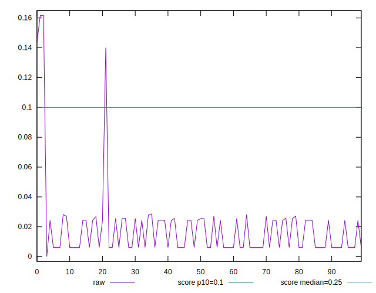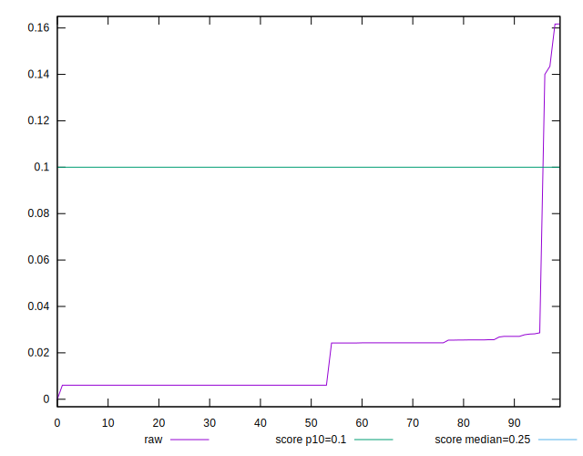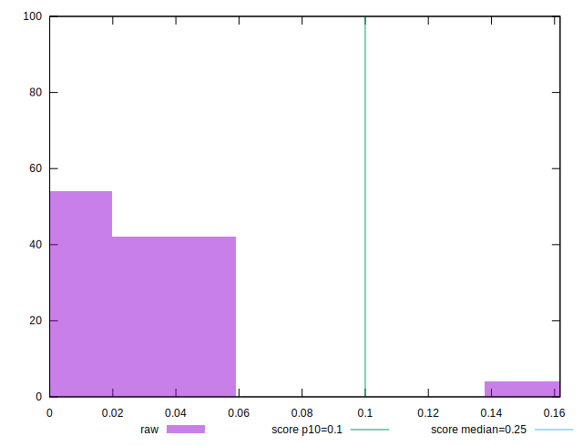
## Score


```yaml
p90min: 0.79
p90max: 1
p90range: 0.20999999999999996
p90mean: 0.9977659574468084
median: 1
p90stdev: 0.021544326168175747
mad: 0
stdevBySn: 0
lfitCenter: 0.9953163792503738
lfitStdev: 0.01151263466000814
mfitCenter: 0.9953163792503738
mfitStdev: 0.014428947791655648
mfitConfidence: 0.0014428947791655649
p90skewness: -9.53995559151991
p90eccentricity: 1.0000000000000027
p90discretization: 47
outlandishness: 0.9850906422929381

```

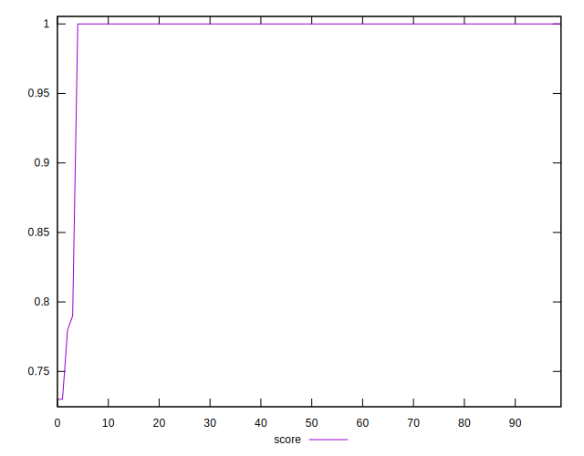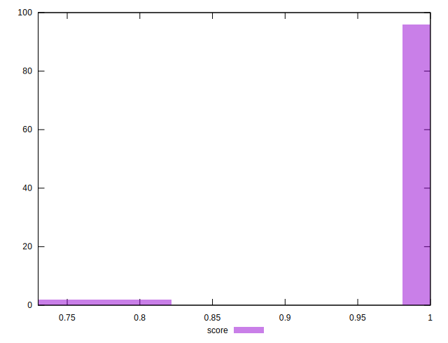
## Raw Estimate

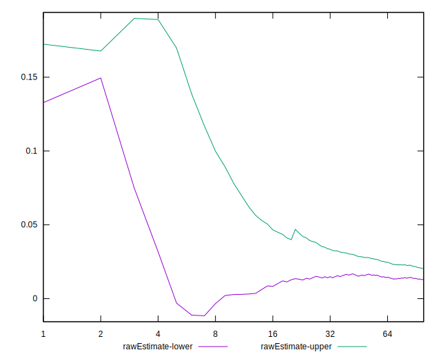
## Score Estimate

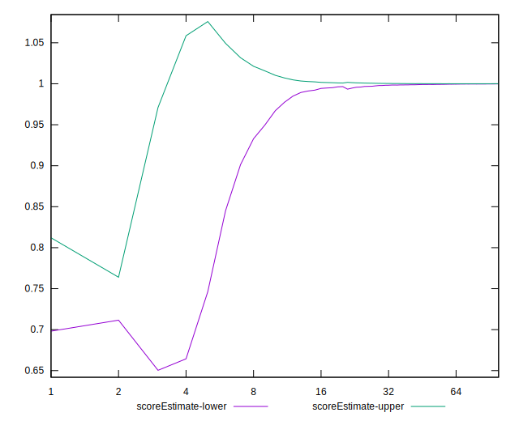
## P Score


```yaml
p90min: 0.7912509844914699
p90max: 0.9999999011422622
p90range: 0.20874891665079232
p90mean: 0.9974693819582362
median: 0.9999999011422622
p90stdev: 0.021386982351814566
mad: 0
stdevBySn: 0
lfitCenter: 0.9950533724754073
lfitStdev: 0.011496137317082624
mfitCenter: 0.9950533724754073
mfitStdev: 0.014408271438518154
mfitConfidence: 0.0014408271438518154
p90skewness: -9.535678792381352
p90eccentricity: 1.0000000000000022
p90discretization: 6.266666666666667
outlandishness: 0.985100252660831

```

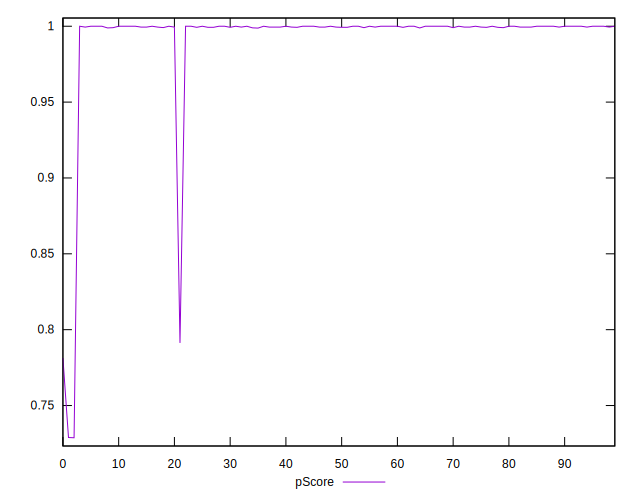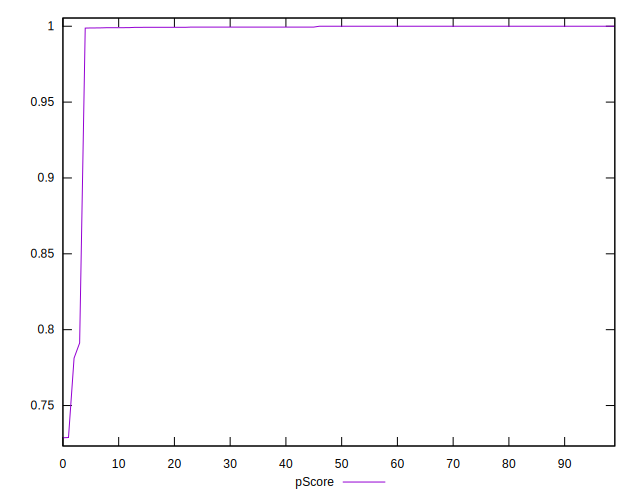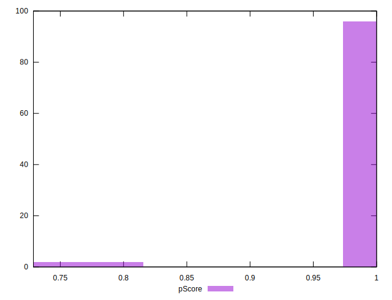
## Score Difference


```yaml
p90min: 0
p90max: 0
p90range: 0
p90mean: 0
median: 0
p90stdev: 0
mad: 0
stdevBySn: 0
lfitCenter: 0
lfitStdev: 0
mfitCenter: 0
mfitStdev: 0
mfitConfidence: 0
p90skewness: .nan
p90eccentricity: .nan
p90discretization: 94
outlandishness: .nan

```


## P Score Difference


```yaml
p90min: -0.0011151411626624252
p90max: -9.885773777362772e-8
p90range: 0.0011150423049246516
p90mean: -0.0002963583883941243
median: -9.885773777362772e-8
p90stdev: 0.00035508233405292795
mad: 0
stdevBySn: 0
lfitCenter: -0.00024930619630364085
lfitStdev: 0.0004053979630601981
mfitCenter: -0.00024930619630364085
mfitStdev: 0.000508090998853516
mfitConfidence: 0.0000508090998853516
p90skewness: -0.6021807186319612
p90eccentricity: 0.9999999999999996
p90discretization: 7.230769230769231
outlandishness: 0.954430222625561

```

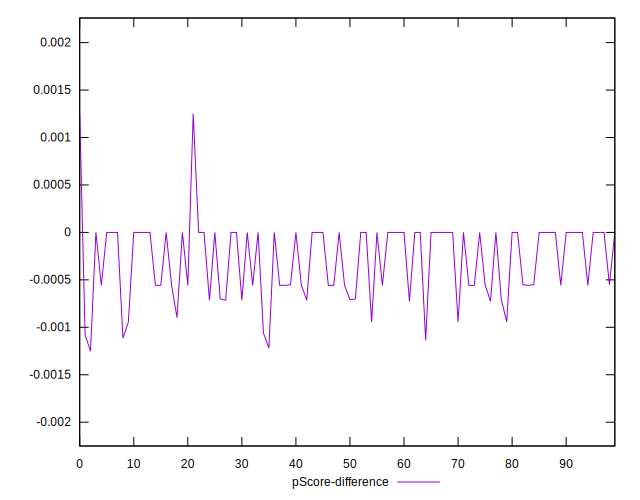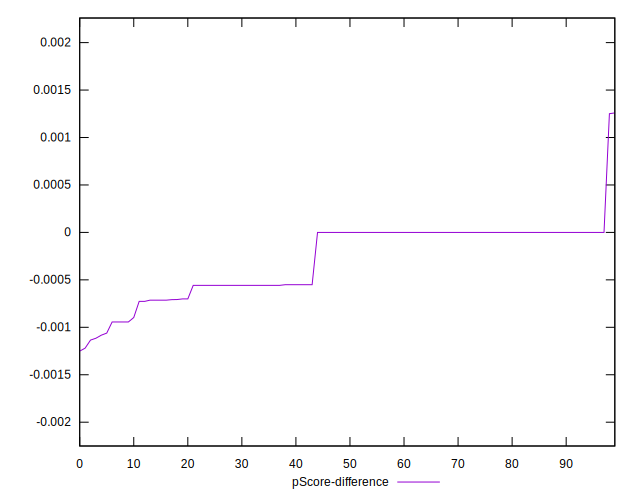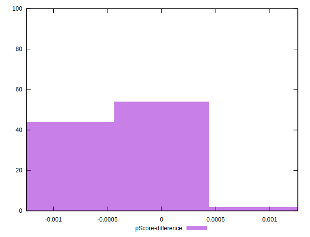