# //cumulative-layout-shift/samples/astro

[→ Parent](../..)


## Raw


```yaml
p90min: 0.113388671875
p90max: 1.5073332977294922
p90range: 1.3939446258544923
p90mean: 0.33124162714532085
median: 0.114910888671875
p90stdev: 0.4845730785276701
mad: 0.001485595703124995
stdevBySn: 0.0018299538574218742
lfitCenter: 0.259404683000679
lfitStdev: 0.32226902220995335
mfitCenter: 0.259404683000679
mfitStdev: 0.4039043219610032
mfitConfidence: 0.04039043219610032
p90skewness: 1.8635909681577751
p90eccentricity: 0.9999999999999999
p90discretization: 2.764705882352941
outlandishness: 1.1728174946271654

```

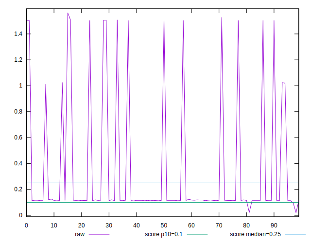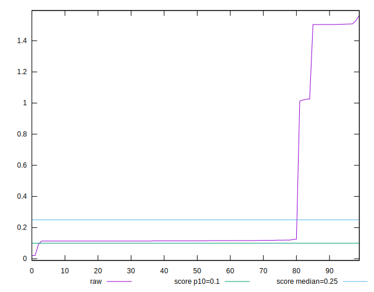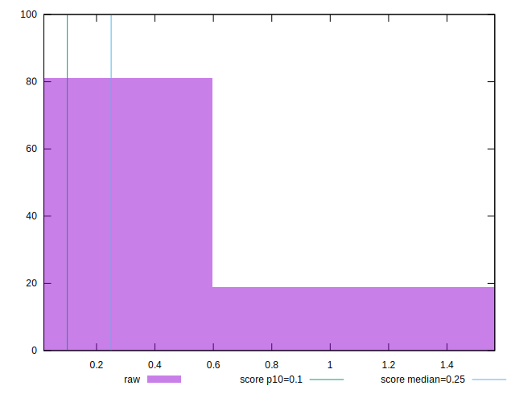
## Score


```yaml
p90min: 0.01
p90max: 0.87
p90range: 0.86
p90mean: 0.7178723404255316
median: 0.86
p90stdev: 0.3192840139677736
mad: 0.010000000000000009
stdevBySn: 0.011926000000000011
lfitCenter: 0.7662463028317217
lfitStdev: 0.21577821759384022
mfitCenter: 0.7662463028317217
mfitStdev: 0.27043789090722625
mfitConfidence: 0.027043789090722626
p90skewness: -1.753089577043933
p90eccentricity: 0.9999999999999992
p90discretization: 11.75
outlandishness: 0.962271450216078

```

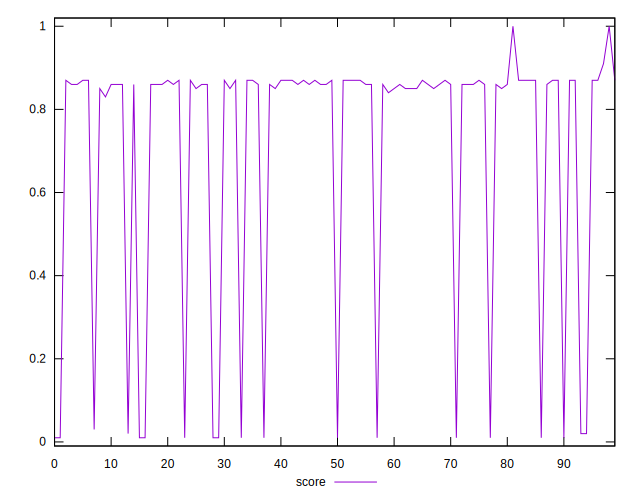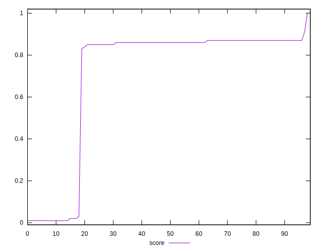
## Raw Estimate

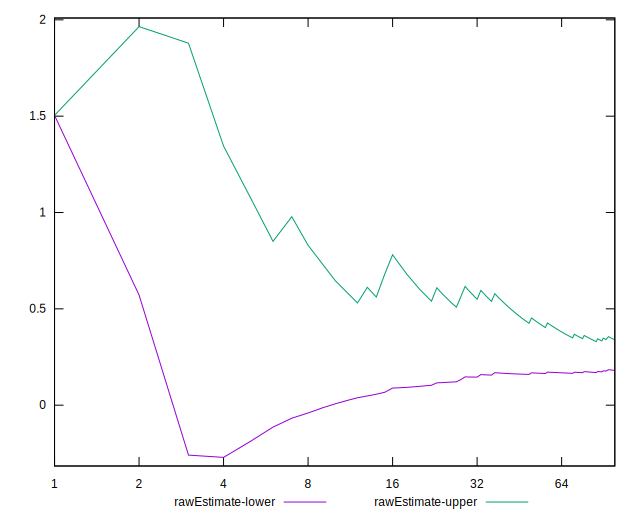
## Score Estimate

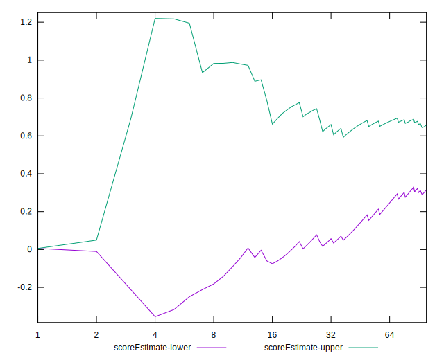
## P Score


```yaml
p90min: 0.005988380531023296
p90max: 0.8655959825000461
p90range: 0.8596076019690229
p90mean: 0.715784946263803
median: 0.861517019177837
p90stdev: 0.3194304000531986
mad: 0.0039811765116458675
stdevBySn: 0.004904130506440959
lfitCenter: 0.7647140985932849
lfitStdev: 0.21605525576890186
mfitCenter: 0.7647140985932849
mfitStdev: 0.27078510676895645
mfitConfidence: 0.027078510676895644
p90skewness: -1.7541010922758475
p90eccentricity: 0.9999999999999994
p90discretization: 2.764705882352941
outlandishness: 0.962266696696432

```

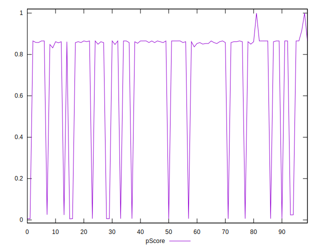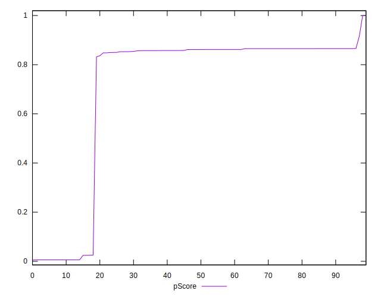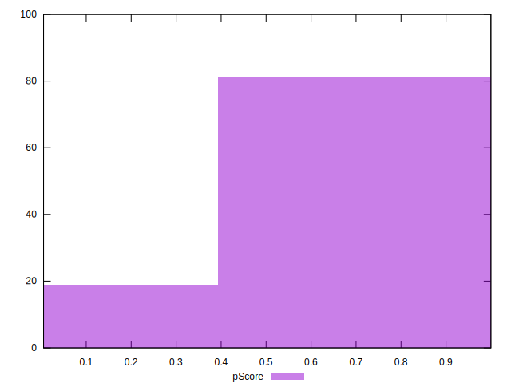
## Score Difference


```yaml
p90min: 0
p90max: 0
p90range: 0
p90mean: 0
median: 0
p90stdev: 0
mad: 0
stdevBySn: 0
lfitCenter: 5.166535369026208e-19
lfitStdev: 1.2890316797319448e-18
mfitCenter: 5.166535369026208e-19
mfitStdev: 1.6155616292812394e-18
mfitConfidence: 1.6155616292812395e-19
p90skewness: .nan
p90eccentricity: .nan
p90discretization: 94
outlandishness: .inf

```

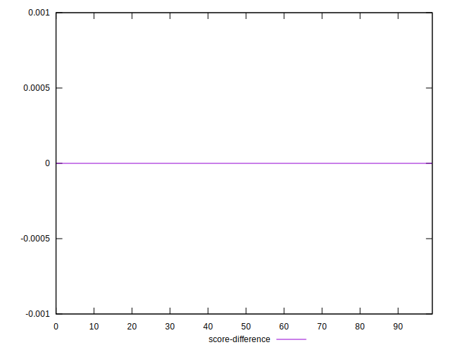
## P Score Difference


```yaml
p90min: -0.004658299055735227
p90max: 0.00413872353056512
p90range: 0.008797022586300347
p90mean: -0.00217584125322619
median: -0.0038850131377425002
p90stdev: 0.0027606496743717837
mad: 0.0008400095440568205
stdevBySn: 0.0011075223466171199
lfitCenter: -0.0024608501924902187
lfitStdev: 0.002515900834336929
mfitCenter: -0.0024608501924902187
mfitStdev: 0.0031532140869312336
mfitConfidence: 0.00031532140869312337
p90skewness: 0.774579757999135
p90eccentricity: 0.9999999999999989
p90discretization: 2.6857142857142855
outlandishness: 0.8871304190199524

```

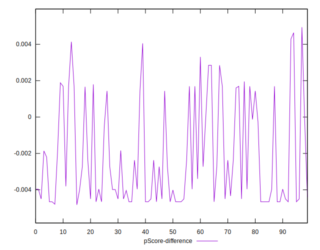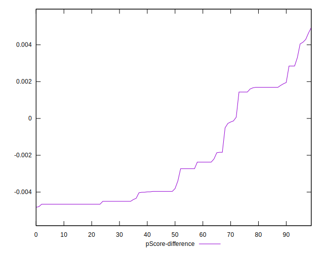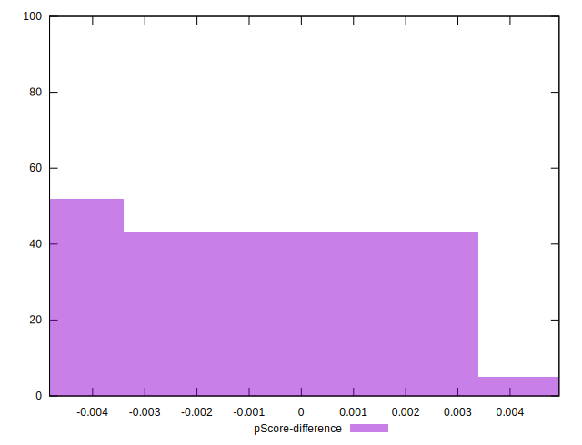