# //cumulative-layout-shift/samples/card

[→ Parent](../..)


## Raw


```yaml
p90min: 0.011352840529547797
p90max: 0.14525024043189155
p90range: 0.13389739990234376
p90mean: 0.027258169095576004
median: 0.029541317092047797
p90stdev: 0.026744391367048932
mad: 0.0181884765625
stdevBySn: 0.021691577148437502
lfitCenter: 0.026948741055927143
lfitStdev: 0.015232839298586681
mfitCenter: 0.026948741055927143
mfitStdev: 0.019091532863584528
mfitConfidence: 0.0019187712479166443
p90skewness: 3.605418327599965
p90eccentricity: 1.0000000000000002
p90discretization: 6.2
outlandishness: 1.2400057050970028

```

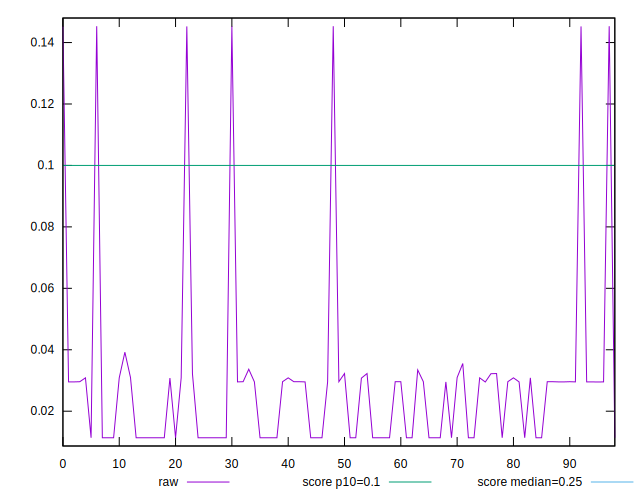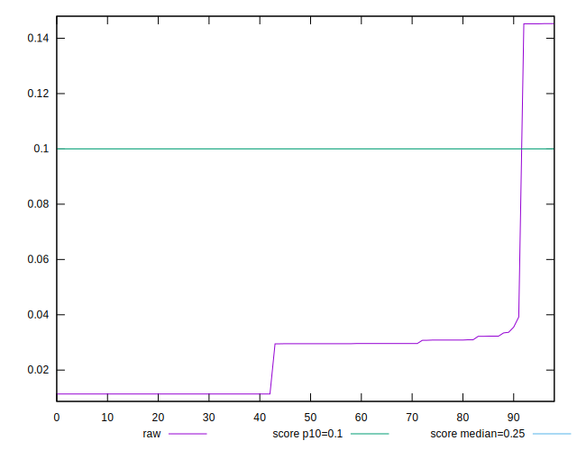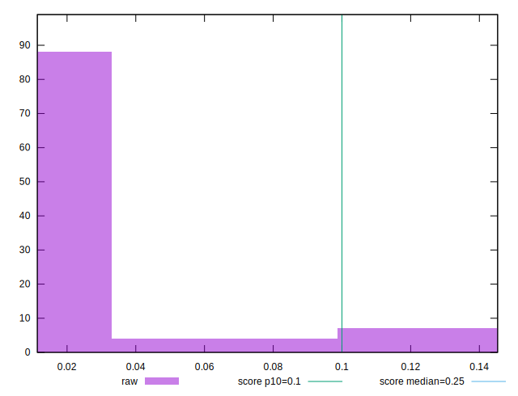
## Score


```yaml
p90min: 0.78
p90max: 1
p90range: 0.21999999999999997
p90mean: 0.9905376344086022
median: 1
p90stdev: 0.04463388922693447
mad: 0
stdevBySn: 0
lfitCenter: 0.9921425337070258
lfitStdev: 0.01899229869805056
mfitCenter: 0.9921425337070258
mfitStdev: 0.023803316482337446
mfitConfidence: 0.002392323319333202
p90skewness: -4.504990990027051
p90eccentricity: 0.9999999999999977
p90discretization: 46.5
outlandishness: 0.9877350462239077

```

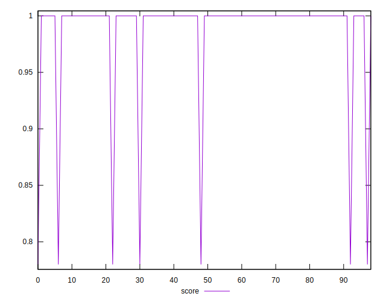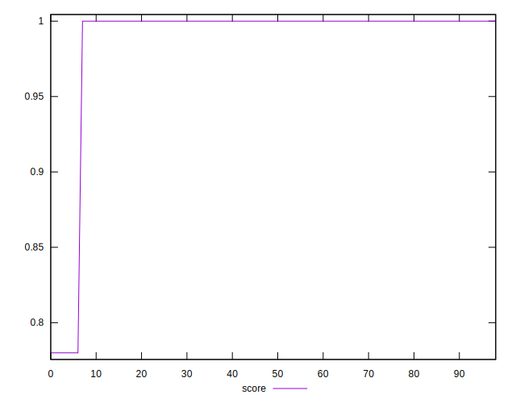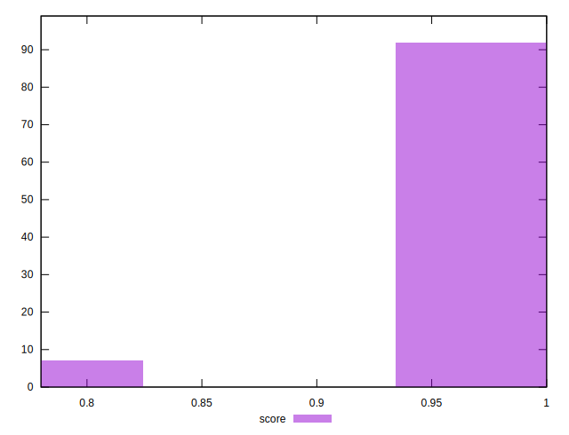
## Raw Estimate

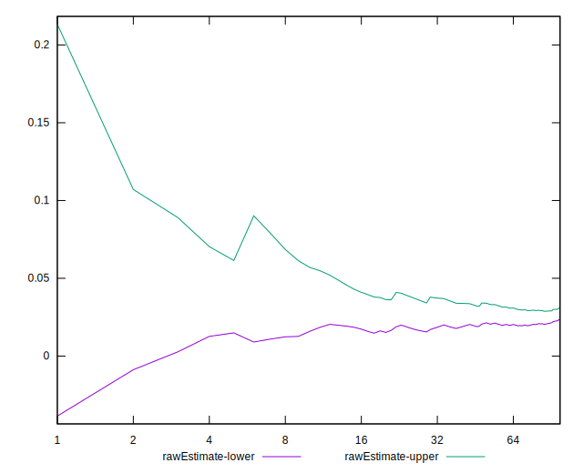
## Score Estimate

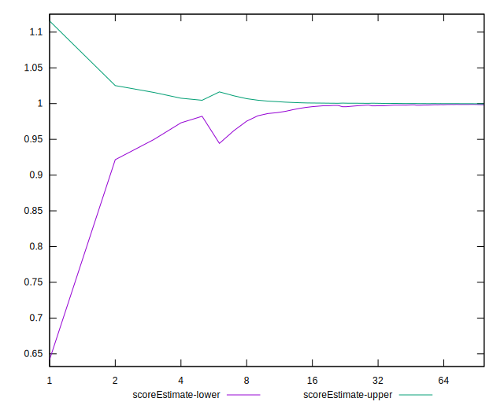
## P Score


```yaml
p90min: 0.7762113550987152
p90max: 0.9999923522960321
p90range: 0.22378099719731692
p90mean: 0.9894761311089187
median: 0.9985913434132248
p90stdev: 0.04522144424394848
mad: 0.0014010088828073641
stdevBySn: 0.0016708431936360627
lfitCenter: 0.991096224679893
lfitStdev: 0.019243934430549576
mfitCenter: 0.991096224679893
mfitStdev: 0.02411869510364955
mfitConfidence: 0.0024240200633875
p90skewness: -4.501924111364829
p90eccentricity: 1.0000000000000007
p90discretization: 6.2
outlandishness: 0.9876098044024637

```

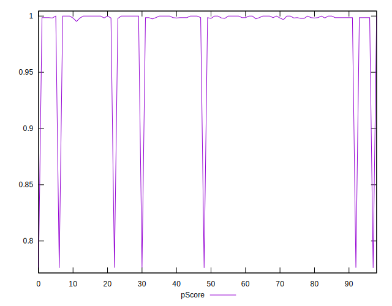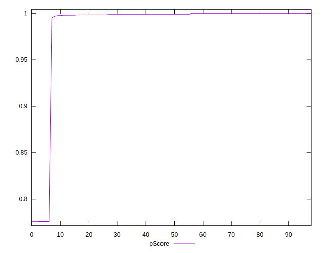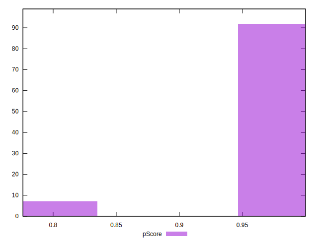
## Score Difference


```yaml
p90min: 0
p90max: 0
p90range: 0
p90mean: 0
median: 0
p90stdev: 0
mad: 0
stdevBySn: 0
lfitCenter: 0
lfitStdev: 0
mfitCenter: 0
mfitStdev: 0
mfitConfidence: 0
p90skewness: .nan
p90eccentricity: .nan
p90discretization: 93
outlandishness: .nan

```


## P Score Difference


```yaml
p90min: -0.003957341553551763
p90max: -0.000007647703967883501
p90range: 0.00394969384958388
p90mean: -0.0010526089281801781
median: -0.0014086565867752476
p90stdev: 0.0010609338484074348
mad: 0.0014010088828073641
stdevBySn: 0.0016708431936360627
lfitCenter: -0.0010453971459240558
lfitStdev: 0.0010135913892742859
mfitCenter: -0.0010453971459240558
mfitStdev: 0.0012703484189169995
mfitConfidence: 0.00012767481995663355
p90skewness: -0.7781816394669375
p90eccentricity: 0.9999999999999987
p90discretization: 6.2
outlandishness: 1.1267350122861157

```

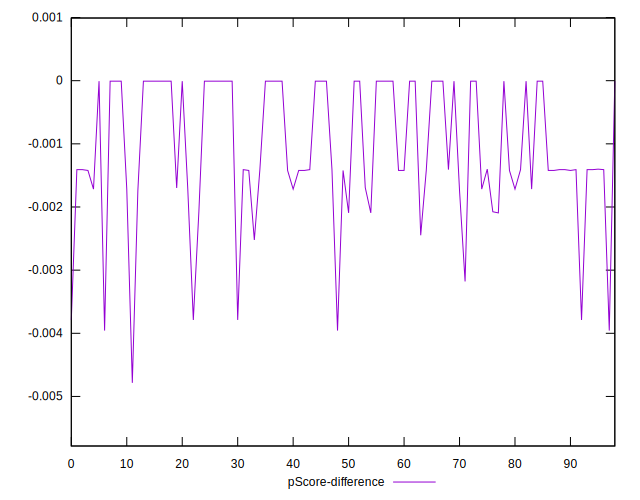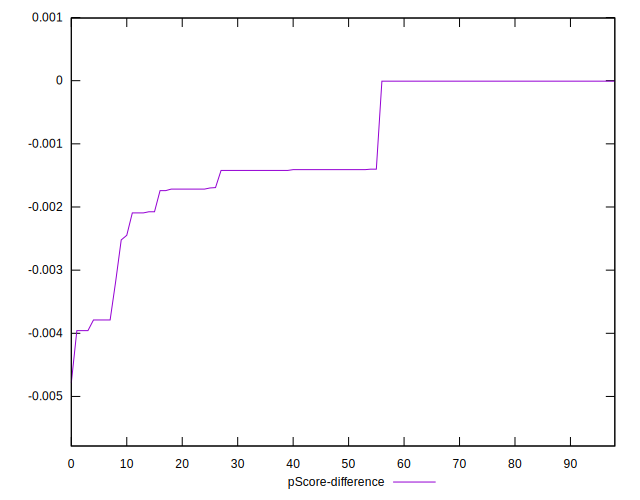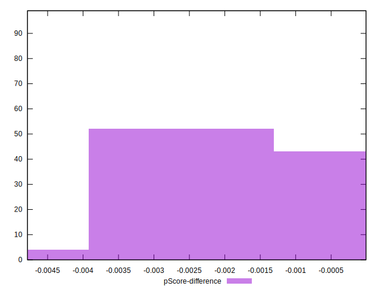