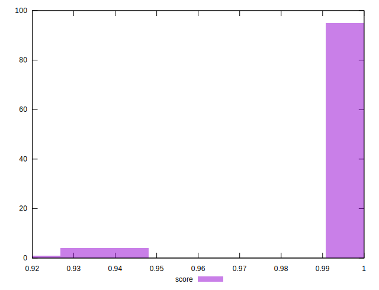

# //cumulative-layout-shift/samples/music

[→ Parent](../..)


## Raw


```yaml
p90min: 0.024215007887946234
p90max: 0.07998214350806344
p90range: 0.05576713562011721
p90mean: 0.027542235216632228
median: 0.025569988356696237
p90stdev: 0.00830763880403902
mad: 0.0013183593750000014
stdevBySn: 0.001572275390625002
lfitCenter: 0.027255164352725358
lfitStdev: 0.004659064296808544
mfitCenter: 0.027255164352725358
mfitStdev: 0.005839271155727771
mfitConfidence: 0.0005839271155727771
p90skewness: 5.406411430721894
p90eccentricity: 1.000000000000001
p90discretization: 3.1333333333333333
outlandishness: 1.0970917635002402

```


## Score


```yaml
p90min: 0.94
p90max: 1
p90range: 0.06000000000000005
p90mean: 0.9987234042553191
median: 1
p90stdev: 0.008658293595479071
mad: 0
stdevBySn: 0
lfitCenter: 0.9984339363302809
lfitStdev: 0.0038291680309310884
mfitCenter: 0.9984339363302809
mfitStdev: 0.004799150432151599
mfitConfidence: 0.0004799150432151599
p90skewness: -6.63488802697038
p90eccentricity: 0.9999999999999991
p90discretization: 47
outlandishness: 0.99615198334038

```


## Raw Estimate


## Score Estimate


## P Score


```yaml
p90min: 0.9445273909797813
p90max: 0.9994527833197606
p90range: 0.054925392339979284
p90mean: 0.9979014729587966
median: 0.9992859434260621
p90stdev: 0.007903493797117666
mad: 0.000162742715688724
stdevBySn: 0.00019408696273037225
lfitCenter: 0.9976330131570535
lfitStdev: 0.0038450986936531205
mfitCenter: 0.9976330131570535
mfitStdev: 0.0048191165569780176
mfitConfidence: 0.00048191165569780173
p90skewness: -6.548640107878251
p90eccentricity: 1.0000000000000009
p90discretization: 3.1333333333333333
outlandishness: 0.9960898173793173

```


## Score Difference


```yaml
p90min: 0
p90max: 1.1102230246251565e-16
p90range: 1.1102230246251565e-16
p90mean: 1.1810883240693154e-18
median: 0
p90stdev: 1.139000331521095e-17
mad: 0
stdevBySn: 0
lfitCenter: 2.1510305028010703e-18
lfitStdev: 5.2873683940481196e-18
mfitCenter: 2.1510305028010703e-18
mfitStdev: 6.626733564123762e-18
mfitConfidence: 6.626733564123762e-19
p90skewness: 9.539955591519908
p90eccentricity: 0.9999999999999996
p90discretization: 47
outlandishness: 14.137600000000003

```


## P Score Difference


```yaml
p90min: -0.003639572565241167
p90max: -9.885773777362772e-8
p90range: 0.0036394737075033934
p90mean: -0.0008655346518618033
median: -0.0007104363506350575
p90stdev: 0.0005697125774508391
mad: 0.00015912249238592135
stdevBySn: 0.00019408696273037225
lfitCenter: -0.0007868688096017886
lfitStdev: 0.0004141142307829192
mfitCenter: -0.0007868688096017886
mfitStdev: 0.0005190152204260215
mfitConfidence: 0.00005190152204260214
p90skewness: -3.128224200416773
p90eccentricity: 1.0000000000000009
p90discretization: 3.1333333333333333
outlandishness: 0.9676657370609949

```

