# //dom-size/samples/agenda

[→ Parent](../..)


## Raw


```yaml
p90min: 569
p90max: 781
p90range: 212
p90mean: 693.0425531914893
median: 781
p90stdev: 104.45317742573599
mad: 0
stdevBySn: 0
lfitCenter: 703.0065481212339
lfitStdev: 123.57716734811164
mfitCenter: 703.0065481212339
mfitStdev: 154.8810110426396
mfitConfidence: 15.488101104263961
p90skewness: -0.3454668136700233
p90eccentricity: 0.9999999999999989
p90discretization: 47
outlandishness: 0.996878380133283

```

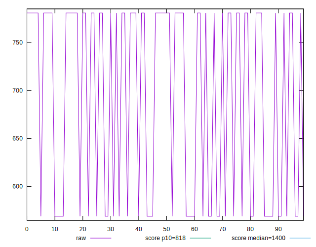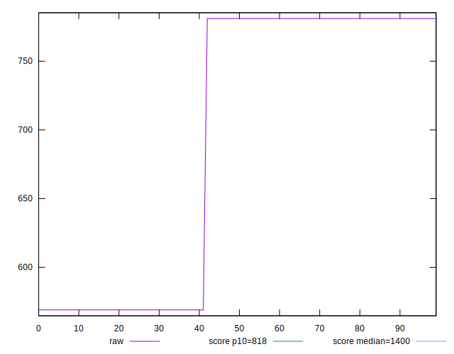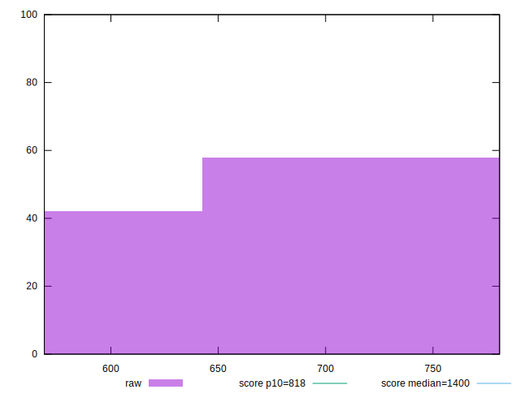
## Score


```yaml
p90min: 0.92
p90max: 0.98
p90range: 0.05999999999999994
p90mean: 0.9448936170212774
median: 0.92
p90stdev: 0.02956222002615167
mad: 0
stdevBySn: 0
lfitCenter: 0.9420736184562544
lfitStdev: 0.034974670004182445
mfitCenter: 0.9420736184562544
mfitStdev: 0.043834248408294106
mfitConfidence: 0.004383424840829411
p90skewness: 0.345466813669945
p90eccentricity: 0.9999999999999991
p90discretization: 47
outlandishness: 1.00064860772841

```

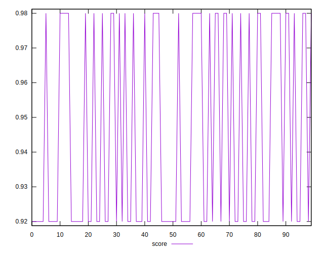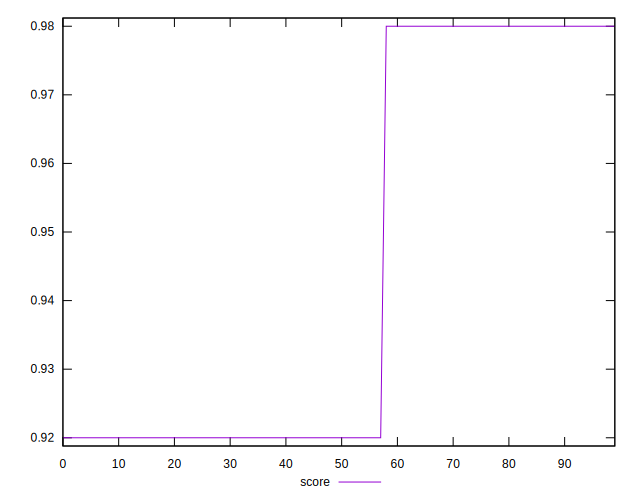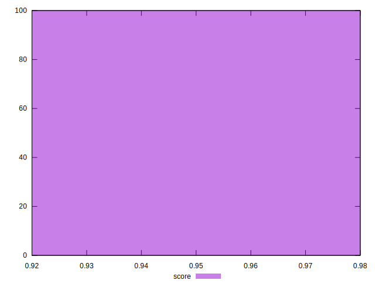
## Raw Estimate

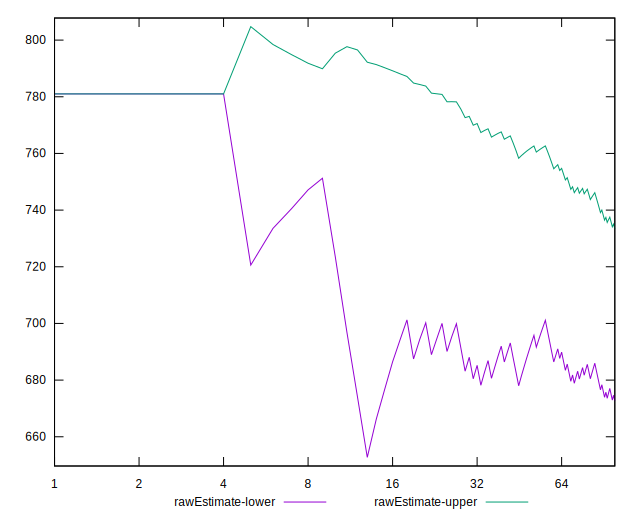
## Score Estimate

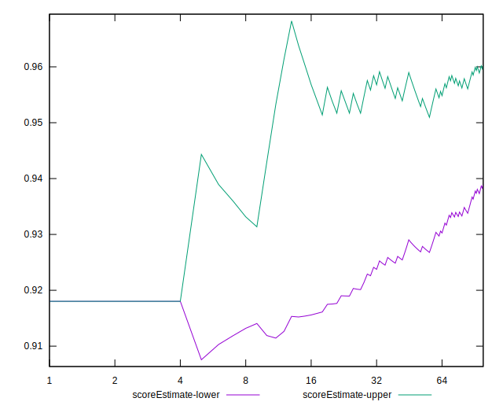
## P Score


```yaml
p90min: 0.9180298053112792
p90max: 0.9841121673367461
p90range: 0.06608236202546691
p90mean: 0.9454469555133345
median: 0.9180298053112792
p90stdev: 0.032559022100744385
mad: 0
stdevBySn: 0
lfitCenter: 0.9423410860785831
lfitStdev: 0.03852014674896048
mfitCenter: 0.9423410860785831
mfitStdev: 0.048277844540519095
mfitConfidence: 0.00482778445405191
p90skewness: 0.3454668136700699
p90eccentricity: 1.0000000000000013
p90discretization: 47
outlandishness: 1.0007139524122035

```

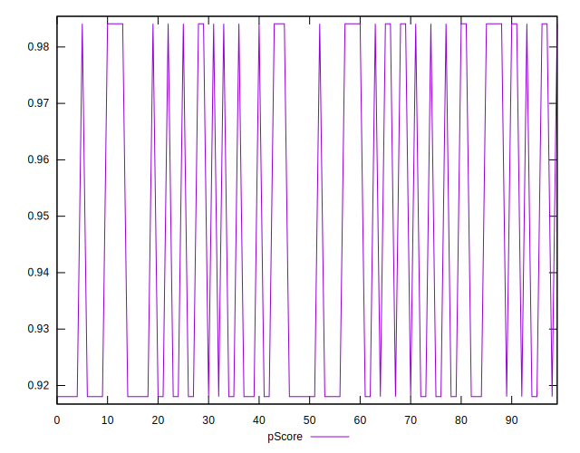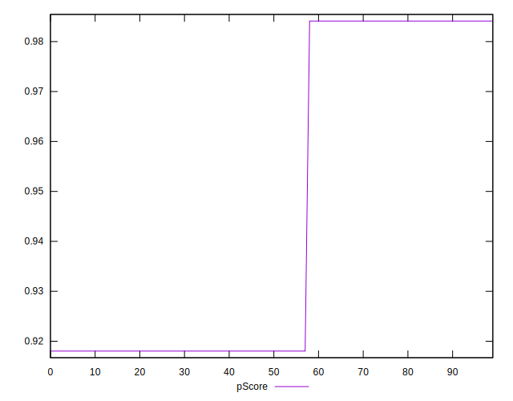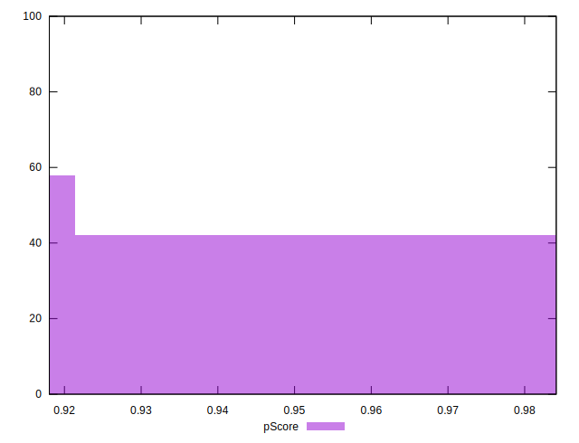
## Score Difference


```yaml
p90min: 0
p90max: 0
p90range: 0
p90mean: 0
median: 0
p90stdev: 0
mad: 0
stdevBySn: 0
lfitCenter: 0
lfitStdev: 0
mfitCenter: 0
mfitStdev: 0
mfitConfidence: 0
p90skewness: .nan
p90eccentricity: .nan
p90discretization: 94
outlandishness: .nan

```


## P Score Difference


```yaml
p90min: -0.001970194688720839
p90max: 0.004112167336746131
p90range: 0.00608236202546697
p90mean: 0.0005533384920580103
median: -0.001970194688720839
p90stdev: 0.002996802074592735
mad: 0
stdevBySn: 0
lfitCenter: 0.000267467622328656
lfitStdev: 0.003545476744777979
mfitCenter: 0.000267467622328656
mfitStdev: 0.004443596132224916
mfitConfidence: 0.00044435961322249163
p90skewness: 0.3454668136700251
p90eccentricity: 0.9999999999999997
p90discretization: 47
outlandishness: 1.1154105019207967

```

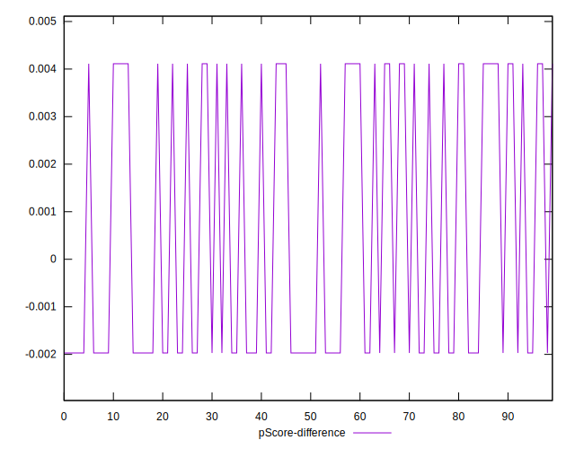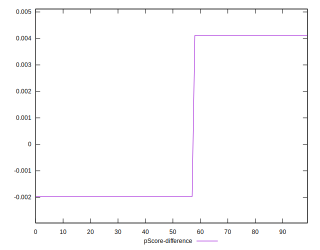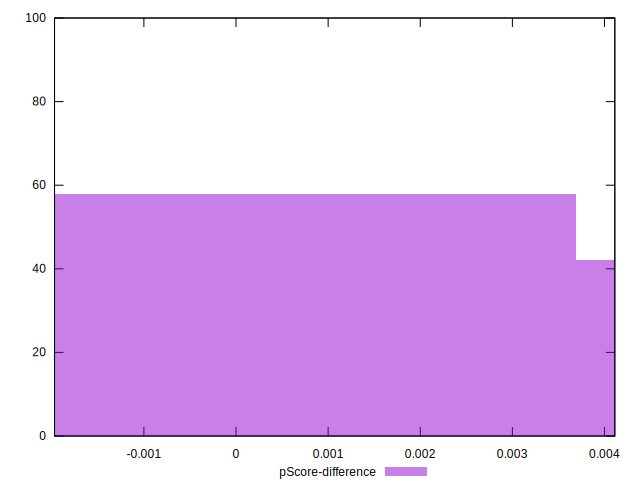