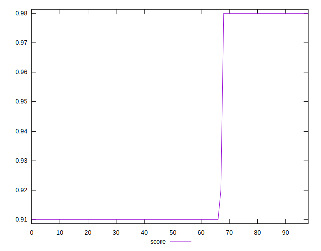

# //dom-size/samples/card

[→ Parent](../..)


## Raw


```yaml
p90min: 582
p90max: 794
p90range: 212
p90mean: 730.0430107526881
median: 794
p90stdev: 97.17293242069229
mad: 0
stdevBySn: 0
lfitCenter: 745.2340405618096
lfitStdev: 93.85610739917985
mfitCenter: 745.2340405618096
mfitStdev: 117.63118639515953
mfitConfidence: 11.822379058094029
p90skewness: -0.8667847848078643
p90eccentricity: 1.0000000000000002
p90discretization: 31
outlandishness: 0.9930316036592592

```


## Score


```yaml
p90min: 0.91
p90max: 0.98
p90range: 0.06999999999999995
p90mean: 0.9311827956989231
median: 0.91
p90stdev: 0.03205671930187365
mad: 0
stdevBySn: 0
lfitCenter: 0.9261707432311851
lfitStdev: 0.030950679693546132
mfitCenter: 0.9261707432311851
mfitStdev: 0.03879092445847822
mfitConfidence: 0.003898634596963408
p90skewness: 0.8642373962839603
p90eccentricity: 1
p90discretization: 31
outlandishness: 1.0017993950533375

```


## Raw Estimate


## Score Estimate


## P Score


```yaml
p90min: 0.9119035147238882
p90max: 0.9818408984193125
p90range: 0.06993738369542435
p90mean: 0.9330208261546148
median: 0.9119035147238882
p90stdev: 0.03204738219439912
mad: 0
stdevBySn: 0
lfitCenter: 0.928010494808623
lfitStdev: 0.030951339103273516
mfitCenter: 0.928010494808623
mfitStdev: 0.03879175090601267
mfitConfidence: 0.0038987176580658534
p90skewness: 0.8662690523720372
p90eccentricity: 0.9999999999999988
p90discretization: 31
outlandishness: 1.0018002926278256

```


## Score Difference


```yaml
p90min: 0
p90max: 0
p90range: 0
p90mean: 0
median: 0
p90stdev: 0
mad: 0
stdevBySn: 0
lfitCenter: 0
lfitStdev: 0
mfitCenter: 0
mfitStdev: 0
mfitConfidence: 0
p90skewness: .nan
p90eccentricity: .nan
p90discretization: 93
outlandishness: .nan

```


## P Score Difference


```yaml
p90min: 0.0018408984193125644
p90max: 0.0019035147238881667
p90range: 0.0000626163045756023
p90mean: 0.0018839892095581401
median: 0.0019035147238881667
p90stdev: 0.000029006375892761172
mad: 0
stdevBySn: 0
lfitCenter: 0.0018683481278906873
lfitStdev: 0.0000669254312269721
mfitCenter: 0.0018683481278906873
mfitStdev: 0.00008387858918710257
mfitConfidence: 0.000008430115402363054
p90skewness: -0.8124171045245996
p90eccentricity: 1
p90discretization: 46.5
outlandishness: 0.9539527135542547

```

