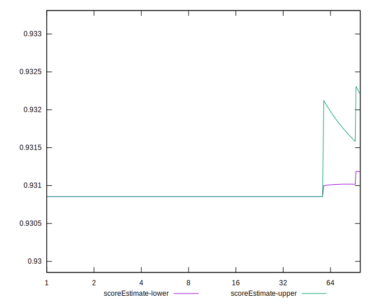

# //dom-size/samples/music

[→ Parent](../..)


## Raw


```yaml
p90min: 752
p90max: 752
p90range: 0
p90mean: 752
median: 752
p90stdev: 0
mad: 0
stdevBySn: 0
lfitCenter: 750.0006098390452
lfitStdev: 4.964461879221154
mfitCenter: 750.0006098390452
mfitStdev: 6.222030263652619
mfitConfidence: 0.6222030263652619
p90skewness: .nan
p90eccentricity: .nan
p90discretization: 94
outlandishness: 0.9887551946582163

```


## Score


```yaml
p90min: 0.93
p90max: 0.93
p90range: 0
p90mean: 0.9300000000000017
median: 0.93
p90stdev: 1.6653345369377348e-15
mad: 0
stdevBySn: 0
lfitCenter: 0.9305658651398929
lfitStdev: 0.0014050363809116472
mfitCenter: 0.9305658651398929
mfitStdev: 0.0017609519614111184
mfitConfidence: 0.00017609519614111184
p90skewness: -1
p90eccentricity: 1
p90discretization: 94
outlandishness: 1.0025823100936528

```


## Raw Estimate


## Score Estimate


## P Score


```yaml
p90min: 0.9308540313791123
p90max: 0.9308540313791123
p90range: 0
p90mean: 0.9308540313791126
median: 0.9308540313791123
p90stdev: 3.3306690738754696e-16
mad: 0
stdevBySn: 0
lfitCenter: 0.9313972810155515
lfitStdev: 0.0013488823560654562
mfitCenter: 0.9313972810155515
mfitStdev: 0.0016905733281334034
mfitConfidence: 0.00016905733281334033
p90skewness: -1
p90eccentricity: 1
p90discretization: 94
outlandishness: 1.0024767651260642

```


## Score Difference


```yaml
p90min: 0
p90max: 0
p90range: 0
p90mean: 0
median: 0
p90stdev: 0
mad: 0
stdevBySn: 0
lfitCenter: 0
lfitStdev: 0
mfitCenter: 0
mfitStdev: 0
mfitConfidence: 0
p90skewness: .nan
p90eccentricity: .nan
p90discretization: 94
outlandishness: .nan

```


## P Score Difference


```yaml
p90min: 0.0008540313791122189
p90max: 0.0008540313791122189
p90range: 0
p90mean: 0.0008540313791122189
median: 0.0008540313791122189
p90stdev: 0
mad: 0
stdevBySn: 0
lfitCenter: 0.0008314158756583522
lfitStdev: 0.000056154024846499225
mfitCenter: 0.0008314158756583522
mfitStdev: 0.00007037863327810131
mfitConfidence: 0.000007037863327810132
p90skewness: .nan
p90eccentricity: .nan
p90discretization: 94
outlandishness: 0.890840380161601

```

