# //estimated-input-latency/samples/agenda

[→ Parent](../..)


## Raw


```yaml
p90min: 12.8
p90max: 416
p90range: 403.2
p90mean: 113.75744680851061
median: 12.8
p90stdev: 119.69864597730574
mad: 0
stdevBySn: 0
lfitCenter: 102.3371782048067
lfitStdev: 124.0135282594275
mfitCenter: 102.3371782048067
mfitStdev: 155.42790834231397
mfitConfidence: 15.542790834231397
p90skewness: 0.7502422463497032
p90eccentricity: 0.9999999999999991
p90discretization: 2.088888888888889
outlandishness: 1.1437627596365803

```

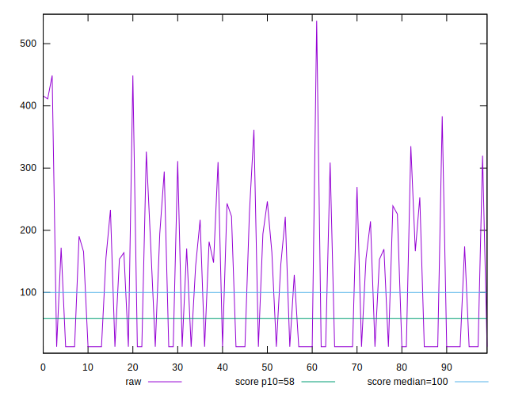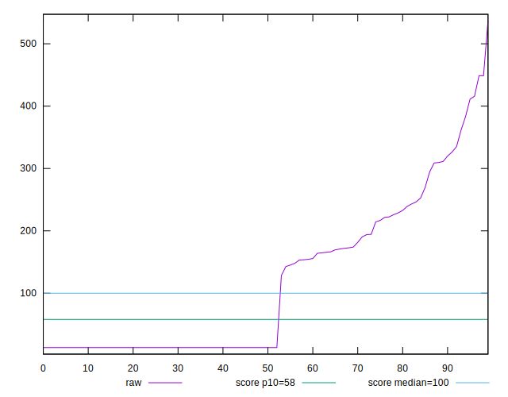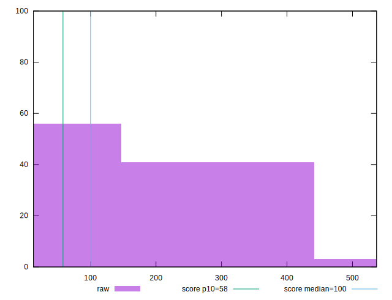
## Score


```yaml
p90min: 0
p90max: 1
p90range: 1
p90mean: 0.5640425531914892
median: 1
p90stdev: 0.4671377744487011
mad: 0
stdevBySn: 0
lfitCenter: 0.5925878111990945
lfitStdev: 0.5642865232309053
mfitCenter: 0.5925878111990945
mfitStdev: 0.7072282777735482
mfitConfidence: 0.07072282777735482
p90skewness: -0.15721742061320595
p90eccentricity: 1.0000000000000004
p90discretization: 5.529411764705882
outlandishness: 0.9864213633254558

```

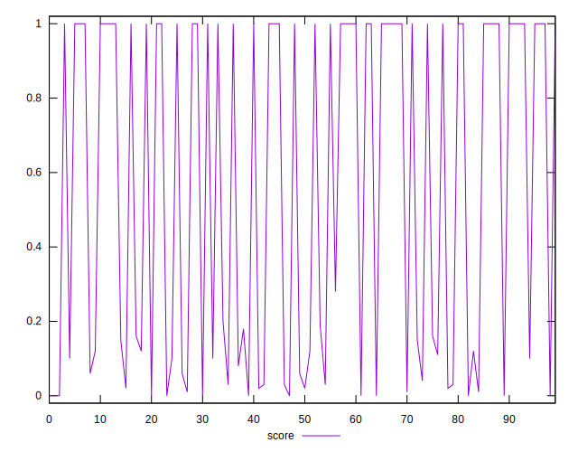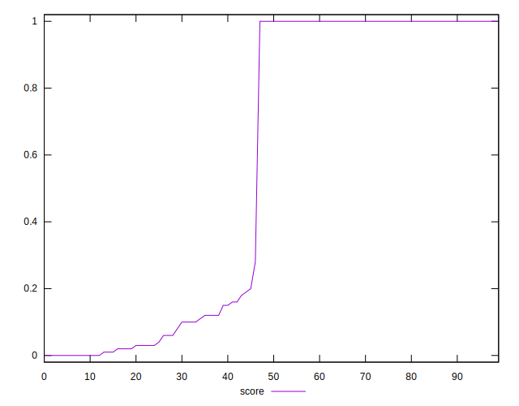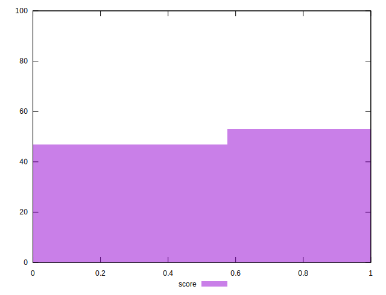
## Raw Estimate

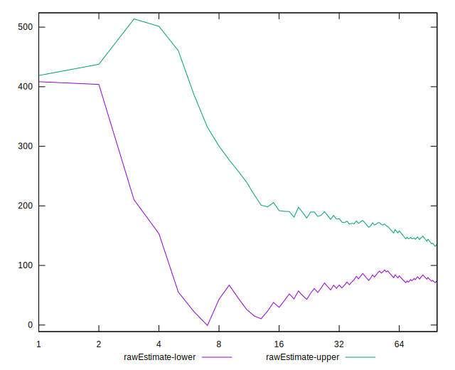
## Score Estimate

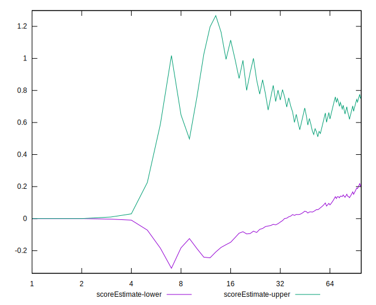
## P Score


```yaml
p90min: 0.000398696953468225
p90max: 0.9999993380488856
p90range: 0.9996006410954175
p90mean: 0.5641065678354519
median: 0.9999993380488856
p90stdev: 0.46701682292133
mad: 0
stdevBySn: 0
lfitCenter: 0.5925335001213782
lfitStdev: 0.5643608299894086
mfitCenter: 0.5925335001213782
mfitStdev: 0.7073214074845722
mfitConfidence: 0.07073214074845721
p90skewness: -0.15658619329430232
p90eccentricity: 1.0000000000000002
p90discretization: 2.088888888888889
outlandishness: 0.9864251708692644

```

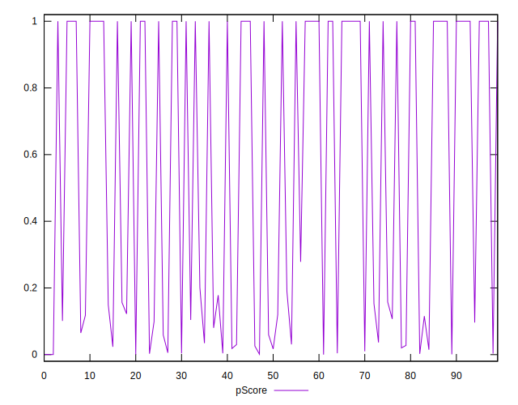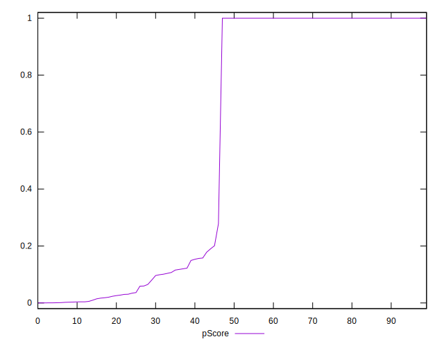
## Score Difference


```yaml
p90min: 0
p90max: 0
p90range: 0
p90mean: 0
median: 0
p90stdev: 0
mad: 0
stdevBySn: 0
lfitCenter: 0
lfitStdev: 0
mfitCenter: 0
mfitStdev: 0
mfitConfidence: 0
p90skewness: .nan
p90eccentricity: .nan
p90discretization: 94
outlandishness: .nan

```

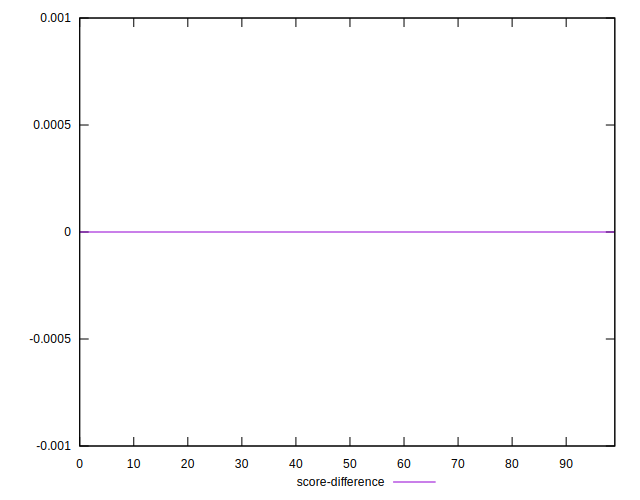
## P Score Difference


```yaml
p90min: -0.003729104063334626
p90max: 0.00399297598118975
p90range: 0.0077220800445243765
p90mean: 0.00006314892603855099
median: -6.619511143668433e-7
p90stdev: 0.0014724025221507157
mad: 0
stdevBySn: 0
lfitCenter: 0.00003988003001572892
lfitStdev: 0.000724443481950954
mfitCenter: 0.00003988003001572892
mfitStdev: 0.0009079552585288203
mfitConfidence: 0.00009079552585288203
p90skewness: 0.3067056274909993
p90eccentricity: 1.0000000000000009
p90discretization: 2.292682926829268
outlandishness: 1.0484248101268905

```

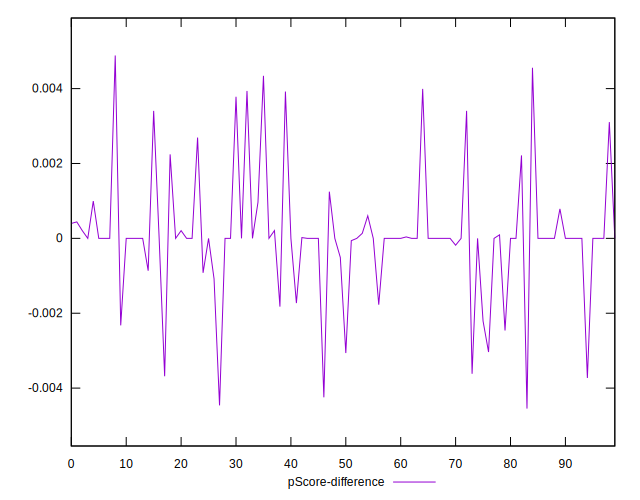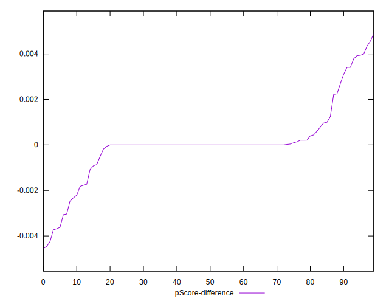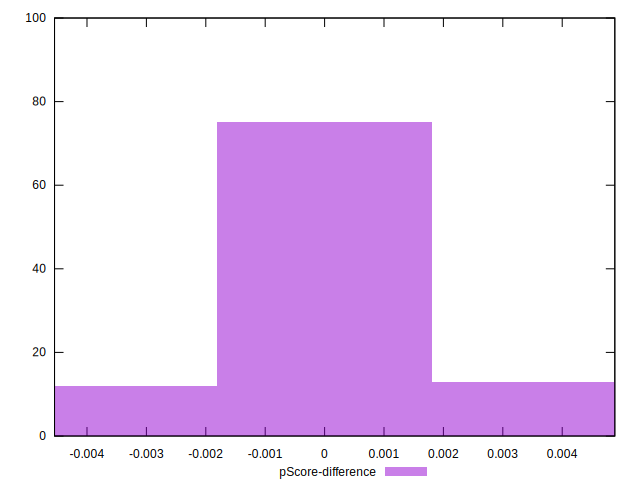