# //estimated-input-latency/samples/astro

[→ Parent](../..)


## Raw


```yaml
p90min: 93.60000000000001
p90max: 561.6
p90range: 468
p90mean: 220.7148936170212
median: 196.6000000000002
p90stdev: 87.70415313965331
mad: 48.20000000000017
stdevBySn: 66.78560000000024
lfitCenter: 219.6911306767481
lfitStdev: 71.84814449275282
mfitCenter: 219.6911306767481
mfitStdev: 90.04829532326434
mfitConfidence: 9.004829532326434
p90skewness: 1.5049436188986611
p90eccentricity: 1.0000000000000002
p90discretization: 1.010752688172043
outlandishness: 1.1329383634697001

```

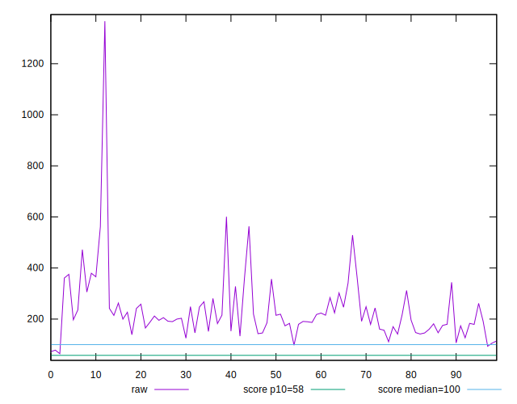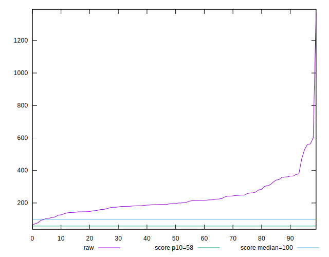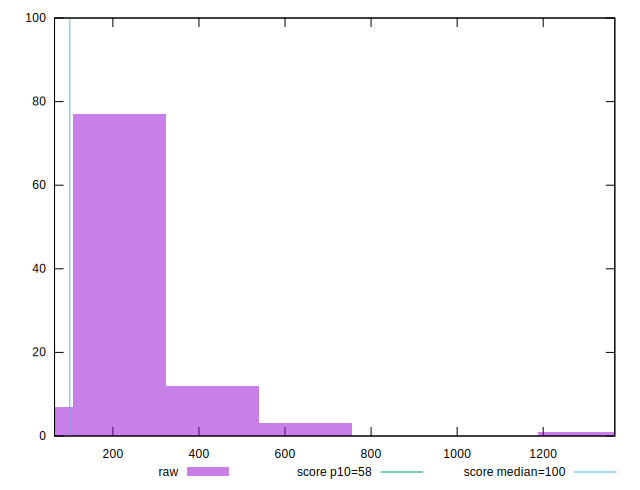
## Score


```yaml
p90min: 0
p90max: 0.56
p90range: 0.56
p90mean: 0.09393617021276594
median: 0.06
p90stdev: 0.11855708818877438
mad: 0.049999999999999996
stdevBySn: 0.07155600000000001
lfitCenter: 0.08696979067718663
lfitStdev: 0.08978753395813167
mfitCenter: 0.08696979067718663
mfitStdev: 0.11253198577765645
mfitConfidence: 0.011253198577765645
p90skewness: 2.0520021110711135
p90eccentricity: 0.9999999999999996
p90discretization: 3.357142857142857
outlandishness: 1.4165043323684192

```

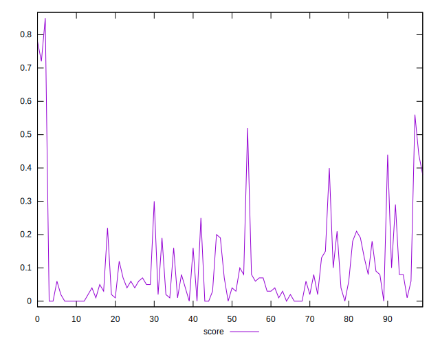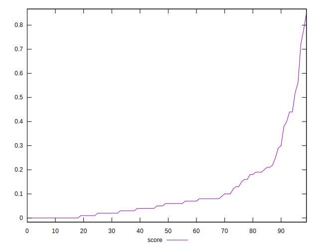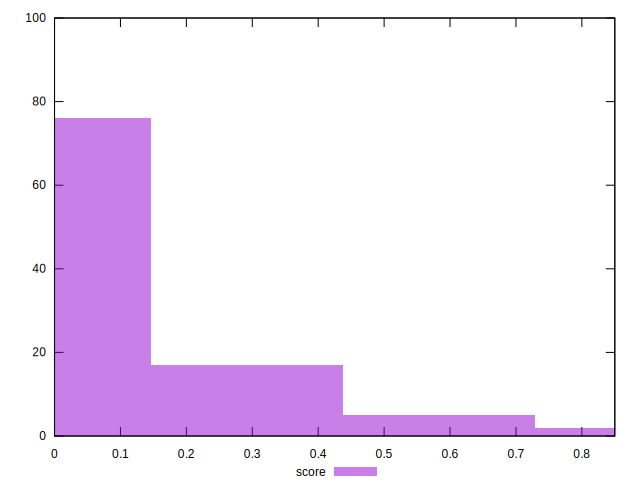
## Raw Estimate

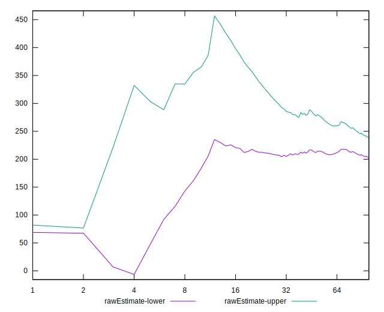
## Score Estimate

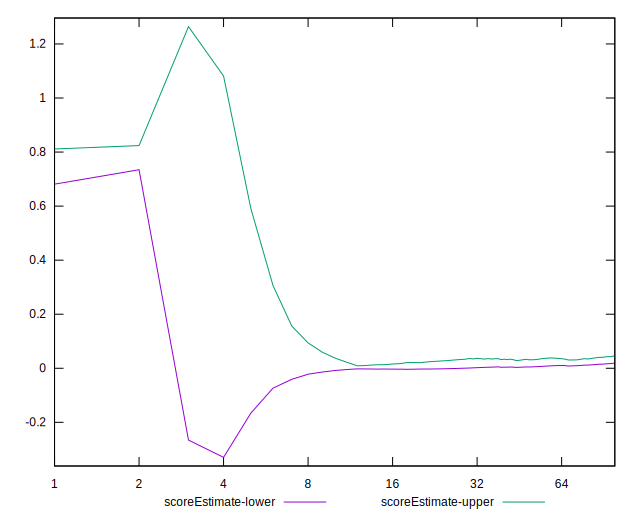
## P Score


```yaml
p90min: 0.00002457241500336549
p90max: 0.5618273106301608
p90range: 0.5618027382151574
p90mean: 0.09407280101408201
median: 0.05587900224543124
p90stdev: 0.11863200640532595
mad: 0.045030288211946046
stdevBySn: 0.06540256461482716
lfitCenter: 0.08691598421381508
lfitStdev: 0.08985761999947986
mfitCenter: 0.08691598421381508
mfitStdev: 0.11261982560419499
mfitConfidence: 0.0112619825604195
p90skewness: 2.0629547506728487
p90eccentricity: 1.0000000000000007
p90discretization: 1.0217391304347827
outlandishness: 1.4137687555851728

```

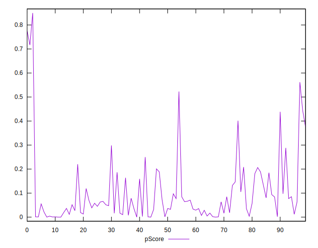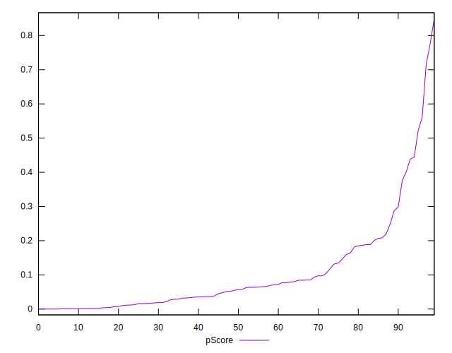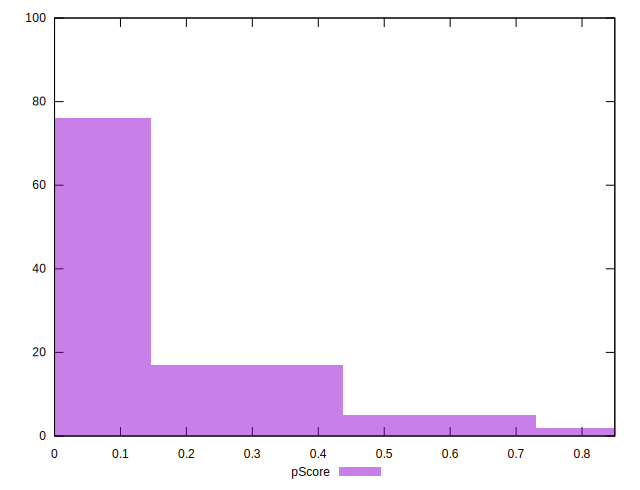
## Score Difference


```yaml
p90min: 0
p90max: 0
p90range: 0
p90mean: 0
median: 0
p90stdev: 0
mad: 0
stdevBySn: 0
lfitCenter: 0
lfitStdev: 0
mfitCenter: 0
mfitStdev: 0
mfitConfidence: 0
p90skewness: .nan
p90eccentricity: .nan
p90discretization: 94
outlandishness: .nan

```


## P Score Difference


```yaml
p90min: -0.004485478758013639
p90max: 0.00493726616220716
p90range: 0.009422744920220799
p90mean: 0.000054261110942125726
median: 0.00003459898416088847
p90stdev: 0.0026744645967369217
mad: 0.0023836386998291534
stdevBySn: 0.0031774299406867284
lfitCenter: 0.00004717853613020946
lfitStdev: 0.002338562767542285
mfitCenter: 0.00004717853613020946
mfitStdev: 0.0029309537805096582
mfitConfidence: 0.0002930953780509658
p90skewness: 0.06700060883579477
p90eccentricity: 0.9999999999999999
p90discretization: 1.0217391304347827
outlandishness: 1.0069589237605856

```

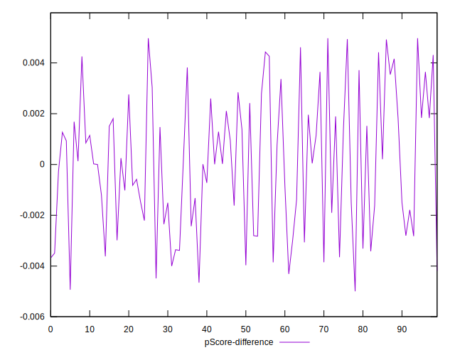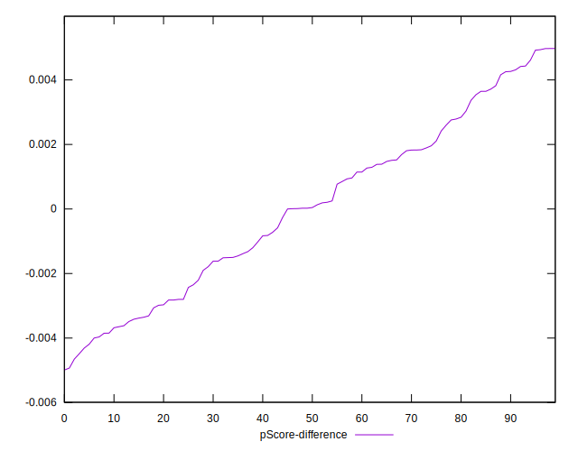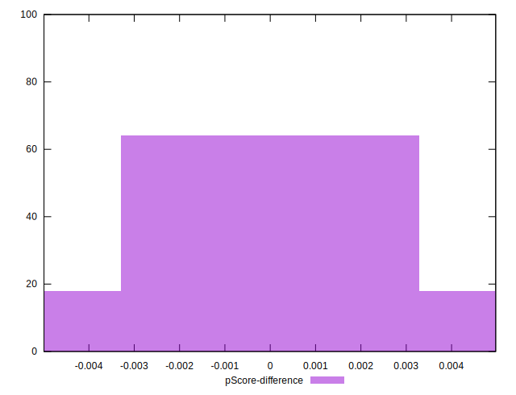