# //estimated-input-latency/samples/card

[→ Parent](../..)


## Raw


```yaml
p90min: 12.8
p90max: 365.6
p90range: 352.8
p90mean: 122.17634408602156
median: 137.6
p90stdev: 106.17360083595078
mad: 124.8
stdevBySn: 148.83648000000002
lfitCenter: 121.78667205943802
lfitStdev: 109.50595547781239
mfitCenter: 121.78667205943802
mfitStdev: 137.24536225868613
mfitConfidence: 13.793677903892902
p90skewness: 0.3273426477453574
p90eccentricity: 1.0000000000000002
p90discretization: 1.7547169811320755
outlandishness: 1.168562757465472

```

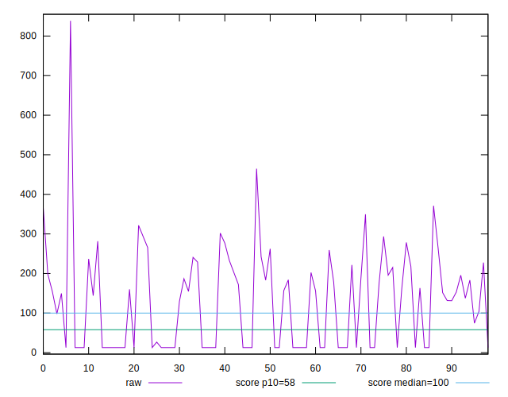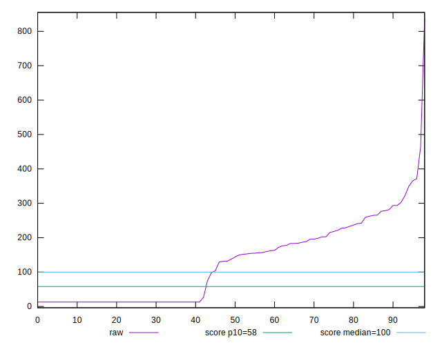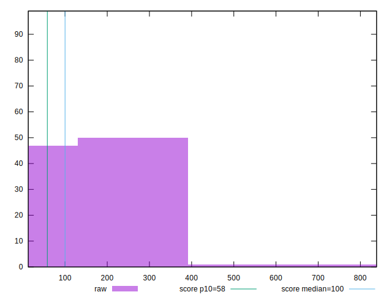
## Score


```yaml
p90min: 0
p90max: 1
p90range: 1
p90mean: 0.49118279569892465
median: 0.23
p90stdev: 0.45456312350695466
mad: 0.23
stdevBySn: 0.27429800000000004
lfitCenter: 0.4759209497474802
lfitStdev: 0.5249547810979542
mfitCenter: 0.4759209497474802
mfitStdev: 0.6579332492634702
mfitConfidence: 0.06612477954261527
p90skewness: 0.1663053111467639
p90eccentricity: 1.0000000000000018
p90discretization: 3.72
outlandishness: 1.002177057937265

```

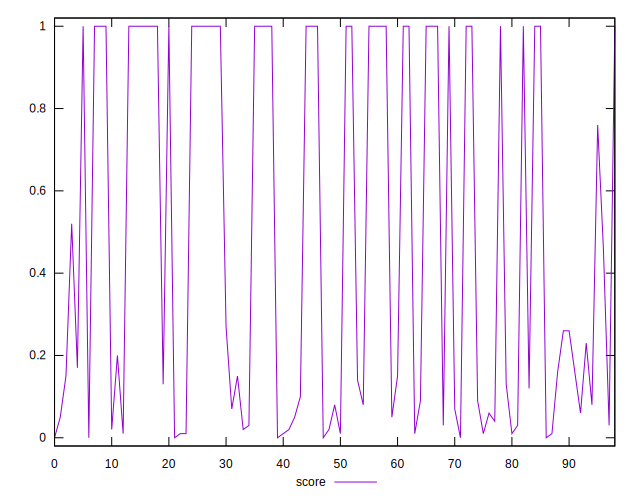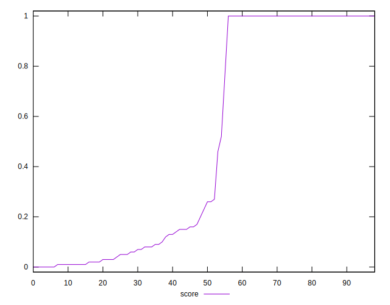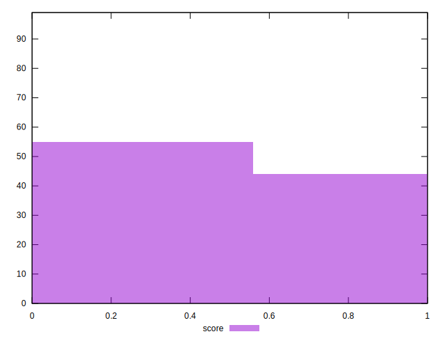
## Raw Estimate

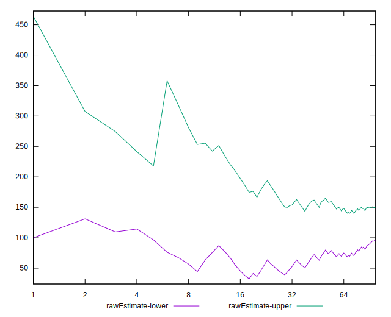
## Score Estimate

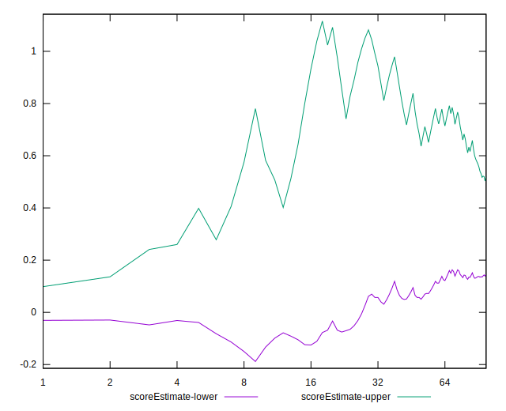
## P Score


```yaml
p90min: 0.0011446488920791031
p90max: 0.9999993380488856
p90range: 0.9988546891568065
p90mean: 0.4910887759816918
median: 0.22635030840124792
p90stdev: 0.45461007316304397
mad: 0.22520565950916882
stdevBySn: 0.26994503980089535
lfitCenter: 0.4758661115982053
lfitStdev: 0.5248020789462041
mfitCenter: 0.4758661115982053
mfitStdev: 0.6577418654976906
mfitConfidence: 0.06610554475043176
p90skewness: 0.1661121877723521
p90eccentricity: 0.9999999999999997
p90discretization: 1.7547169811320755
outlandishness: 1.002248653397791

```

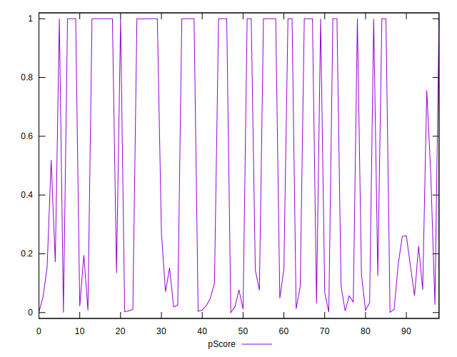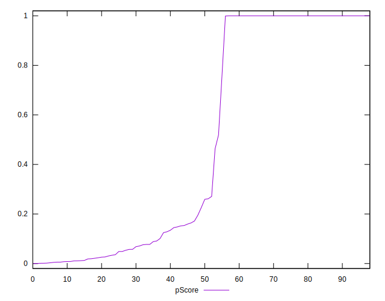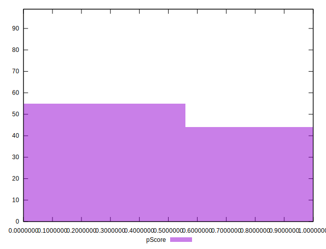
## Score Difference


```yaml
p90min: 0
p90max: 0
p90range: 0
p90mean: 0
median: 0
p90stdev: 0
mad: 0
stdevBySn: 0
lfitCenter: 0
lfitStdev: 0
mfitCenter: 0
mfitStdev: 0
mfitConfidence: 0
p90skewness: .nan
p90eccentricity: .nan
p90discretization: 93
outlandishness: .nan

```


## P Score Difference


```yaml
p90min: -0.004310990784952361
p90max: 0.00441669651107407
p90range: 0.00872768729602643
p90mean: -0.00009208533439511777
median: -6.619511143668433e-7
p90stdev: 0.0017683194327888
mad: 0.0008693789114095352
stdevBySn: 0.0010379487310789297
lfitCenter: -0.000059216914065736334
lfitStdev: 0.0010721960427564085
mfitCenter: -0.000059216914065736334
mfitStdev: 0.0013437984597125285
mfitConfidence: 0.0001350568268098174
p90skewness: -0.06540072169468267
p90eccentricity: 0.9999999999999997
p90discretization: 1.86
outlandishness: 0.6912586953094197

```

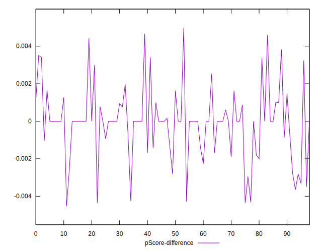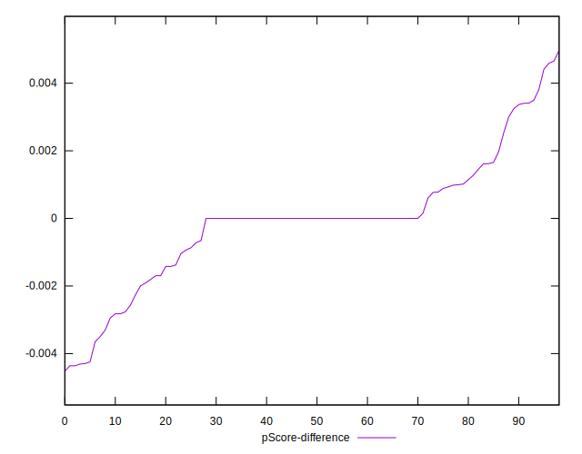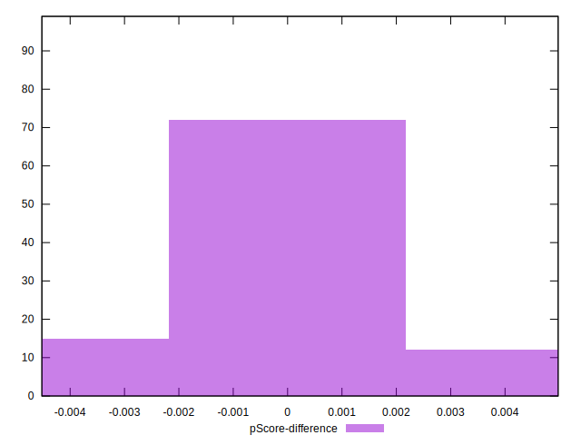