# //estimated-input-latency/samples/music

[→ Parent](../..)


## Raw


```yaml
p90min: 127.60000000000001
p90max: 483.1999999999993
p90range: 355.5999999999993
p90mean: 270.99999999999994
median: 262.4
p90stdev: 85.07299994210233
mad: 64.00000000000001
stdevBySn: 97.07764000000003
lfitCenter: 270.09715208736975
lfitStdev: 75.78180963987829
mfitCenter: 270.09715208736975
mfitStdev: 94.97841346858283
mfitConfidence: 9.497841346858284
p90skewness: 0.38927150471198885
p90eccentricity: 1
p90discretization: 1.0681818181818181
outlandishness: 1.0325859451804844

```

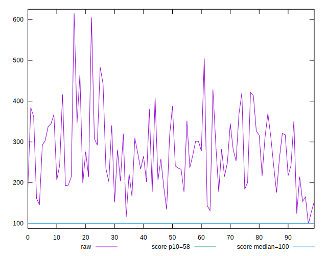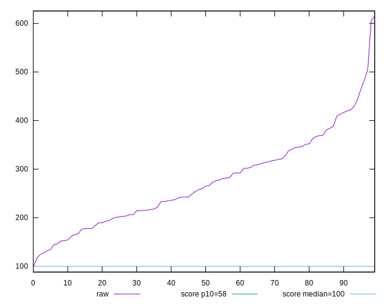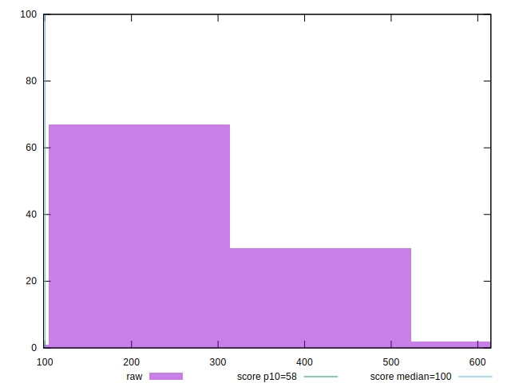
## Score


```yaml
p90min: 0
p90max: 0.28
p90range: 0.28
p90mean: 0.03840425531914893
median: 0.01
p90stdev: 0.060164724086838914
mad: 0.01
stdevBySn: 0.011926
lfitCenter: 0.03361503610878393
lfitStdev: 0.0462906591326104
mfitCenter: 0.03361503610878393
mfitStdev: 0.05801673757493239
mfitConfidence: 0.005801673757493239
p90skewness: 2.2028613638041805
p90eccentricity: 0.9999999999999988
p90discretization: 4.947368421052632
outlandishness: 1.5621537587955892

```

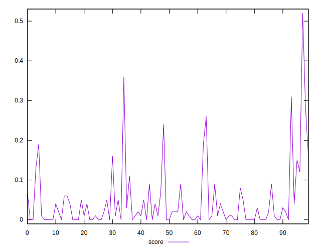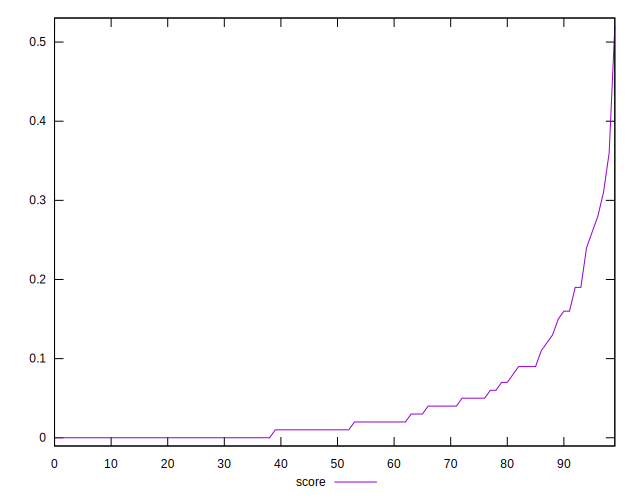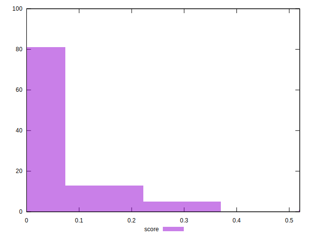
## Raw Estimate

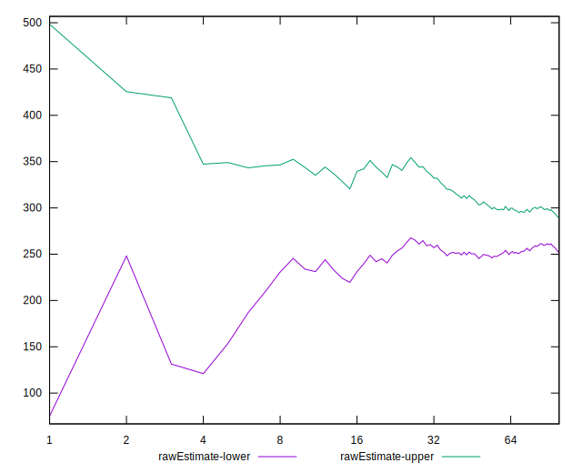
## Score Estimate

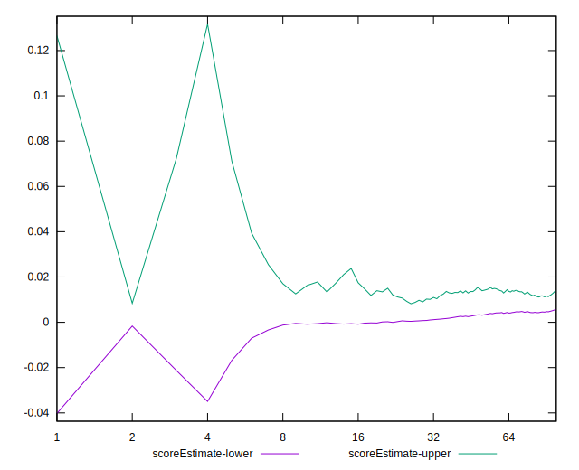
## P Score


```yaml
p90min: 0.00010529499850564505
p90max: 0.28318303184174765
p90range: 0.283077736843242
p90mean: 0.03905083667300931
median: 0.011634854877108108
p90stdev: 0.06007460587236229
mad: 0.011192689990244503
stdevBySn: 0.01386325447953298
lfitCenter: 0.034149989551646824
lfitStdev: 0.045567856610385225
mfitCenter: 0.034149989551646824
mfitStdev: 0.05711083895442873
mfitConfidence: 0.005711083895442873
p90skewness: 2.247423173038559
p90eccentricity: 0.9999999999999997
p90discretization: 1.0681818181818181
outlandishness: 1.5462347284764397

```

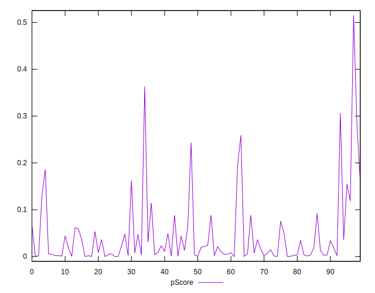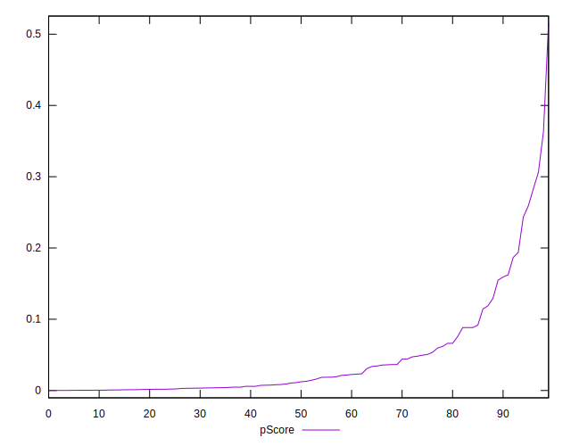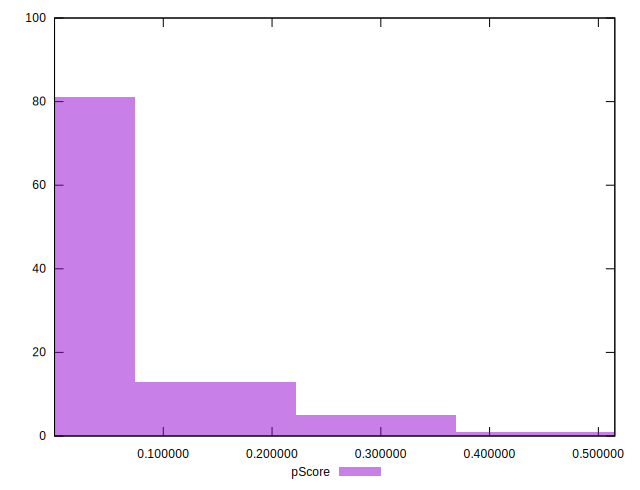
## Score Difference


```yaml
p90min: 0
p90max: 0
p90range: 0
p90mean: 0
median: 0
p90stdev: 0
mad: 0
stdevBySn: 0
lfitCenter: 0
lfitStdev: 0
mfitCenter: 0
mfitStdev: 0
mfitConfidence: 0
p90skewness: .nan
p90eccentricity: .nan
p90discretization: 94
outlandishness: .nan

```


## P Score Difference


```yaml
p90min: -0.004149878858639202
p90max: 0.004491380642152265
p90range: 0.008641259500791467
p90mean: 0.0005861385322391864
median: 0.0006571857742483506
p90stdev: 0.002483886614414627
mad: 0.002249421710842553
stdevBySn: 0.003054656748191971
lfitCenter: 0.0006440743868291302
lfitStdev: 0.002060569217961357
mfitCenter: 0.0006440743868291302
mfitStdev: 0.0025825405343867748
mfitConfidence: 0.0002582540534386775
p90skewness: -0.3077384750275718
p90eccentricity: 1.0000000000000002
p90discretization: 1.0561797752808988
outlandishness: 0.9089315978618768

```

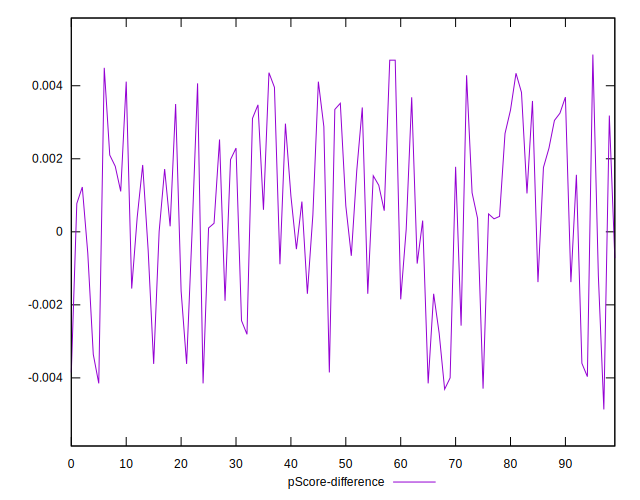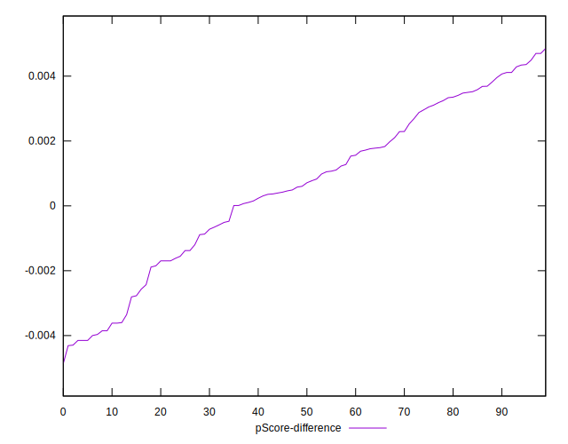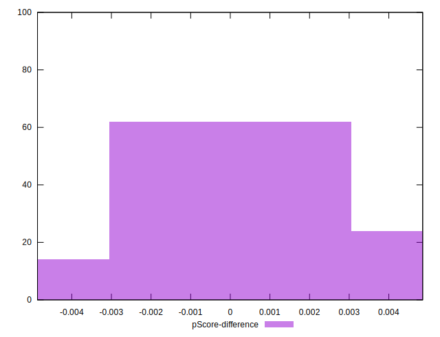