# //first-contentful-paint

[→ Parent](..)

[0=music](samples/music)  
[1=agenda](samples/agenda)  
[2=card](samples/card)  
[3=astro](samples/astro)  

## Progression

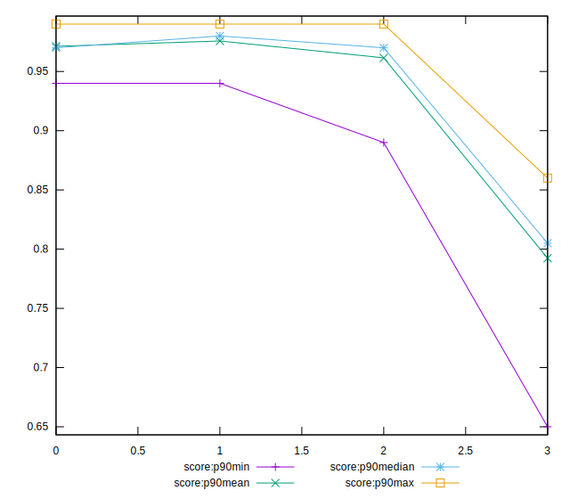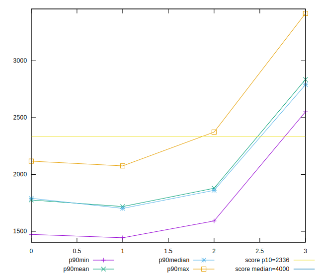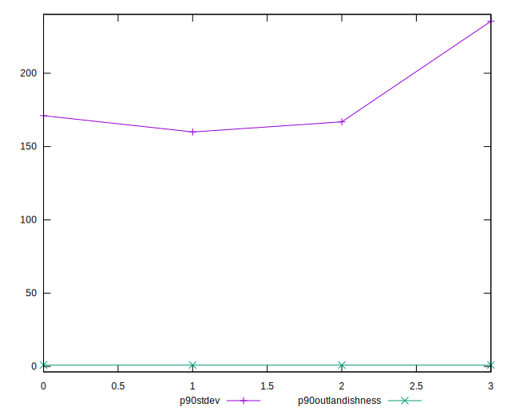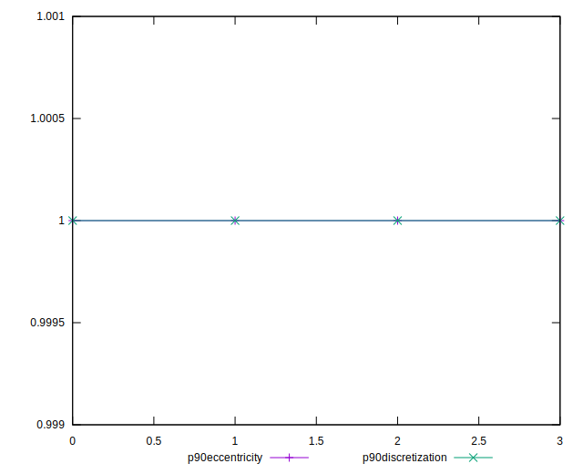
## Overall Histogram

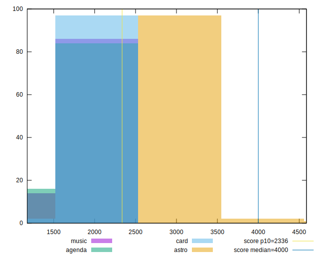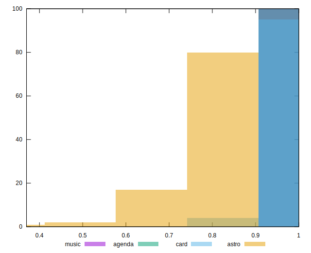
## Overall Sorted

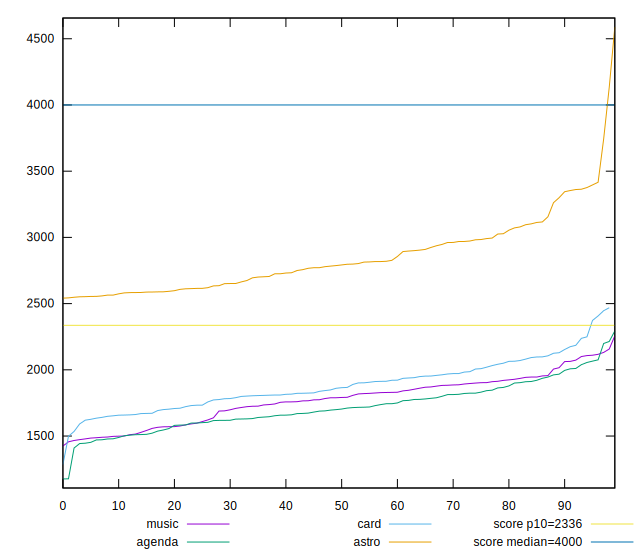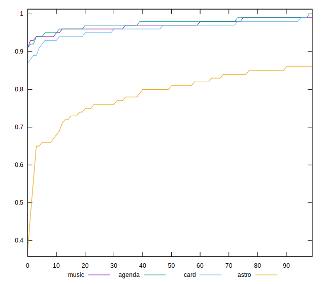
## Histogram comparison

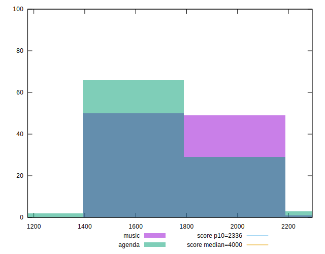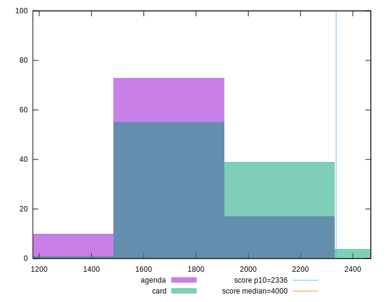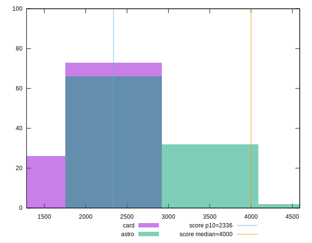
## Sorted comparisons

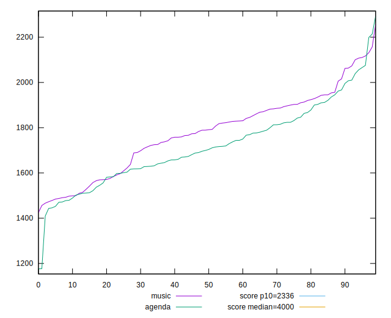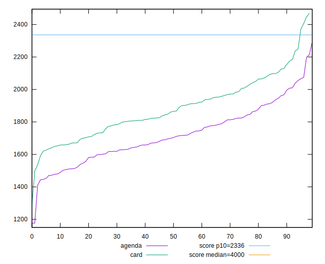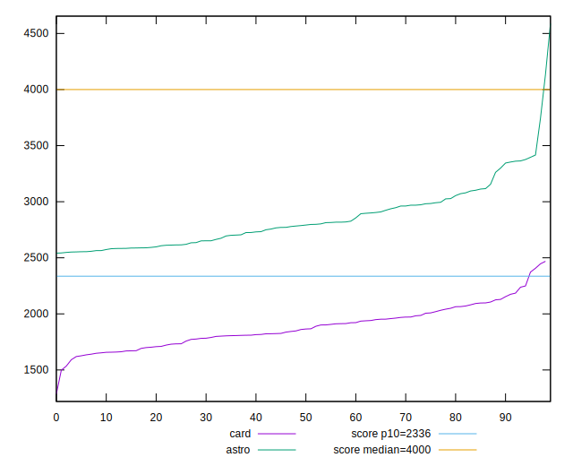
## Line plot comparisons

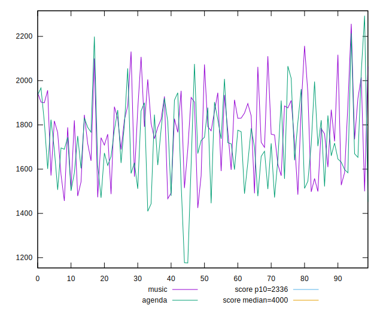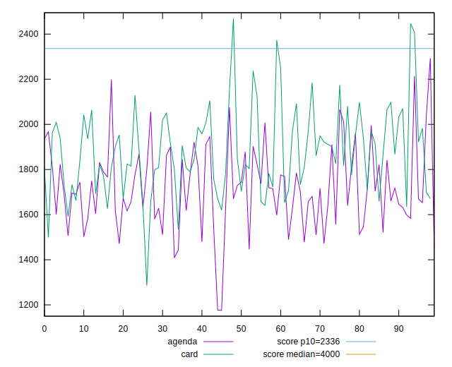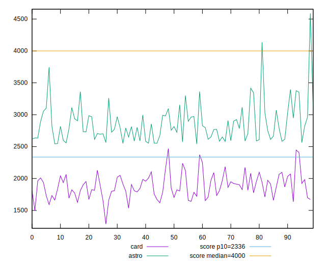