# //first-contentful-paint/samples/astro

[→ Parent](../..)


## Raw


```yaml
p90min: 2551.402
p90max: 3416.3820000000005
p90range: 864.9800000000005
p90mean: 2835.5365265957457
median: 2789.6344999999997
p90stdev: 235.46176891650416
mad: 179.44350000000077
stdevBySn: 245.70690575000017
lfitCenter: 2832.896169316745
lfitStdev: 210.4799499503352
mfitCenter: 2832.896169316745
mfitStdev: 263.7974971596583
mfitConfidence: 26.37974971596583
p90skewness: 0.8293510347321218
p90eccentricity: 0.9999999999999996
p90discretization: 1
outlandishness: 1.0218851201754198

```

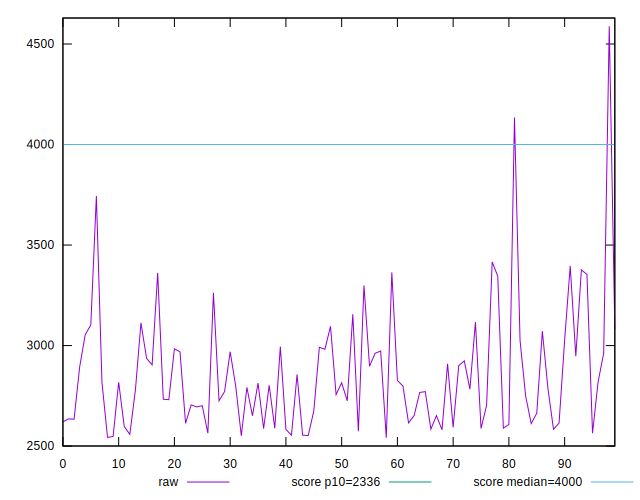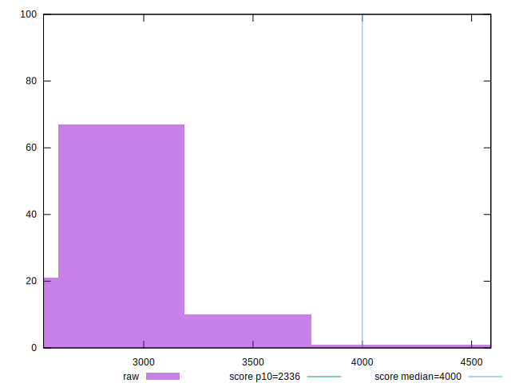
## Score


```yaml
p90min: 0.65
p90max: 0.86
p90range: 0.20999999999999996
p90mean: 0.7923404255319151
median: 0.805
p90stdev: 0.05724946403010088
mad: 0.04499999999999993
stdevBySn: 0.05664849999999992
lfitCenter: 0.7933428333413016
lfitStdev: 0.050891328249993706
mfitCenter: 0.7933428333413016
mfitStdev: 0.06378282122666179
mfitConfidence: 0.006378282122666179
p90skewness: -0.9188470824787562
p90eccentricity: 1.0000000000000007
p90discretization: 4.476190476190476
outlandishness: 0.9805573035992617

```

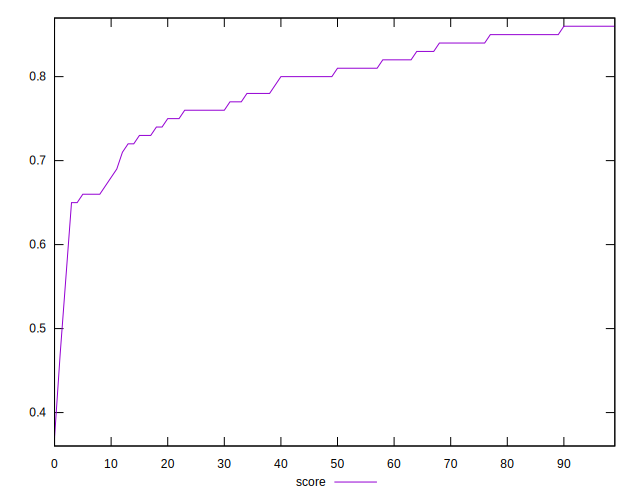
## Raw Estimate

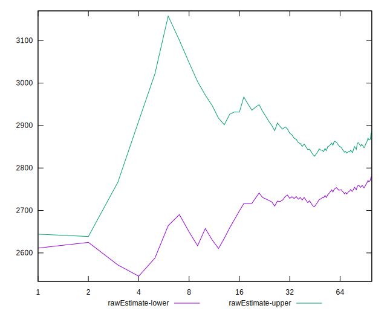
## Score Estimate

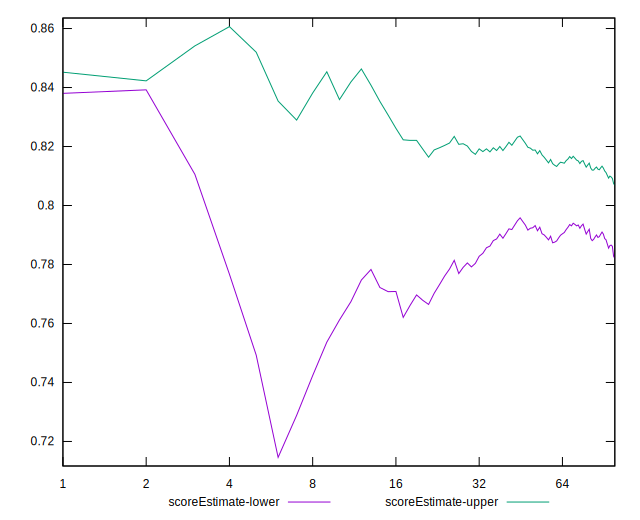
## P Score


```yaml
p90min: 0.6464607582363194
p90max: 0.8580027754325675
p90range: 0.2115420171962481
p90mean: 0.7918982529577909
median: 0.8047441419793527
p90stdev: 0.05725354497002794
mad: 0.04259499188169785
stdevBySn: 0.05729074724967206
lfitCenter: 0.7929704625959092
lfitStdev: 0.050979333654817466
mfitCenter: 0.7929704625959092
mfitStdev: 0.06389311964479857
mfitConfidence: 0.006389311964479857
p90skewness: -0.9337247579146868
p90eccentricity: 1.0000000000000004
p90discretization: 1
outlandishness: 0.9806536984858506

```

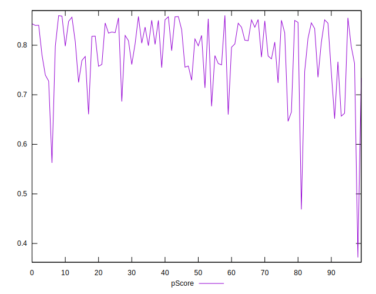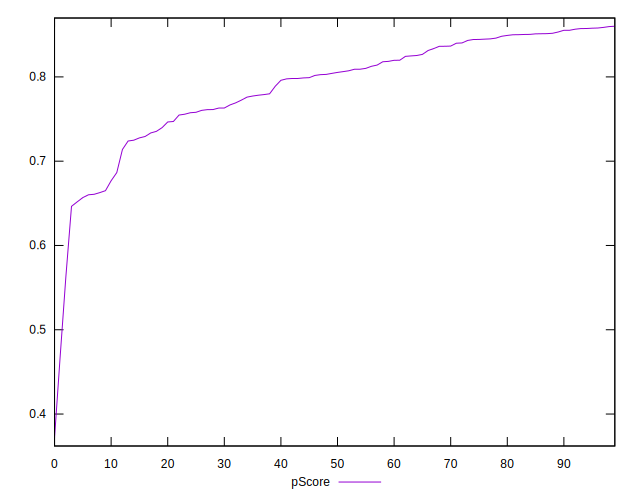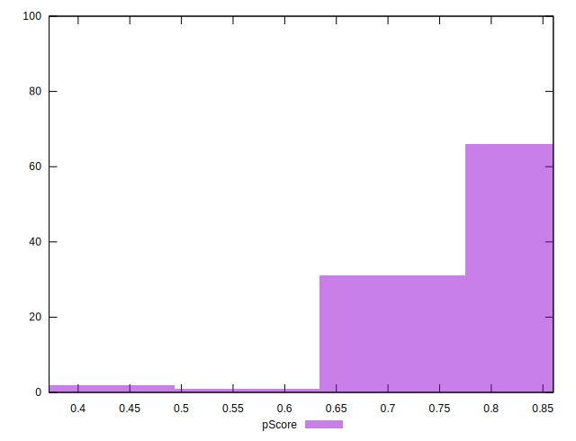
## Score Difference


```yaml
p90min: 0
p90max: 1.1102230246251565e-16
p90range: 1.1102230246251565e-16
p90mean: 1.0039250754589182e-17
median: 0
p90stdev: 3.132111734552388e-17
mad: 0
stdevBySn: 0
lfitCenter: 6.871108213956909e-18
lfitStdev: 1.6103336250882454e-17
mfitCenter: 6.871108213956909e-18
mfitStdev: 2.0182539001484694e-17
mfitConfidence: 2.0182539001484695e-18
p90skewness: 2.8550801089852333
p90eccentricity: 1.000000000000001
p90discretization: 31.333333333333332
outlandishness: 1.6173854671280277

```

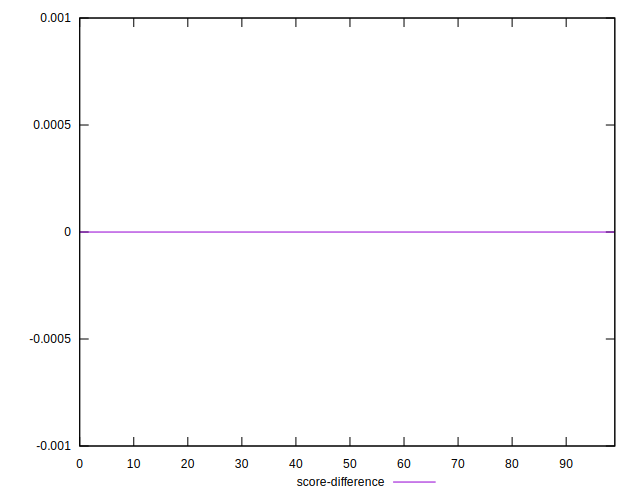
## P Score Difference


```yaml
p90min: -0.004689489214089626
p90max: 0.004728686099579882
p90range: 0.009418175313669508
p90mean: -0.0004246740530614319
median: -0.0007550654341145213
p90stdev: 0.0026355757834164955
mad: 0.002281942357943323
stdevBySn: 0.0031491558375090537
lfitCenter: -0.00048659043428274964
lfitStdev: 0.002273781627689109
mfitCenter: -0.00048659043428274964
mfitStdev: 0.002849762662018562
mfitConfidence: 0.0002849762662018562
p90skewness: 0.24934751546617703
p90eccentricity: 1.0000000000000002
p90discretization: 1
outlandishness: 0.884114875527234

```

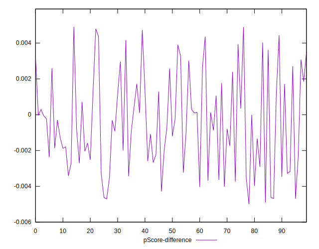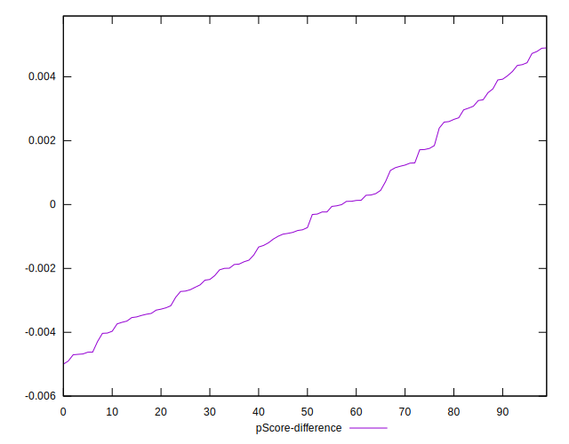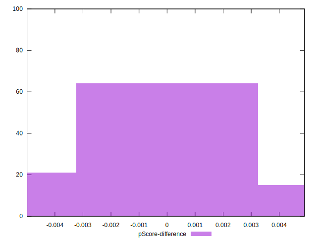