# //first-cpu-idle/samples/agenda

[→ Parent](../..)


## Raw


```yaml
p90min: 1445.8740000000003
p90max: 6653.352
p90range: 5207.477999999999
p90mean: 2803.6750053191495
median: 2488.159
p90stdev: 1363.3046736606343
mad: 301.3684999999998
stdevBySn: 544.5280414
lfitCenter: 2696.215301610697
lfitStdev: 824.8501454056609
mfitCenter: 2696.215301610697
mfitStdev: 1033.7963494439107
mfitConfidence: 103.37963494439107
p90skewness: 1.7487092694361162
p90eccentricity: 0.9999999999999999
p90discretization: 1
outlandishness: 1.0551444779888441

```

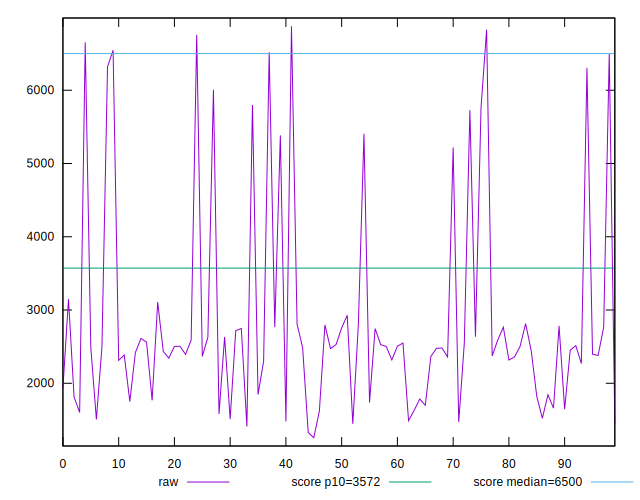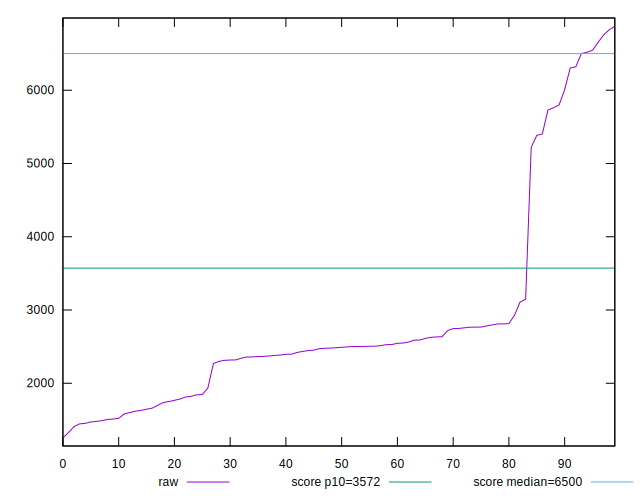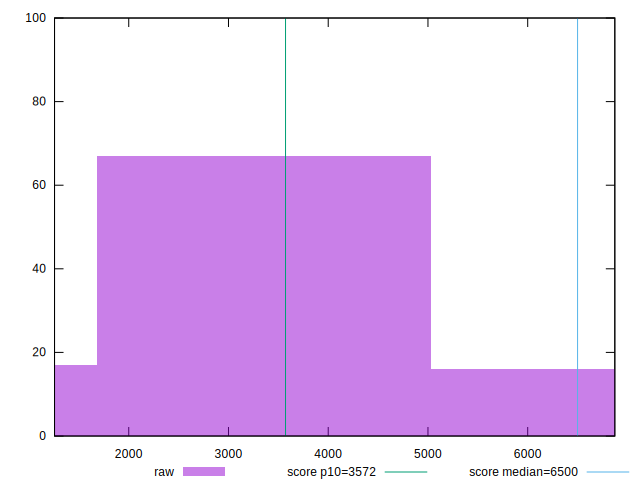
## Score


```yaml
p90min: 0.48
p90max: 1
p90range: 0.52
p90mean: 0.9256382978723402
median: 0.98
p90stdev: 0.14582529995765847
mad: 0.015000000000000013
stdevBySn: 0.023852000000000022
lfitCenter: 0.9428051773189753
lfitStdev: 0.08896350774434233
mfitCenter: 0.9428051773189753
mfitStdev: 0.1114992220733565
mfitConfidence: 0.01114992220733565
p90skewness: -2.1825828809171353
p90eccentricity: 0.9999999999999996
p90discretization: 5.529411764705882
outlandishness: 0.9747982133952795

```

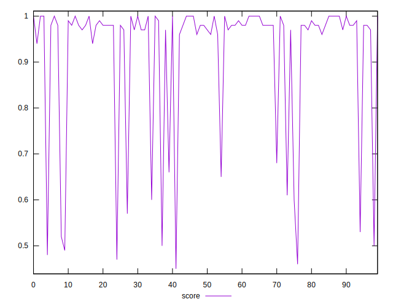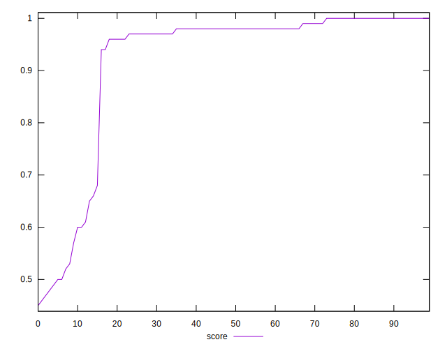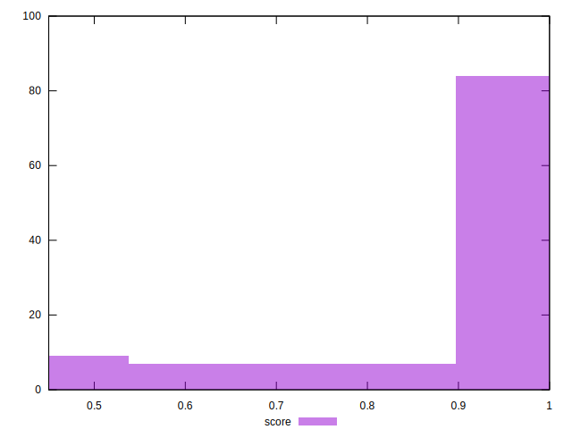
## Raw Estimate

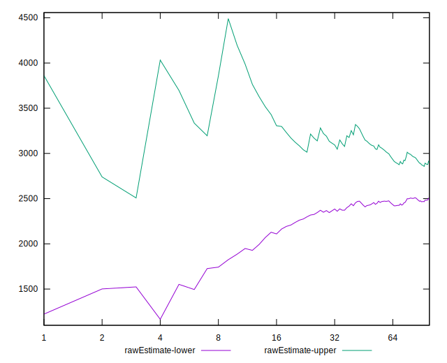
## Score Estimate

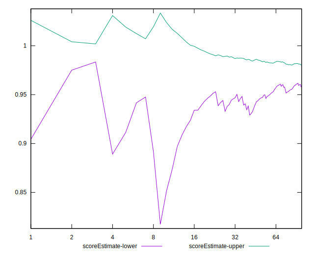
## P Score


```yaml
p90min: 0.4800942865401
p90max: 0.9993535347571207
p90range: 0.5192592482170207
p90mean: 0.9251951746922578
median: 0.9800878337088212
p90stdev: 0.14571904206790967
mad: 0.01495833909132921
stdevBySn: 0.020685571432257795
lfitCenter: 0.942574002785877
lfitStdev: 0.08897219379137909
mfitCenter: 0.942574002785877
mfitStdev: 0.11151010841891601
mfitConfidence: 0.011151010841891601
p90skewness: -2.185234984686994
p90eccentricity: 0.9999999999999994
p90discretization: 1
outlandishness: 0.9747710790836385

```

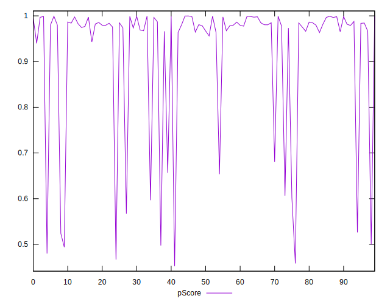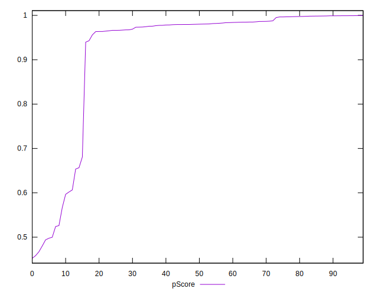
## Score Difference


```yaml
p90min: 0
p90max: 5.551115123125783e-17
p90range: 5.551115123125783e-17
p90mean: 5.905441620346577e-19
median: 0
p90stdev: 5.695001657605474e-18
mad: 0
stdevBySn: 0
lfitCenter: 1.871360833134931e-18
lfitStdev: 4.599922739399784e-18
mfitCenter: 1.871360833134931e-18
mfitStdev: 5.76514820564993e-18
mfitConfidence: 5.76514820564993e-19
p90skewness: 9.539955591519895
p90eccentricity: 1.0000000000000033
p90discretization: 47
outlandishness: 43.29640000000001

```

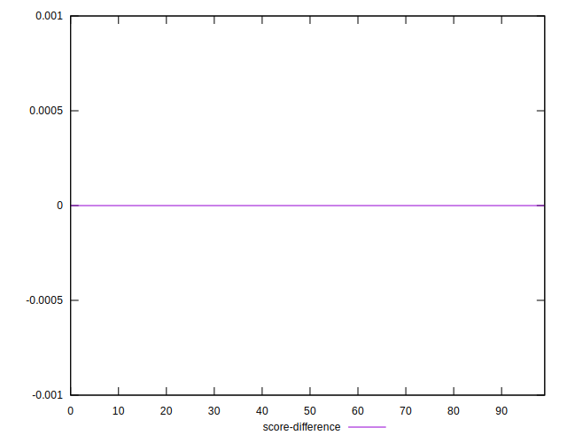
## P Score Difference


```yaml
p90min: -0.004451268373131034
p90max: 0.004712907187292892
p90range: 0.009164175560423926
p90mean: -0.0004878610014162757
median: -0.0008394882659387148
p90stdev: 0.0026422491476410345
mad: 0.0021800052011657356
stdevBySn: 0.0030677959118952844
lfitCenter: -0.0006316351029606699
lfitStdev: 0.002133965419355295
mfitCenter: -0.0006316351029606699
mfitStdev: 0.002674529031311616
mfitConfidence: 0.0002674529031311616
p90skewness: 0.5397030049746097
p90eccentricity: 0.9999999999999997
p90discretization: 1
outlandishness: 0.851632660344424

```

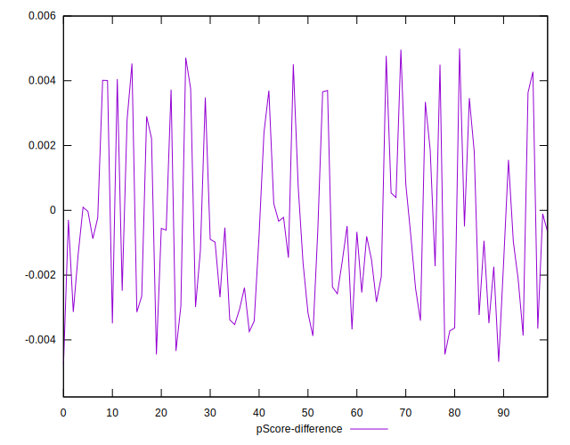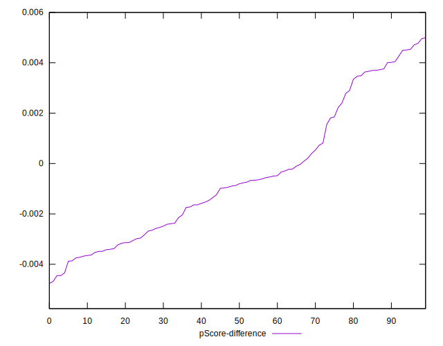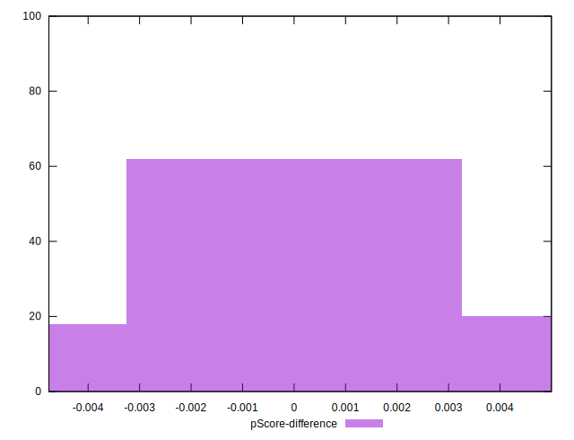