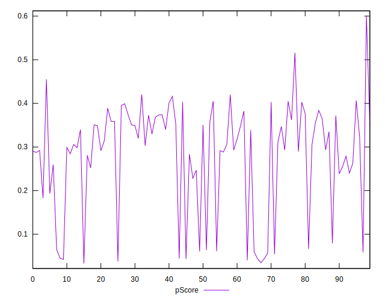

# //first-cpu-idle/samples/astro

[→ Parent](../..)


## Raw


```yaml
p90min: 7140.084
p90max: 14699.292000000001
p90range: 7559.208000000001
p90mean: 9066.52294680851
median: 8206.699999999999
p90stdev: 2302.525909509738
mad: 638.9399999999991
stdevBySn: 934.4250575499993
lfitCenter: 8774.390688857866
lfitStdev: 1639.1390508585682
mfitCenter: 8774.390688857866
mfitStdev: 2054.356147534135
mfitConfidence: 205.4356147534135
p90skewness: 1.5116570779678682
p90eccentricity: 1.0000000000000002
p90discretization: 1
outlandishness: 1.022318106505706

```


## Score


```yaml
p90min: 0.04
p90max: 0.42
p90range: 0.38
p90mean: 0.2799999999999998
median: 0.31
p90stdev: 0.11741905314961958
mad: 0.06
stdevBySn: 0.0924265
lfitCenter: 0.29223751388297386
lfitStdev: 0.08818836476052241
mfitCenter: 0.29223751388297386
mfitStdev: 0.11052772441231651
mfitConfidence: 0.01105277244123165
p90skewness: -1.0546272518101514
p90eccentricity: 1
p90discretization: 3.6153846153846154
outlandishness: 0.9992858418367347

```


## Raw Estimate


## Score Estimate


## P Score


```yaml
p90min: 0.040339702706696345
p90max: 0.4203281713510999
p90range: 0.37998846864440355
p90mean: 0.28042896087124236
median: 0.3088674419252261
p90stdev: 0.11701813243915092
mad: 0.06070734122231272
stdevBySn: 0.09072914633683135
lfitCenter: 0.29259491786468
lfitStdev: 0.08768062335451239
mfitCenter: 0.29259491786468
mfitStdev: 0.10989136492942336
mfitConfidence: 0.010989136492942336
p90skewness: -1.0530050140196388
p90eccentricity: 0.9999999999999999
p90discretization: 1
outlandishness: 0.9995957953452176

```


## Score Difference


```yaml
p90min: 0
p90max: 5.551115123125783e-17
p90range: 5.551115123125783e-17
p90mean: 4.724353296277262e-18
median: 0
p90stdev: 1.5489828153710842e-17
mad: 0
stdevBySn: 0
lfitCenter: 3.2613928185421445e-18
lfitStdev: 7.694795773604994e-18
mfitCenter: 3.2613928185421445e-18
mfitStdev: 9.6439963365189e-18
mfitConfidence: 9.6439963365189e-19
p90skewness: 2.9737221214857823
p90eccentricity: 0.999999999999997
p90discretization: 47
outlandishness: 1.67055625

```


## P Score Difference


```yaml
p90min: -0.00459787665446626
p90max: 0.004844736538988294
p90range: 0.009442613193454553
p90mean: 0.0004998107127634036
median: 0.0004862101845281852
p90stdev: 0.0026475609719421997
mad: 0.0023407416659102648
stdevBySn: 0.0031602379341038127
lfitCenter: 0.0005190868319232806
lfitStdev: 0.00235190252844267
mfitCenter: 0.0005190868319232806
mfitStdev: 0.0029476726914513425
mfitConfidence: 0.00029476726914513427
p90skewness: -0.16258666532586702
p90eccentricity: 1.0000000000000007
p90discretization: 1
outlandishness: 0.8928687344644912

```

