# //first-cpu-idle/samples/card

[→ Parent](../..)


## Raw


```yaml
p90min: 1783.1490000000001
p90max: 6915.19
p90range: 5132.040999999999
p90mean: 3174.244356989248
median: 2686.7419999999993
p90stdev: 1352.913424192546
mad: 167.39799999999968
stdevBySn: 313.5893996000005
lfitCenter: 3013.925817274356
lfitStdev: 827.3422544923801
mfitCenter: 3013.925817274356
mfitStdev: 1036.9197449971712
mfitConfidence: 104.21435551110962
p90skewness: 1.9615197101120063
p90eccentricity: 1.0000000000000002
p90discretization: 1
outlandishness: 1.042325542316082

```

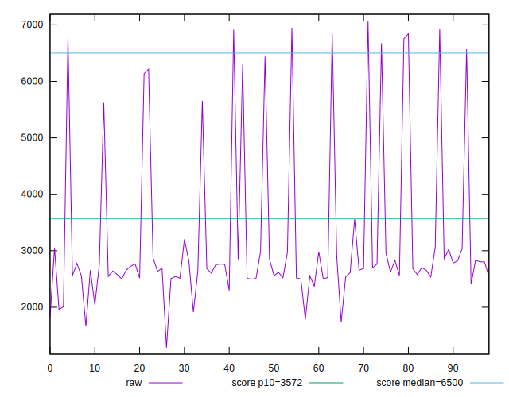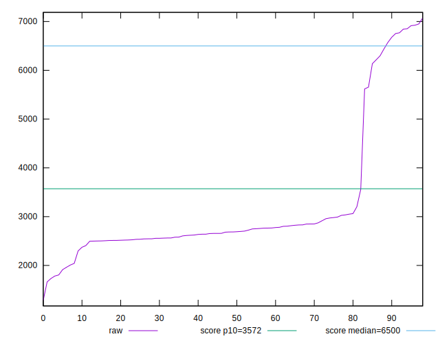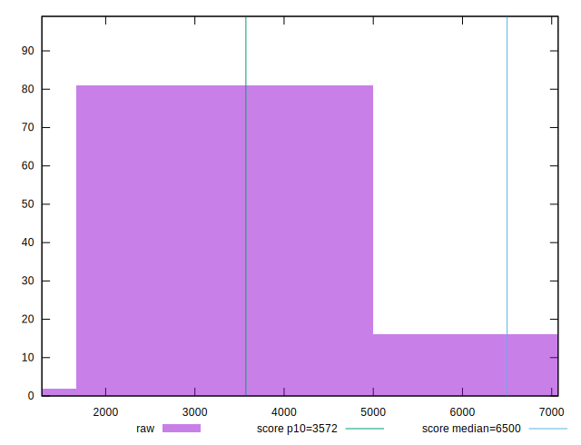
## Score


```yaml
p90min: 0.45
p90max: 1
p90range: 0.55
p90mean: 0.9065591397849455
median: 0.97
p90stdev: 0.16115506873786248
mad: 0.010000000000000009
stdevBySn: 0.011926000000000011
lfitCenter: 0.927064226477138
lfitStdev: 0.09898079180896699
mfitCenter: 0.927064226477138
mfitStdev: 0.12405402582168903
mfitConfidence: 0.012467898708594024
p90skewness: -2.114107058557979
p90eccentricity: 1.0000000000000002
p90discretization: 5.166666666666667
outlandishness: 0.9752115313048286

```

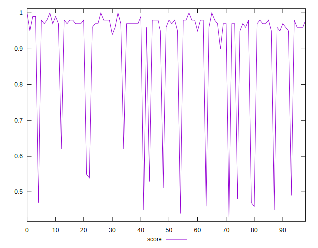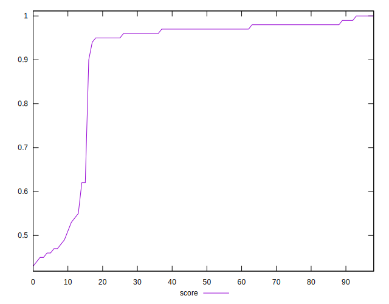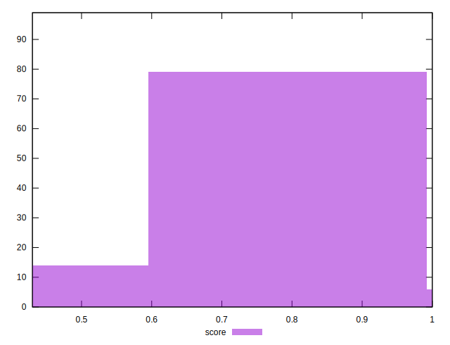
## Raw Estimate

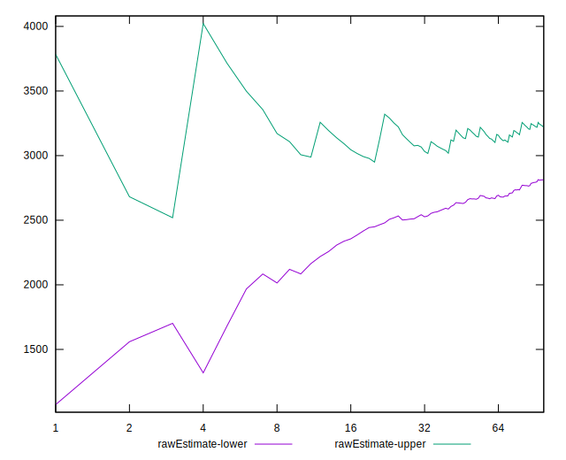
## Score Estimate

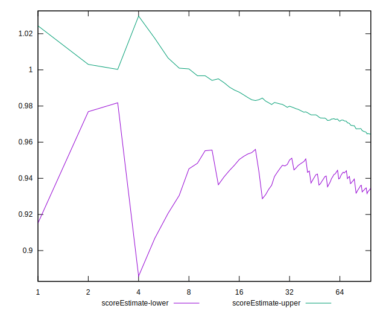
## P Score


```yaml
p90min: 0.44727666940819755
p90max: 0.9971863594152562
p90range: 0.5499096900070587
p90mean: 0.9061313493529239
median: 0.9707011298081226
p90stdev: 0.16190980382088233
mad: 0.008345442885282384
stdevBySn: 0.015999010367099747
lfitCenter: 0.9268305399242721
lfitStdev: 0.09934059321758748
mfitCenter: 0.9268305399242721
mfitStdev: 0.12450497001419288
mfitConfidence: 0.012513220305197812
p90skewness: -2.1177352476865328
p90eccentricity: 1
p90discretization: 1
outlandishness: 0.9751063193224092

```

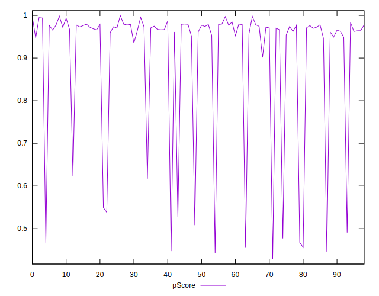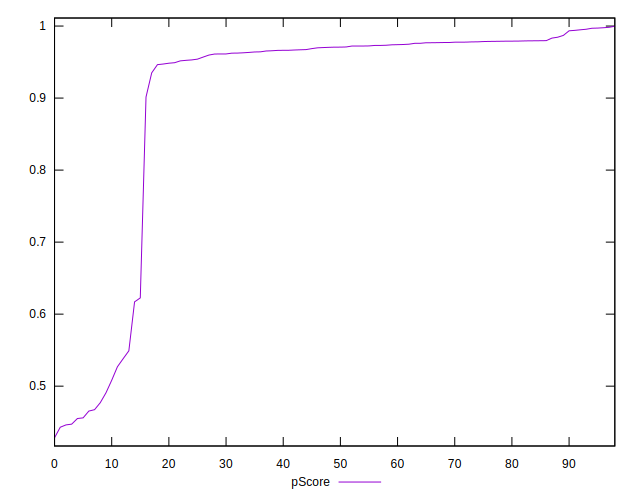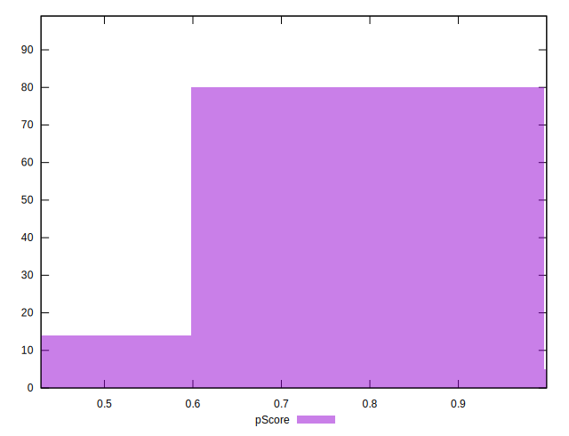
## Score Difference


```yaml
p90min: 0
p90max: 1.1102230246251565e-16
p90range: 1.1102230246251565e-16
p90mean: 8.356517389651716e-18
median: 0
p90stdev: 2.813645075444673e-17
mad: 0
stdevBySn: 0
lfitCenter: 5.921462458998477e-18
lfitStdev: 1.3960785464488077e-17
mfitCenter: 5.921462458998477e-18
mfitStdev: 1.7497249808278127e-17
mfitConfidence: 1.7585397720356517e-18
p90skewness: 3.2115646317839572
p90eccentricity: 0.9999999999999996
p90discretization: 31
outlandishness: 1.8009407619797226

```

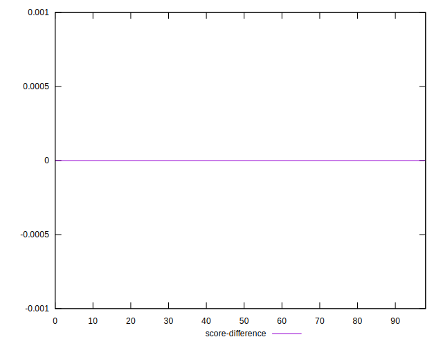
## P Score Difference


```yaml
p90min: -0.004598711872089101
p90max: 0.00439343245011381
p90range: 0.00899214432220291
p90mean: -0.000497011346655626
median: -0.0009534273065949783
p90stdev: 0.002610965024448806
mad: 0.0021104692038935724
stdevBySn: 0.003161256935829313
lfitCenter: -0.0006182597653335405
lfitStdev: 0.0023477951252618996
mfitCenter: -0.0006182597653335405
mfitStdev: 0.002942524824972048
mfitConfidence: 0.00029573487214359023
p90skewness: 0.34784387778210296
p90eccentricity: 1
p90discretization: 1
outlandishness: 0.8970244875670563

```

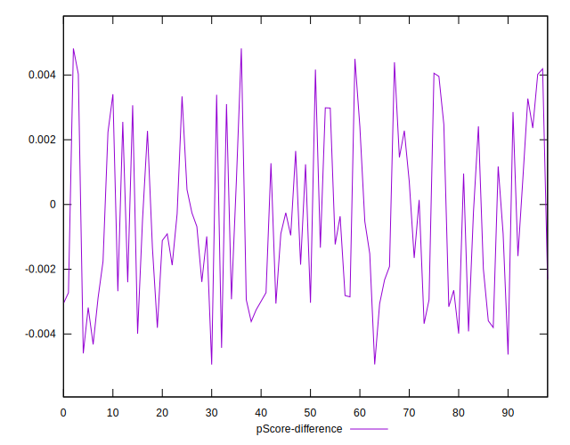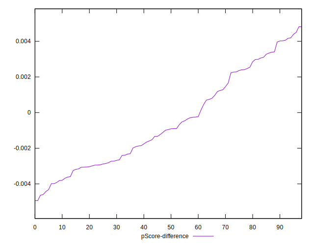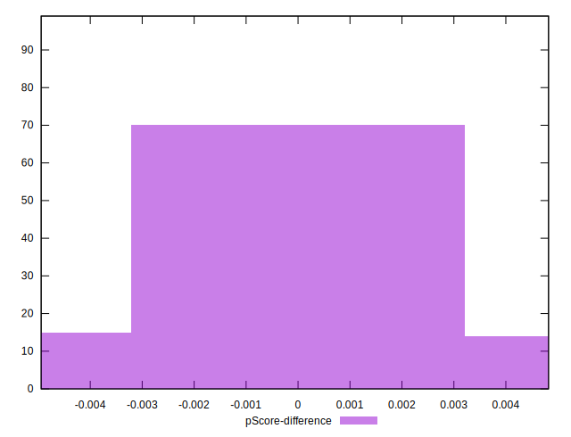