# //first-cpu-idle/samples/music

[→ Parent](../..)


## Raw


```yaml
p90min: 1497.4830000000002
p90max: 6264.239
p90range: 4766.755999999999
p90mean: 3127.2555265957444
median: 2602.0935000000004
p90stdev: 1476.2814865299868
mad: 898.5385000000002
stdevBySn: 1236.8564915500003
lfitCenter: 2999.6691861253876
lfitStdev: 1319.5517425955504
mfitCenter: 2999.6691861253876
mfitStdev: 1653.8128555784442
mfitConfidence: 165.38128555784442
p90skewness: 0.7383873466561749
p90eccentricity: 1.0000000000000002
p90discretization: 1
outlandishness: 1.0334487586257128

```

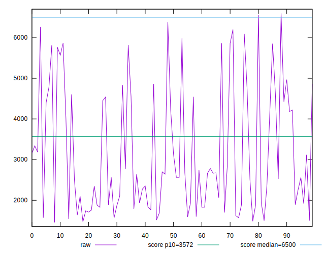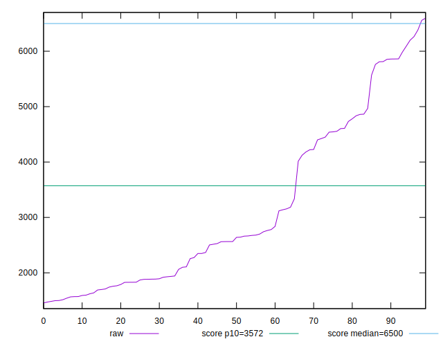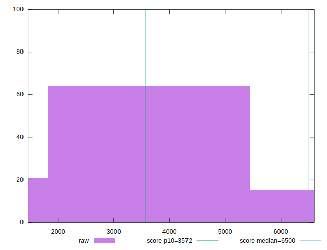
## Score


```yaml
p90min: 0.53
p90max: 1
p90range: 0.47
p90mean: 0.8926595744680851
median: 0.975
p90stdev: 0.1462886648792699
mad: 0.025000000000000022
stdevBySn: 0.032796500000000034
lfitCenter: 0.9128298453962318
lfitStdev: 0.12876596544524818
mfitCenter: 0.9128298453962318
mfitStdev: 0.1613842050600004
mfitConfidence: 0.01613842050600004
p90skewness: -1.191748494215926
p90eccentricity: 1.0000000000000004
p90discretization: 3.6153846153846154
outlandishness: 0.9809142555695496

```

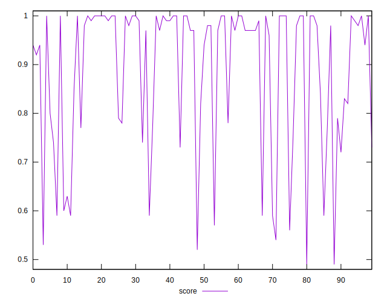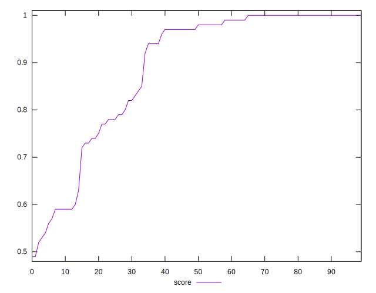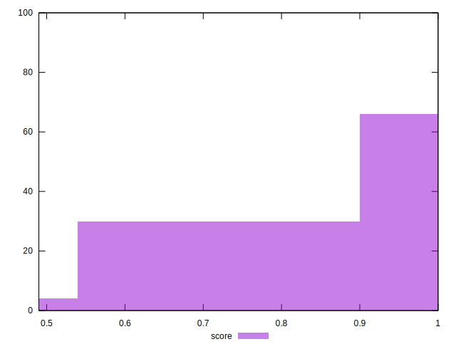
## Raw Estimate

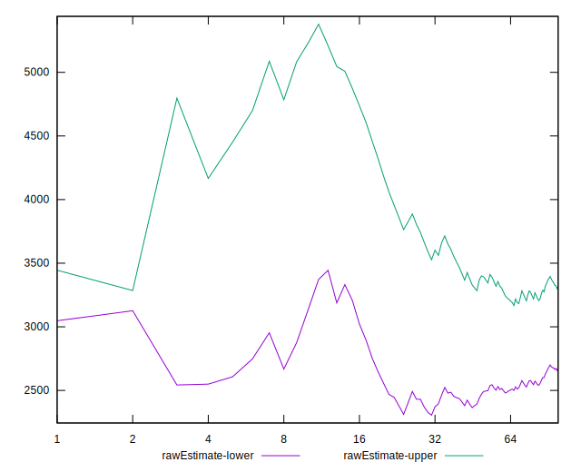
## Score Estimate

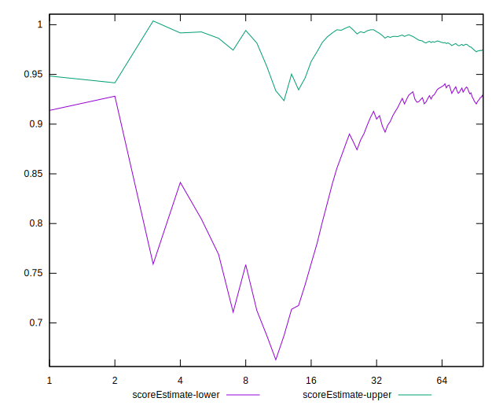
## P Score


```yaml
p90min: 0.5315180070438863
p90max: 0.9991623645679113
p90range: 0.467644357524025
p90mean: 0.891608982416157
median: 0.9749435939123899
p90stdev: 0.14551094113550245
mad: 0.023743691747004192
stdevBySn: 0.02978230546315642
lfitCenter: 0.9118002486896023
lfitStdev: 0.12819093112555044
mfitCenter: 0.9118002486896023
mfitStdev: 0.1606635064169564
mfitConfidence: 0.01606635064169564
p90skewness: -1.1997923835876987
p90eccentricity: 0.9999999999999994
p90discretization: 1
outlandishness: 0.9808812918372399

```

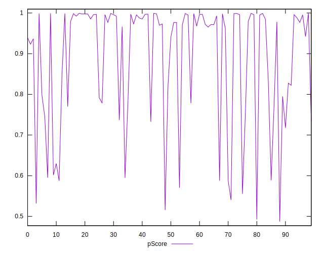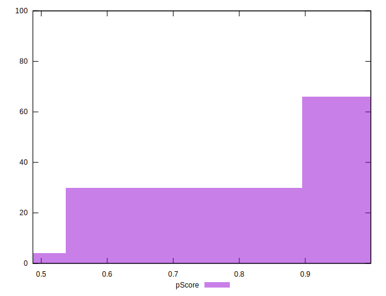
## Score Difference


```yaml
p90min: 0
p90max: 1.1102230246251565e-16
p90range: 1.1102230246251565e-16
p90mean: 5.9054416203465774e-18
median: 0
p90stdev: 2.4915085490873312e-17
mad: 0
stdevBySn: 0
lfitCenter: 4.545807909231485e-18
lfitStdev: 1.0928096704220885e-17
mfitCenter: 4.545807909231485e-18
mfitStdev: 1.3696338107132798e-17
mfitConfidence: 1.3696338107132797e-18
p90skewness: 3.9819818903758026
p90eccentricity: 0.999999999999997
p90discretization: 47
outlandishness: 2.262016

```

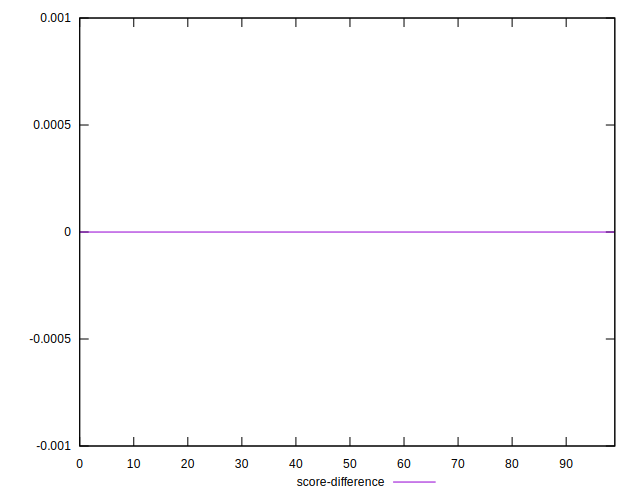
## P Score Difference


```yaml
p90min: -0.004705103224816876
p90max: 0.004624442096736958
p90range: 0.009329545321553834
p90mean: -0.0011236059988179814
median: -0.0013179409559607724
p90stdev: 0.00236691175641297
mad: 0.0019073110203587929
stdevBySn: 0.0027261404633360116
lfitCenter: -0.0012073778544481873
lfitStdev: 0.0019394609488744782
mfitCenter: -0.0012073778544481873
mfitStdev: 0.002430753828441646
mfitConfidence: 0.0002430753828441646
p90skewness: 0.4850264884878836
p90eccentricity: 0.9999999999999997
p90discretization: 1
outlandishness: 0.8822054981071336

```

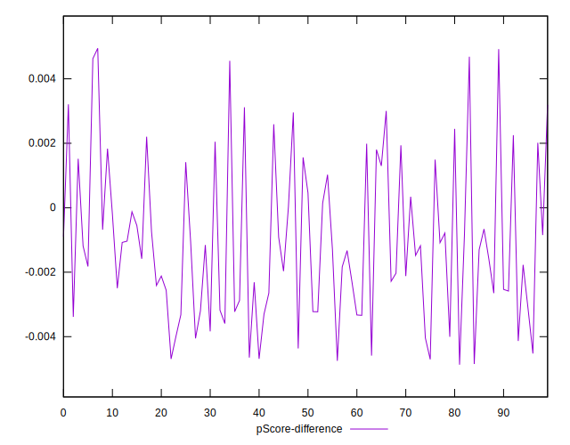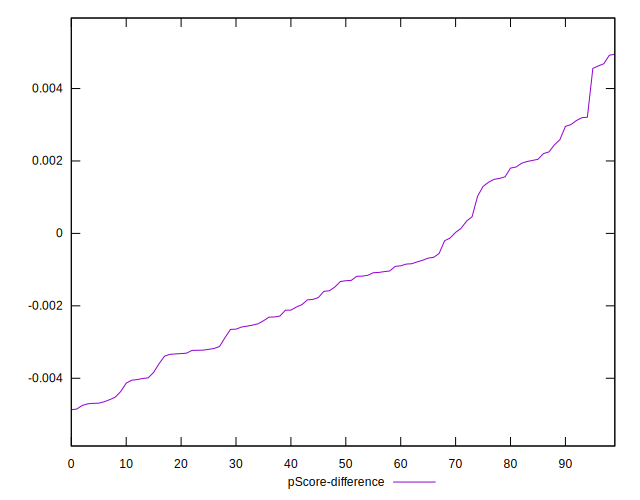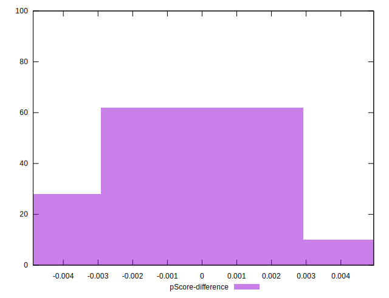