# //first-meaningful-paint/samples/agenda

[→ Parent](../..)


## Raw


```yaml
p90min: 1443.2779999999998
p90max: 2075.4725
p90range: 632.1945000000001
p90mean: 1717.807994680851
median: 1701.6444999999999
p90stdev: 159.96363578358586
mad: 118.59699999999975
stdevBySn: 185.24387465000007
lfitCenter: 1713.81215763468
lfitStdev: 138.057455817811
mfitCenter: 1713.81215763468
mfitStdev: 173.02936131238206
mfitConfidence: 17.302936131238205
p90skewness: 0.31536465338474645
p90eccentricity: 0.9999999999999999
p90discretization: 1
outlandishness: 1.0018914253264908

```

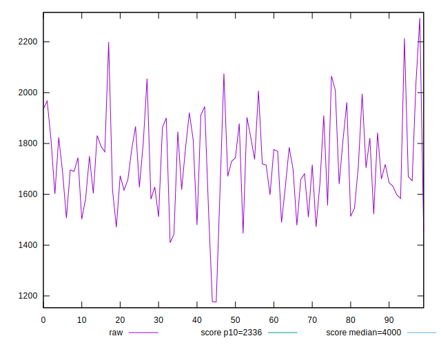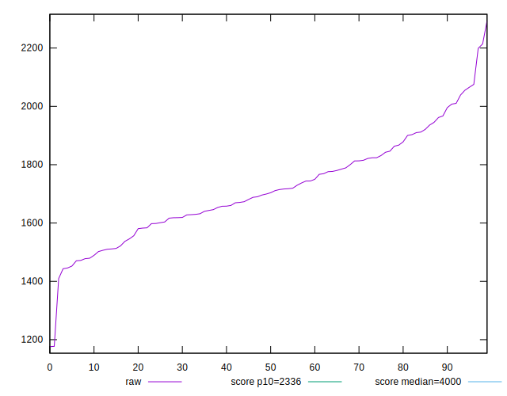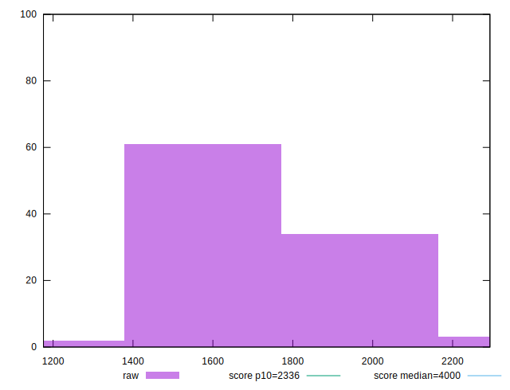
## Score


```yaml
p90min: 0.94
p90max: 0.99
p90range: 0.050000000000000044
p90mean: 0.9757446808510634
median: 0.98
p90stdev: 0.012840209591161387
mad: 0.010000000000000009
stdevBySn: 0.011926000000000011
lfitCenter: 0.9762476972346429
lfitStdev: 0.011207284796020773
mfitCenter: 0.9762476972346429
mfitStdev: 0.01404624848990783
mfitConfidence: 0.001404624848990783
p90skewness: -0.9493245698390438
p90eccentricity: 0.9999999999999991
p90discretization: 15.666666666666666
outlandishness: 0.9976551049868495

```

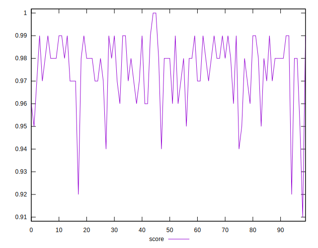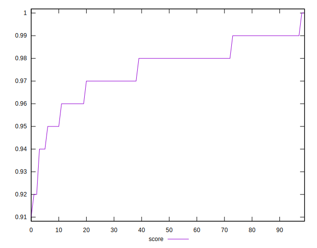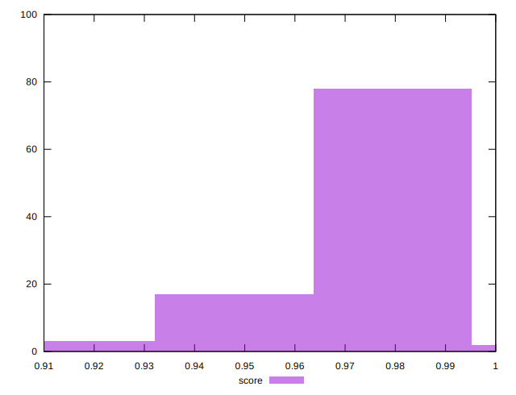
## Raw Estimate

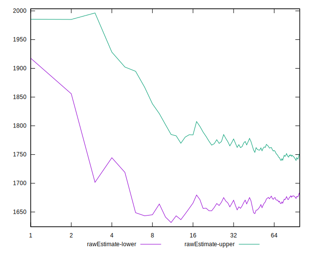
## Score Estimate

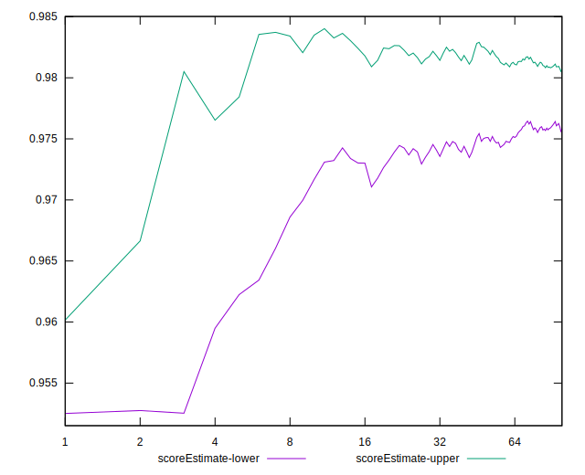
## P Score


```yaml
p90min: 0.9410101535642725
p90max: 0.9924272755552683
p90range: 0.051417121990995795
p90mean: 0.9759342146408188
median: 0.979149658627818
p90stdev: 0.012690873856306356
mad: 0.008713761971161083
stdevBySn: 0.012761888804620206
lfitCenter: 0.9764392709234229
lfitStdev: 0.010847918512125134
mfitCenter: 0.9764392709234229
mfitStdev: 0.013595849645373678
mfitConfidence: 0.0013595849645373678
p90skewness: -0.9439219482429475
p90eccentricity: 0.9999999999999996
p90discretization: 1
outlandishness: 0.997653792722772

```

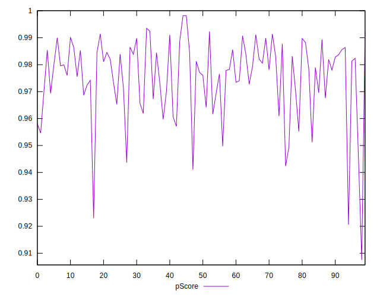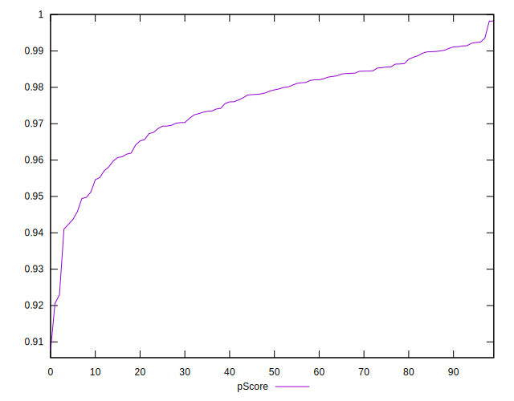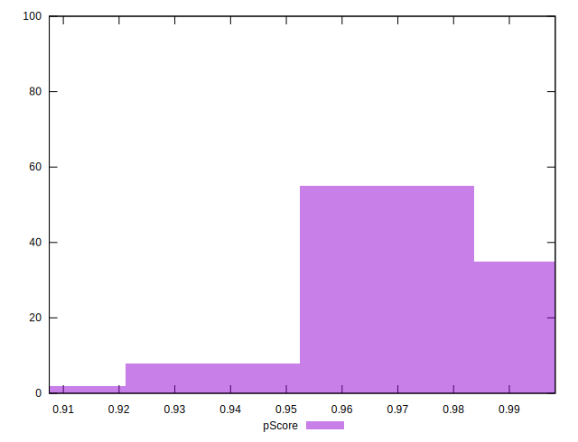
## Score Difference


```yaml
p90min: 0
p90max: 1.1102230246251565e-16
p90range: 1.1102230246251565e-16
p90mean: 5.9054416203465774e-18
median: 0
p90stdev: 2.491508549087332e-17
mad: 0
stdevBySn: 0
lfitCenter: 4.545807909231485e-18
lfitStdev: 1.0928096704220885e-17
mfitCenter: 4.545807909231485e-18
mfitStdev: 1.3696338107132798e-17
mfitConfidence: 1.3696338107132797e-18
p90skewness: 3.981981890375796
p90eccentricity: 0.999999999999997
p90discretization: 47
outlandishness: 2.262016

```

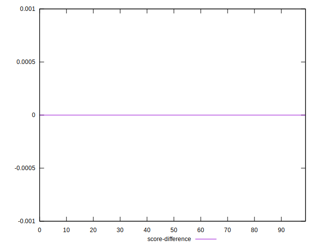
## P Score Difference


```yaml
p90min: -0.004571205414031221
p90max: 0.004460944056090321
p90range: 0.009032149470121542
p90mean: 0.0002072170415711491
median: 0.0002492178726895
p90stdev: 0.0025150253625191403
mad: 0.002102128828263994
stdevBySn: 0.0030525493152469777
lfitCenter: 0.00024394571624468823
lfitStdev: 0.0021278950323921704
mfitCenter: 0.00024394571624468823
mfitStdev: 0.0026669209295041006
mfitConfidence: 0.0002666920929504101
p90skewness: -0.1860432505904612
p90eccentricity: 1.0000000000000002
p90discretization: 1
outlandishness: 0.8290034882259959

```

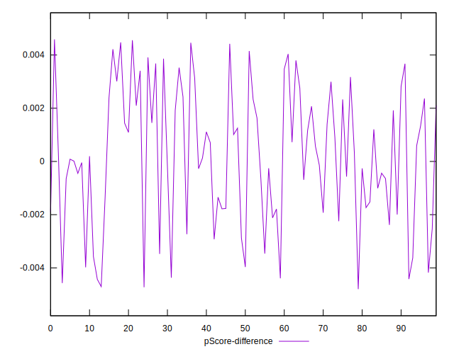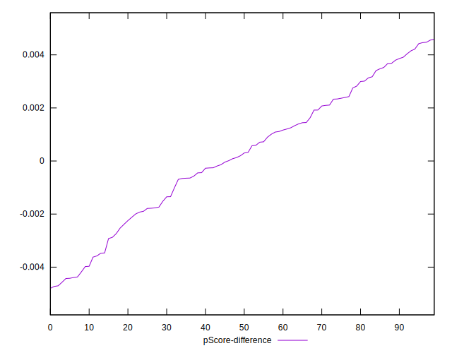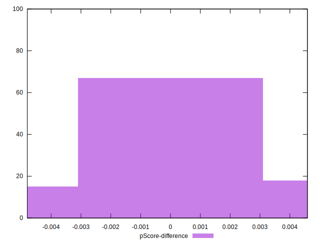