# //first-meaningful-paint/samples/astro

[→ Parent](../..)


## Raw


```yaml
p90min: 4397.076999999999
p90max: 8522.145999999997
p90range: 4125.068999999998
p90mean: 6318.0718563829805
median: 6164.414499999997
p90stdev: 849.2012365603457
mad: 513.606499999999
stdevBySn: 959.8730544999996
lfitCenter: 6284.764277429914
lfitStdev: 723.3971761176347
mfitCenter: 6284.764277429914
mfitStdev: 906.643908634646
mfitConfidence: 90.6643908634646
p90skewness: 0.3810473867922769
p90eccentricity: 1
p90discretization: 1
outlandishness: 1.0054291148957726

```

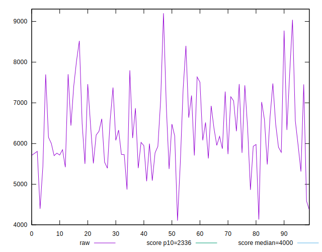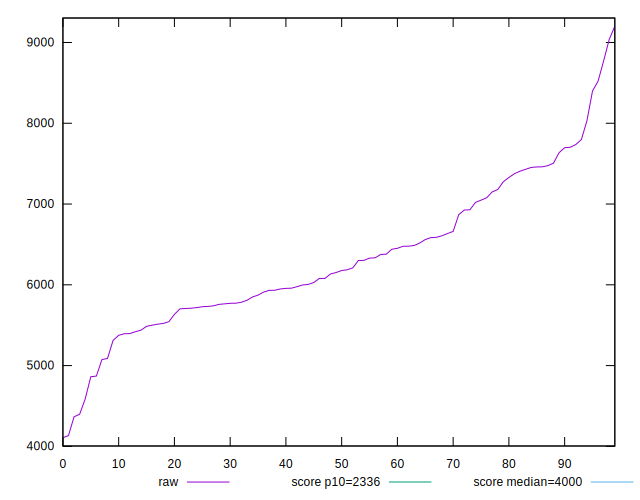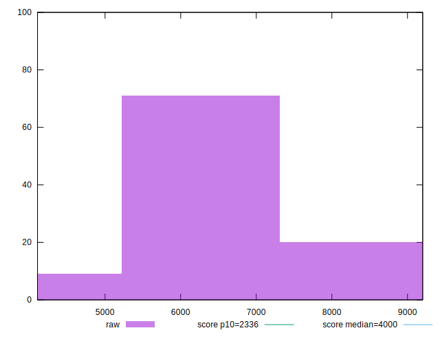
## Score


```yaml
p90min: 0.04
p90max: 0.41
p90range: 0.37
p90mean: 0.1547872340425532
median: 0.15
p90stdev: 0.0724895990104091
mad: 0.05000000000000002
stdevBySn: 0.077519
lfitCenter: 0.15508633547318798
lfitStdev: 0.060350430141467494
mfitCenter: 0.15508633547318798
mfitStdev: 0.07563804736548291
mfitConfidence: 0.007563804736548291
p90skewness: 0.8164788980059151
p90eccentricity: 1.0000000000000002
p90discretization: 3.4814814814814814
outlandishness: 1.0684880905988359

```

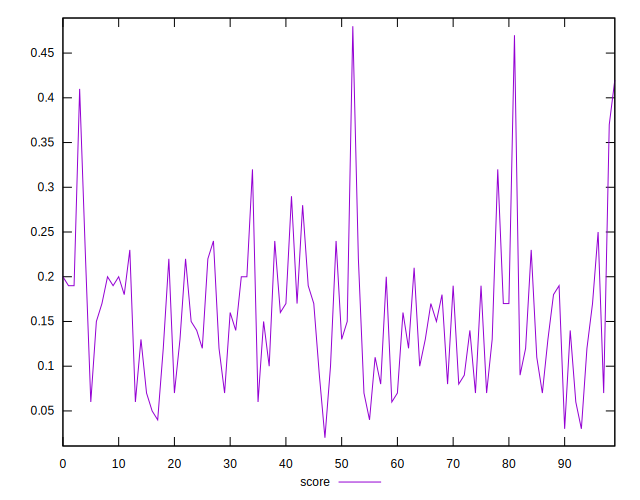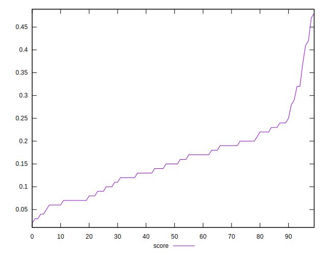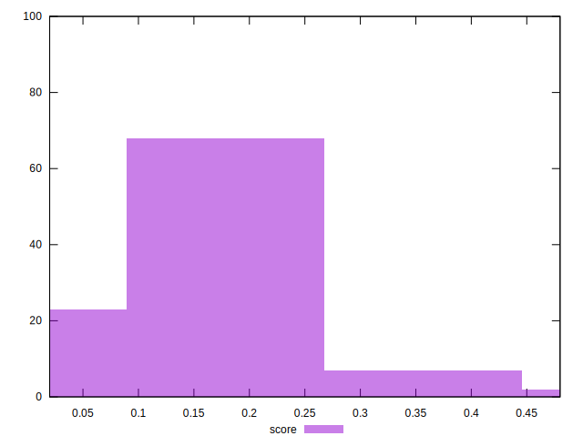
## Raw Estimate

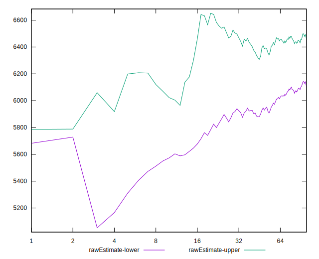
## Score Estimate

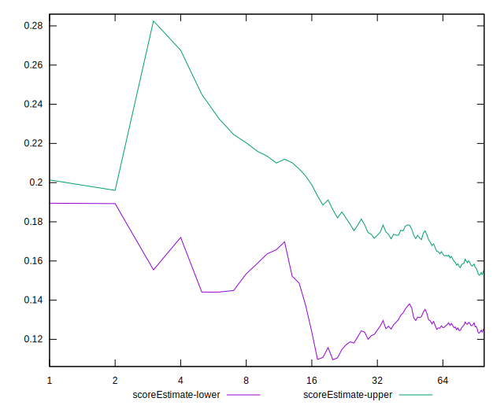
## P Score


```yaml
p90min: 0.0357553043339639
p90max: 0.4107900524086386
p90range: 0.3750347480746747
p90mean: 0.15446193215669762
median: 0.15138688265785513
p90stdev: 0.07290040183867662
mad: 0.05009575569230662
stdevBySn: 0.07718035480999312
lfitCenter: 0.1548057511707141
lfitStdev: 0.06070883481862459
mfitCenter: 0.1548057511707141
mfitStdev: 0.0760872410146959
mfitConfidence: 0.0076087241014695895
p90skewness: 0.8089020661307148
p90eccentricity: 1.0000000000000004
p90discretization: 1
outlandishness: 1.0677224864922599

```

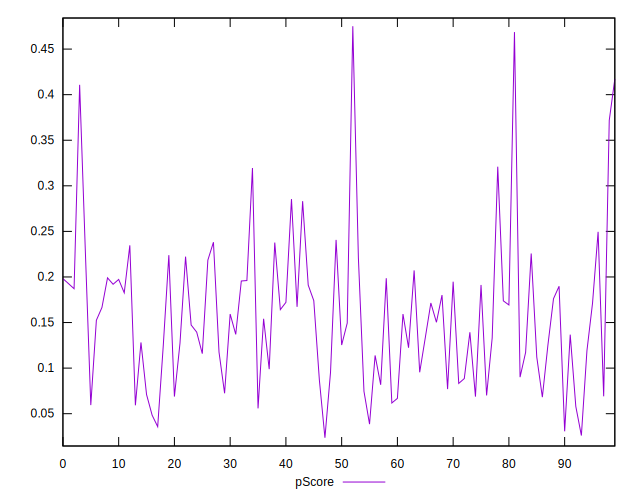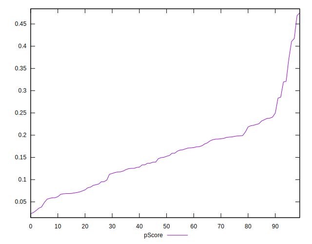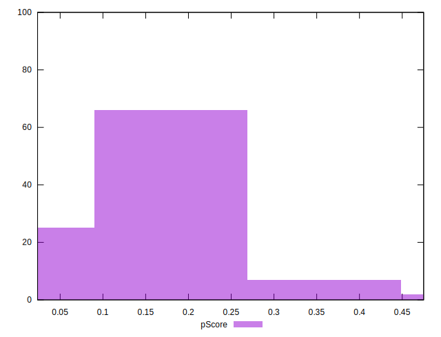
## Score Difference


```yaml
p90min: 0
p90max: 0
p90range: 0
p90mean: 0
median: 0
p90stdev: 0
mad: 0
stdevBySn: 0
lfitCenter: 5.235304226182962e-19
lfitStdev: 1.2999197837702497e-18
mfitCenter: 5.235304226182962e-19
mfitStdev: 1.6292078440147404e-18
mfitConfidence: 1.6292078440147404e-19
p90skewness: .nan
p90eccentricity: .nan
p90discretization: 94
outlandishness: .inf

```

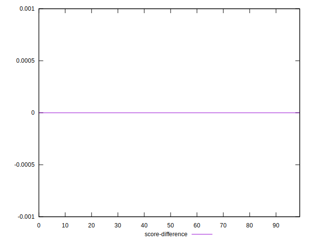
## P Score Difference


```yaml
p90min: -0.004603194064375649
p90max: 0.004542996898163898
p90range: 0.009146190962539547
p90mean: -0.00041677703630630514
median: -0.0006949157908890391
p90stdev: 0.002527966874863255
mad: 0.0021366361514075782
stdevBySn: 0.0029597378112521068
lfitCenter: -0.00046723240799348897
lfitStdev: 0.0021714022469825093
mfitCenter: -0.00046723240799348897
mfitStdev: 0.0027214491366802603
mfitConfidence: 0.00027214491366802605
p90skewness: 0.17720953165455386
p90eccentricity: 1.0000000000000002
p90discretization: 1
outlandishness: 0.8912798499117696

```

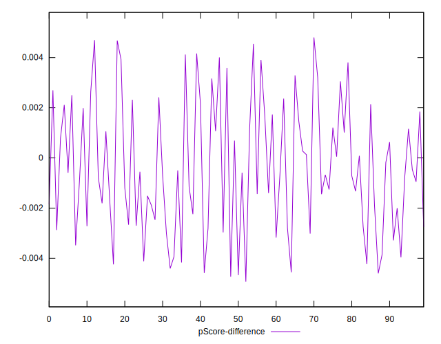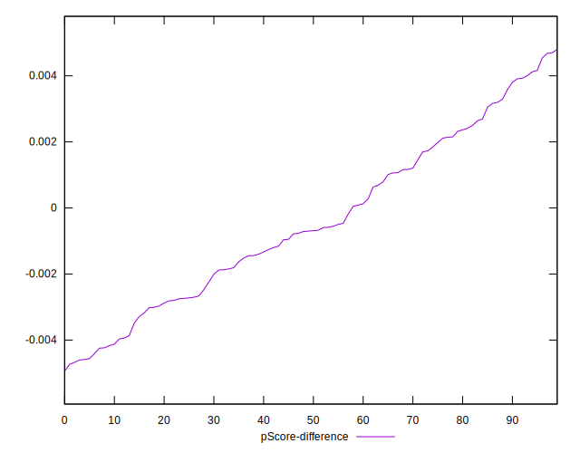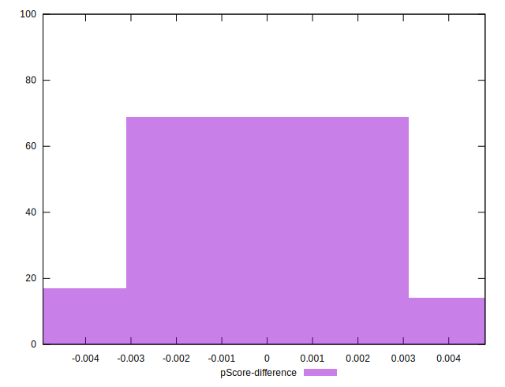