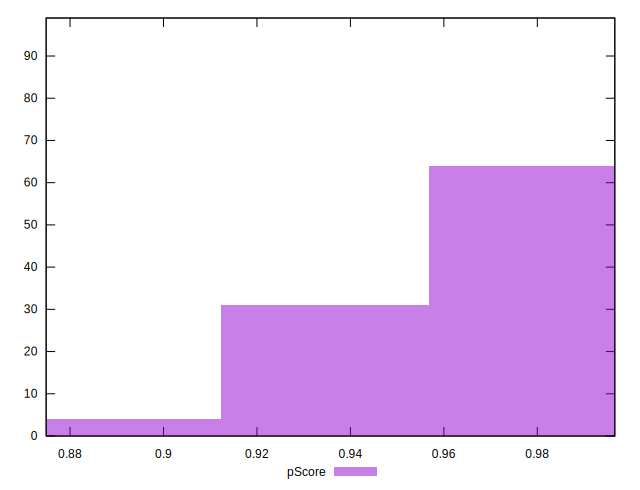

# //first-meaningful-paint/samples/card

[→ Parent](../..)


## Raw


```yaml
p90min: 1591.3579999999997
p90max: 2372.97
p90range: 781.6120000000001
p90mean: 1879.142588709677
median: 1860.65
p90stdev: 166.84838860736798
mad: 127.80050000000051
stdevBySn: 199.70146629999994
lfitCenter: 1875.656880870957
lfitStdev: 147.6250238774798
mfitCenter: 1875.656880870957
mfitStdev: 185.02052963335925
mfitConfidence: 18.59526288808137
p90skewness: 0.4383336592039654
p90eccentricity: 1.0000000000000002
p90discretization: 1
outlandishness: 1.0039355897118782

```


## Score


```yaml
p90min: 0.89
p90max: 0.99
p90range: 0.09999999999999998
p90mean: 0.9615053763440854
median: 0.97
p90stdev: 0.018017090844328145
mad: 0.010000000000000009
stdevBySn: 0.011926000000000011
lfitCenter: 0.962360237336307
lfitStdev: 0.015476911204876157
mfitCenter: 0.962360237336307
mfitStdev: 0.01939743163456648
mfitConfidence: 0.0019495152311644621
p90skewness: -1.2072600515605392
p90eccentricity: 1.0000000000000018
p90discretization: 9.3
outlandishness: 0.9968711607060805

```


## Raw Estimate


## Score Estimate


## P Score


```yaml
p90min: 0.8932754669583619
p90max: 0.985959833520901
p90range: 0.09268436656253909
p90mean: 0.9616575690909842
median: 0.9658977206928592
p90stdev: 0.018071600326304393
mad: 0.011849777258641003
stdevBySn: 0.01802048265016793
lfitCenter: 0.9622597838318989
lfitStdev: 0.015419992748783513
mfitCenter: 0.9622597838318989
mfitStdev: 0.019326094928799616
mfitConfidence: 0.0019423456224732904
p90skewness: -1.0801142295084294
p90eccentricity: 1.0000000000000002
p90discretization: 1
outlandishness: 0.9967846547399887

```


## Score Difference


```yaml
p90min: 0
p90max: 1.1102230246251565e-16
p90range: 1.1102230246251565e-16
p90mean: 1.910061117634678e-17
median: 0
p90stdev: 4.190179571246677e-17
mad: 0
stdevBySn: 0
lfitCenter: 1.2855990842641254e-17
lfitStdev: 2.8493626872780807e-17
mfitCenter: 1.2855990842641254e-17
mfitStdev: 3.571146541898343e-17
mfitConfidence: 3.589137318440001e-18
p90skewness: 1.737898791009473
p90eccentricity: 0.9999999999999988
p90discretization: 46.5
outlandishness: 1.244407856978879

```


## P Score Difference


```yaml
p90min: -0.004559986118469972
p90max: 0.004429802624436041
p90range: 0.008989788742906013
p90mean: 0.00011361289917216215
median: 0.0002884929281845583
p90stdev: 0.002515773493666187
mad: 0.0021922780678025333
stdevBySn: 0.0029274295754004556
lfitCenter: 0.00014537525800741727
lfitStdev: 0.0021951658696888936
mfitCenter: 0.00014537525800741727
mfitStdev: 0.0027512324210019726
mfitConfidence: 0.0002765092621674135
p90skewness: -0.0930896043788628
p90eccentricity: 1
p90discretization: 1
outlandishness: 0.9424249162622136

```

