# //first-meaningful-paint/samples/music

[→ Parent](../..)


## Raw


```yaml
p90min: 1472.8139999999999
p90max: 2117.035
p90range: 644.221
p90mean: 1775.3734574468083
median: 1790.205
p90stdev: 171.0571584749363
mad: 121.70250000000021
stdevBySn: 195.49784945000013
lfitCenter: 1781.0543016546392
lfitStdev: 140.93200413113823
mfitCenter: 1781.0543016546392
mfitStdev: 176.63207335549671
mfitConfidence: 17.66320733554967
p90skewness: -0.10107510845632597
p90eccentricity: 0.9999999999999997
p90discretization: 1
outlandishness: 1.0027117982560274

```

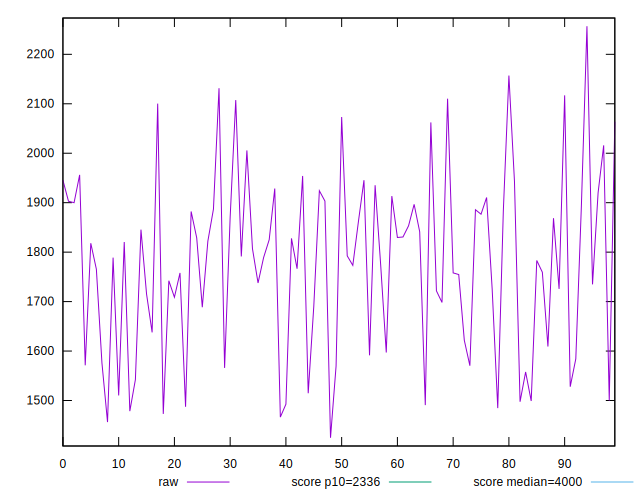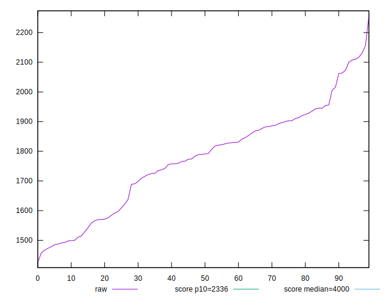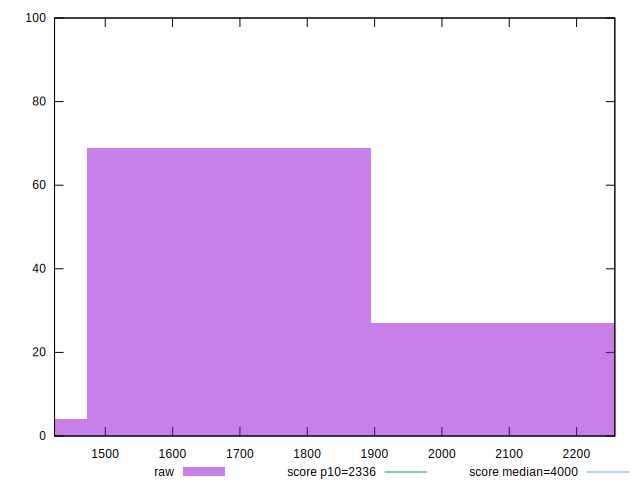
## Score


```yaml
p90min: 0.94
p90max: 0.99
p90range: 0.050000000000000044
p90mean: 0.9712765957446801
median: 0.97
p90stdev: 0.014383356409494124
mad: 0.010000000000000009
stdevBySn: 0.017889000000000016
lfitCenter: 0.9710230967846929
lfitStdev: 0.011766750242892551
mfitCenter: 0.9710230967846929
mfitStdev: 0.014747434444517326
mfitConfidence: 0.0014747434444517325
p90skewness: -0.39566891810258625
p90eccentricity: 0.9999999999999994
p90discretization: 15.666666666666666
outlandishness: 0.9981957762056894

```

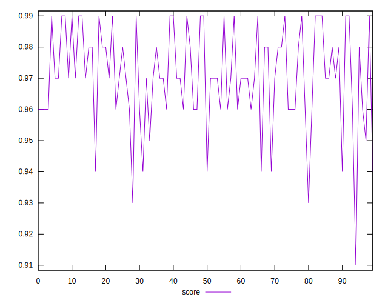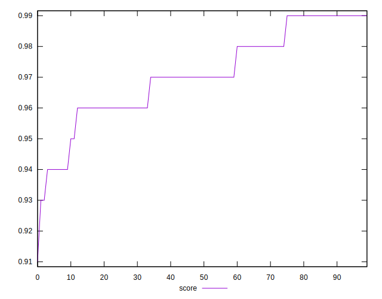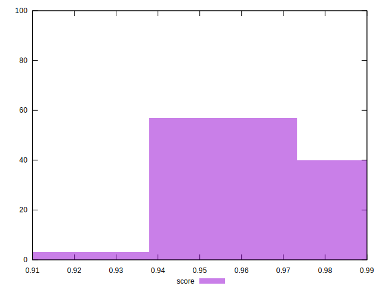
## Raw Estimate

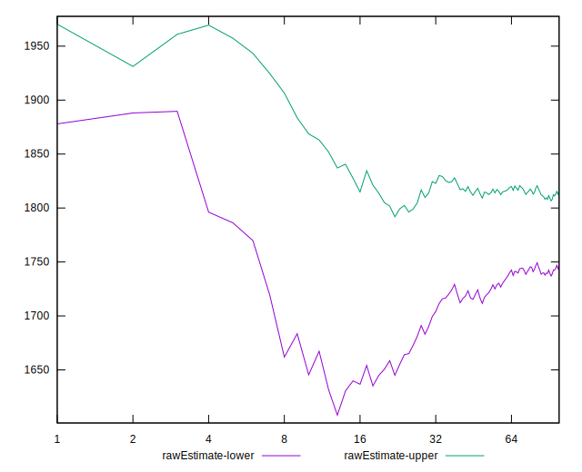
## Score Estimate

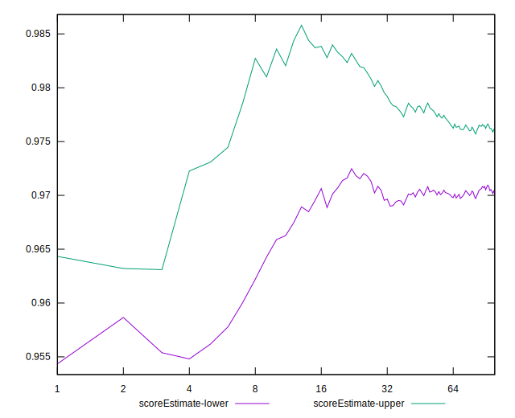
## P Score


```yaml
p90min: 0.9352487004905223
p90max: 0.991358091731388
p90range: 0.05610939124086567
p90mean: 0.9711250173970309
median: 0.9722928880519413
p90stdev: 0.014262725112725822
mad: 0.011233758085441081
stdevBySn: 0.01585897097853296
lfitCenter: 0.9712042379226588
lfitStdev: 0.011693921573528873
mfitCenter: 0.9712042379226588
mfitStdev: 0.014656157243510106
mfitConfidence: 0.0014656157243510106
p90skewness: -0.5670184198632208
p90eccentricity: 1
p90discretization: 1
outlandishness: 0.9984790905488395

```

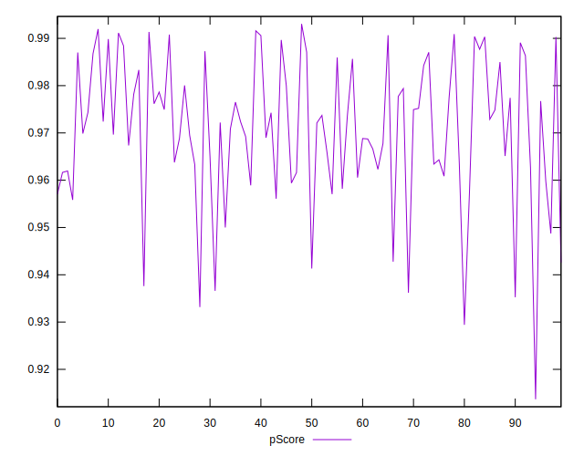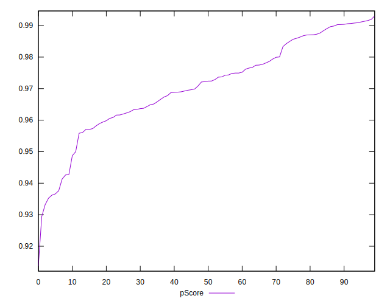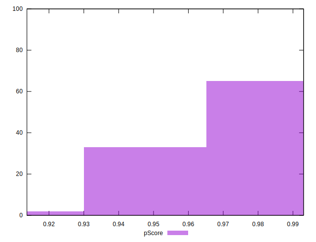
## Score Difference


```yaml
p90min: 0
p90max: 1.1102230246251565e-16
p90range: 1.1102230246251565e-16
p90mean: 7.086529944415892e-18
median: 0
p90stdev: 2.713934347484319e-17
mad: 0
stdevBySn: 0
lfitCenter: 5.186597246566366e-18
lfitStdev: 1.239351332211875e-17
mfitCenter: 5.186597246566366e-18
mfitStdev: 1.553296547324935e-17
mfitConfidence: 1.553296547324935e-18
p90skewness: 3.5685919470918006
p90eccentricity: 0.9999999999999983
p90discretization: 47
outlandishness: 1.9881000000000004

```

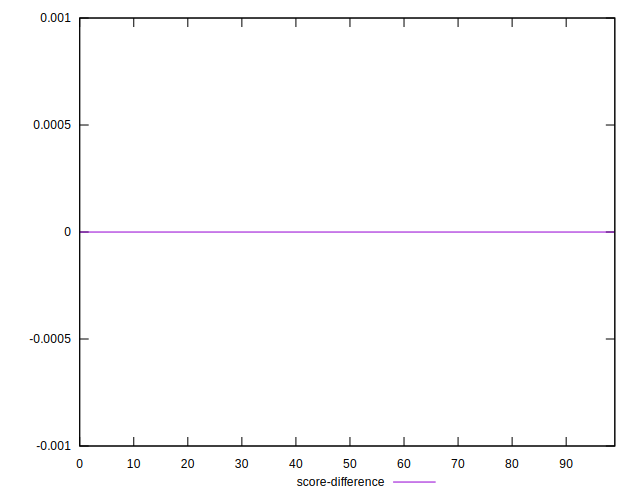
## P Score Difference


```yaml
p90min: -0.004344274220027922
p90max: 0.004916694176048564
p90range: 0.009260968396076485
p90mean: -0.000019151396114128254
median: -0.00013871657989350528
p90stdev: 0.002585345390165619
mad: 0.002440041753420663
stdevBySn: 0.003041206406542969
lfitCenter: -0.00005033536964495937
lfitStdev: 0.0022538974715393604
mfitCenter: -0.00005033536964495937
mfitStdev: 0.0028248415679824166
mfitConfidence: 0.00028248415679824166
p90skewness: 0.11489673606520265
p90eccentricity: 1.0000000000000002
p90discretization: 1
outlandishness: 0.516238034910704

```

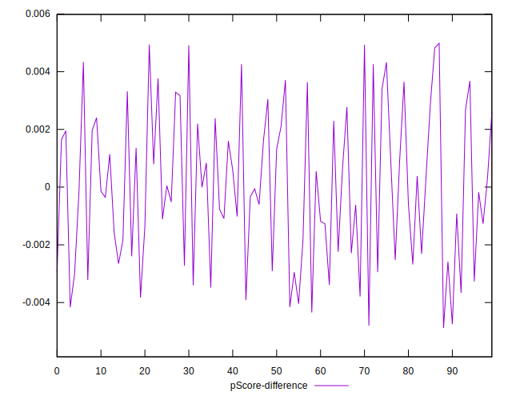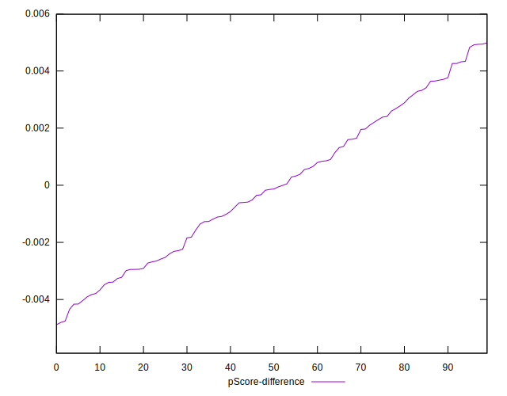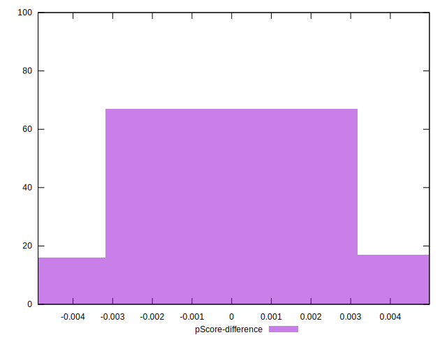