# //interactive/samples/agenda

[→ Parent](../..)


## Raw


```yaml
p90min: 1445.8740000000003
p90max: 19673.676
p90range: 18227.802
p90mean: 9083.678122340423
median: 2368.91275
p90stdev: 7680.740899761716
mad: 941.1817499999997
stdevBySn: 1194.139497525
lfitCenter: 8646.461626243577
lfitStdev: 9152.256340743837
mfitCenter: 8646.461626243577
mfitStdev: 11470.652271731937
mfitConfidence: 1147.0652271731938
p90skewness: 0.17552892102764717
p90eccentricity: 0.9999999999999999
p90discretization: 1
outlandishness: 1.0256494448463198

```

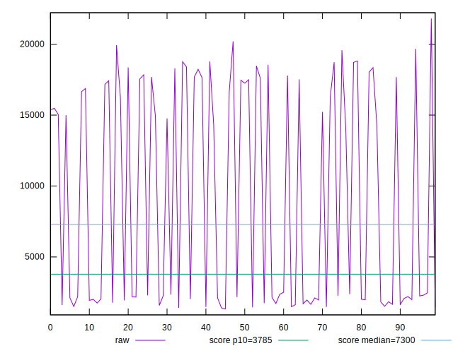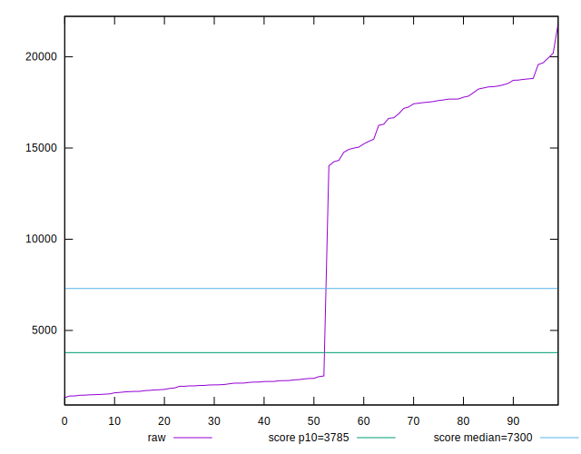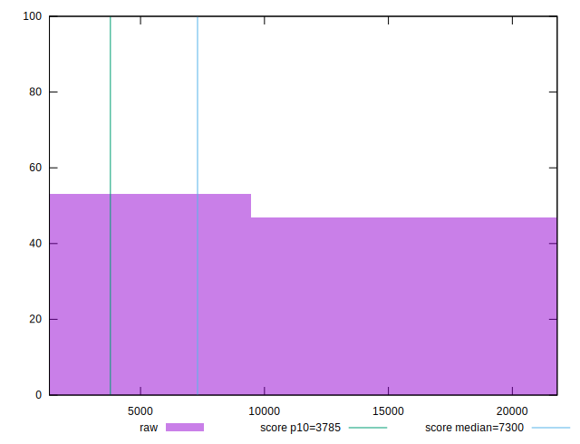
## Score


```yaml
p90min: 0.03
p90max: 1
p90range: 0.97
p90mean: 0.5521276595744682
median: 0.99
p90stdev: 0.4712497470859427
mad: 0.010000000000000009
stdevBySn: 0.011926000000000011
lfitCenter: 0.5731634052613332
lfitStdev: 0.5806145473257674
mfitCenter: 0.5731634052613332
mfitStdev: 0.727692421226659
mfitConfidence: 0.0727692421226659
p90skewness: -0.13012706688104178
p90eccentricity: 1.0000000000000002
p90discretization: 8.545454545454545
outlandishness: 0.9912254985836849

```

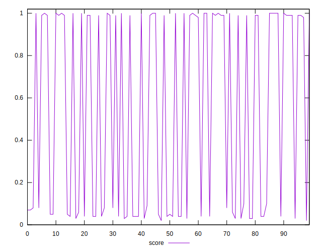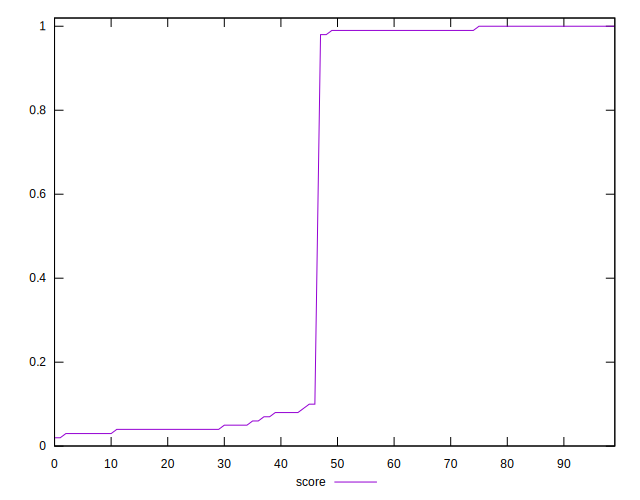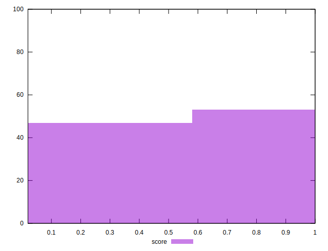
## Raw Estimate

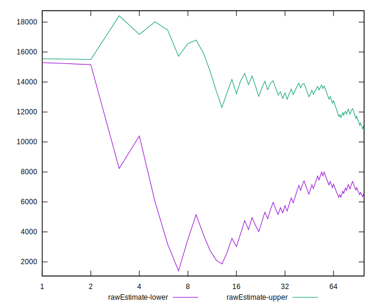
## Score Estimate

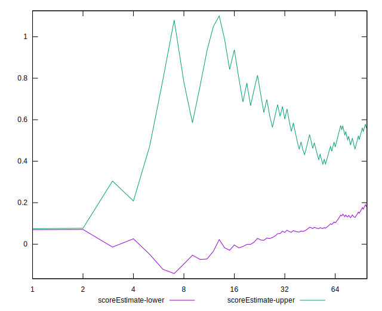
## P Score


```yaml
p90min: 0.026534682494651185
p90max: 0.9992088576691408
p90range: 0.9726741751744896
p90mean: 0.5523173205747761
median: 0.9859492818228364
p90stdev: 0.47079639863424944
mad: 0.013321852506851528
stdevBySn: 0.01613544135536215
lfitCenter: 0.5734305810222848
lfitStdev: 0.5800990470750064
mfitCenter: 0.5734305810222848
mfitStdev: 0.7270463374739403
mfitConfidence: 0.07270463374739403
p90skewness: -0.1302115271956735
p90eccentricity: 1.0000000000000002
p90discretization: 1
outlandishness: 0.9909408331208441

```

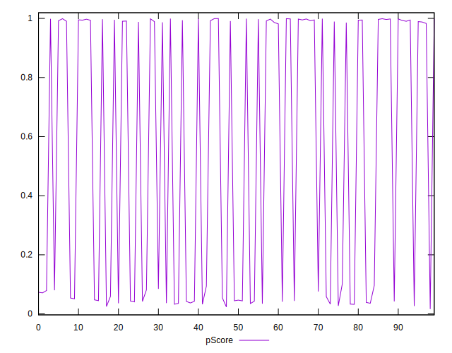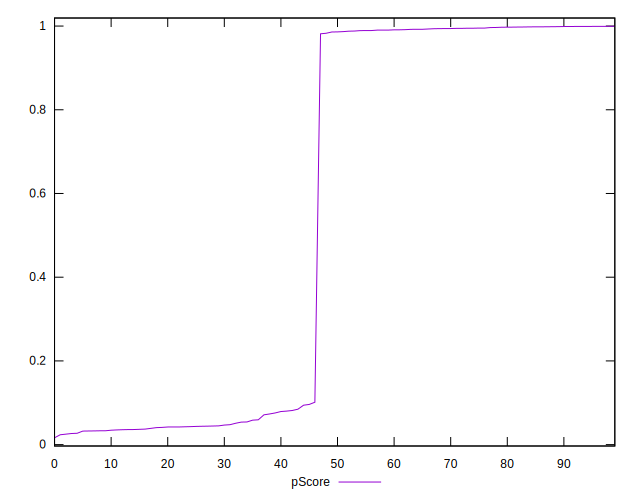
## Score Difference


```yaml
p90min: 0
p90max: 0
p90range: 0
p90mean: 0
median: 0
p90stdev: 0
mad: 0
stdevBySn: 0
lfitCenter: 0
lfitStdev: 0
mfitCenter: 0
mfitStdev: 0
mfitConfidence: 0
p90skewness: .nan
p90eccentricity: .nan
p90discretization: 94
outlandishness: .nan

```


## P Score Difference


```yaml
p90min: -0.004824930731100796
p90max: 0.004591168212132304
p90range: 0.0094160989432331
p90mean: 0.00011939004595986869
median: -0.0005453087382845667
p90stdev: 0.002749030381141021
mad: 0.002711202923063323
stdevBySn: 0.003271789847166704
lfitCenter: 0.00008319735496049287
lfitStdev: 0.0025440709424162386
mfitCenter: 0.00008319735496049287
mfitStdev: 0.0031885200816722642
mfitConfidence: 0.00031885200816722645
p90skewness: 0.031129883122144632
p90eccentricity: 1
p90discretization: 1
outlandishness: 0.8467475839507203

```

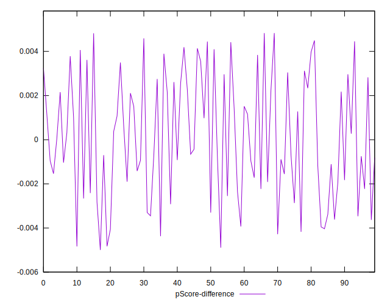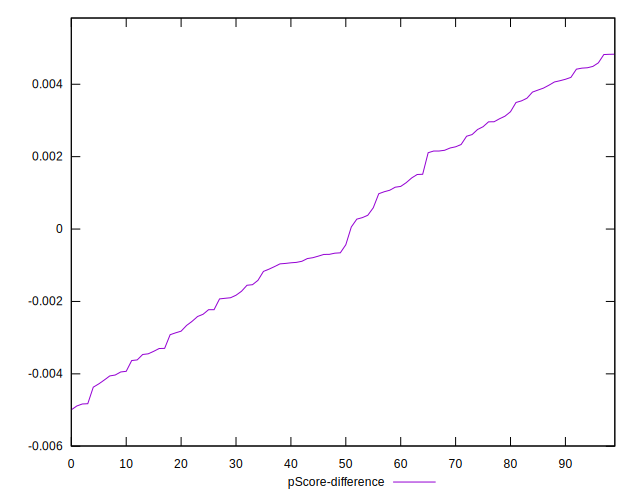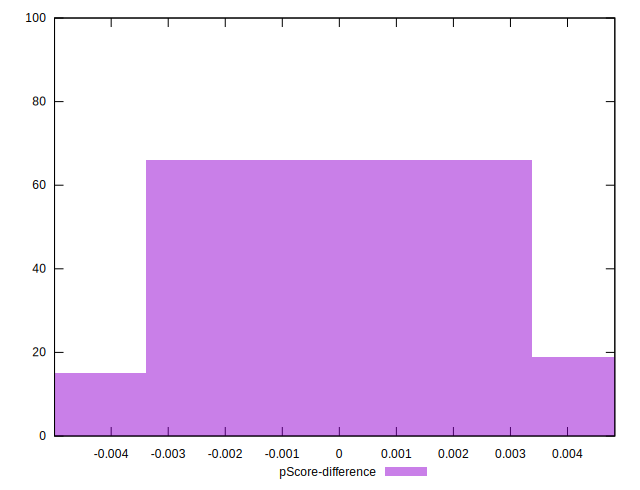