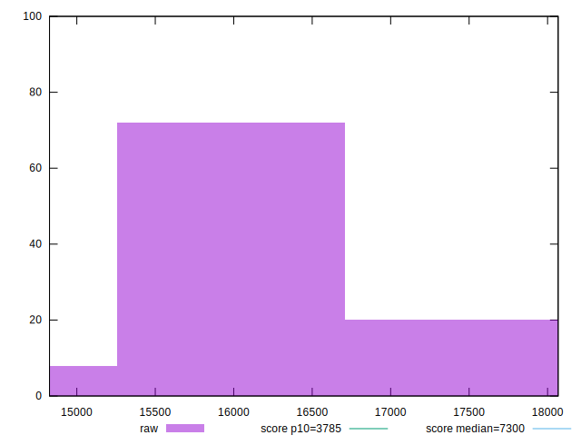

# //interactive/samples/astro

[→ Parent](../..)


## Raw


```yaml
p90min: 15100.327
p90max: 17691.622499999998
p90range: 2591.2954999999984
p90mean: 16165.292196808512
median: 16091.465000000002
p90stdev: 590.4686555467862
mad: 411.95975
stdevBySn: 617.5160558499989
lfitCenter: 16149.816204521587
lfitStdev: 486.1938737025188
mfitCenter: 16149.816204521587
mfitStdev: 609.3536560007111
mfitConfidence: 60.93536560007111
p90skewness: 0.4486877965529191
p90eccentricity: 0.9999999999999997
p90discretization: 1
outlandishness: 1.0016896152251074

```


## Score


```yaml
p90min: 0.04
p90max: 0.08
p90range: 0.04
p90mean: 0.06117021276595741
median: 0.06
p90stdev: 0.00909247795014536
mad: 0.009999999999999995
stdevBySn: 0.011925999999999996
lfitCenter: 0.06109922209871877
lfitStdev: 0.006837414720946475
mfitCenter: 0.06109922209871877
mfitStdev: 0.008569428541074257
mfitConfidence: 0.0008569428541074257
p90skewness: -0.1476472010563003
p90eccentricity: 1.0000000000000013
p90discretization: 18.8
outlandishness: 0.9977056653308126

```


## Raw Estimate


## Score Estimate


## P Score


```yaml
p90min: 0.04206898886851074
p90max: 0.0780725864160256
p90range: 0.036003597547514865
p90mean: 0.06105270407969262
median: 0.061513459421618205
p90stdev: 0.008374952343924666
mad: 0.005857714637317102
stdevBySn: 0.009352347446896614
lfitCenter: 0.06115019903983941
lfitStdev: 0.006951656448584629
mfitCenter: 0.06115019903983941
mfitStdev: 0.008712609313538577
mfitConfidence: 0.0008712609313538576
p90skewness: -0.10769732538560962
p90eccentricity: 0.9999999999999999
p90discretization: 1
outlandishness: 0.9997288701358438

```


## Score Difference


```yaml
p90min: 0
p90max: 0
p90range: 0
p90mean: 0
median: 0
p90stdev: 0
mad: 0
stdevBySn: 0
lfitCenter: 0
lfitStdev: 0
mfitCenter: 0
mfitStdev: 0
mfitConfidence: 0
p90skewness: .nan
p90eccentricity: .nan
p90discretization: 94
outlandishness: .nan

```


## P Score Difference


```yaml
p90min: -0.00433272353349623
p90max: 0.004709747057069988
p90range: 0.009042470590566218
p90mean: -0.00006584373304859764
median: -0.00017820756123526627
p90stdev: 0.002774095405900194
mad: 0.002540144067716049
stdevBySn: 0.0034146573145882593
lfitCenter: -0.00010082564051250626
lfitStdev: 0.0026499041829889315
mfitCenter: -0.00010082564051250626
mfitStdev: 0.003321162378413403
mfitConfidence: 0.0003321162378413403
p90skewness: 0.09568740868188896
p90eccentricity: 0.9999999999999996
p90discretization: 1
outlandishness: 0.7123610311672395

```

