# //interactive/samples/card

[→ Parent](../..)


## Raw


```yaml
p90min: 1732.8494999999996
p90max: 20331.171499999997
p90range: 18598.321999999996
p90mean: 10591.299578494618
median: 14877.484
p90stdev: 7350.2713633421845
mad: 4623.438999999995
stdevBySn: 5815.625051300002
lfitCenter: 10889.021703311459
lfitStdev: 8380.873176031486
mfitCenter: 10889.021703311459
mfitStdev: 10503.866845137956
mfitConfidence: 1055.6783385811125
p90skewness: -0.1916864666333484
p90eccentricity: 0.9999999999999993
p90discretization: 1
outlandishness: 1.0080441214931672

```

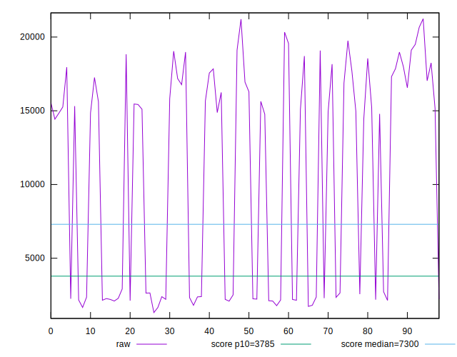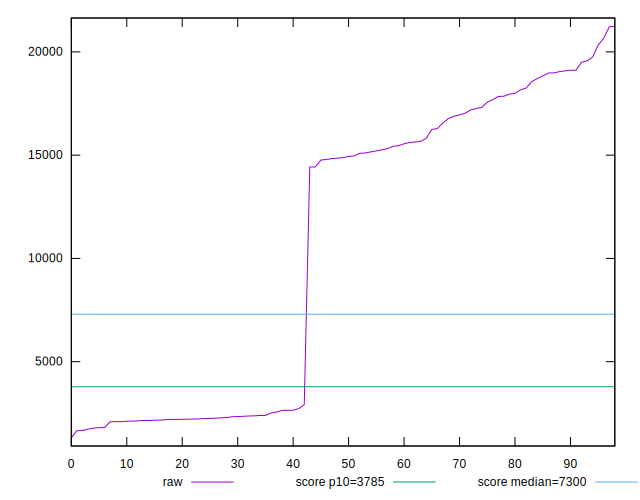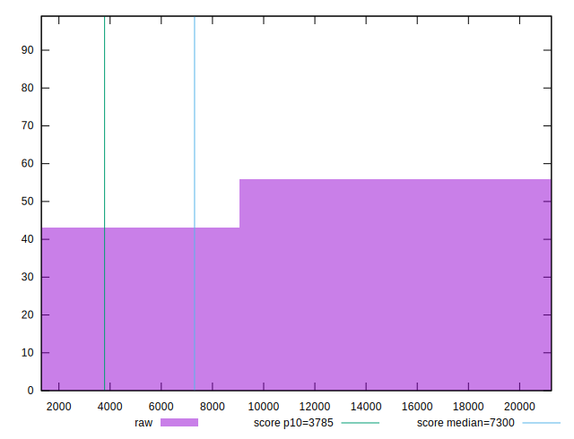
## Score


```yaml
p90min: 0.02
p90max: 1
p90range: 0.98
p90mean: 0.45655913978494594
median: 0.08
p90stdev: 0.4624071999282627
mad: 0.05
stdevBySn: 0.05963000000000001
lfitCenter: 0.42230034251682363
lfitStdev: 0.5517238958855513
mfitCenter: 0.42230034251682363
mfitStdev: 0.6914833593039466
mfitConfidence: 0.06949669247229392
p90skewness: 0.27923436219668935
p90eccentricity: 1.0000000000000013
p90discretization: 7.153846153846154
outlandishness: 1.0142383666383294

```

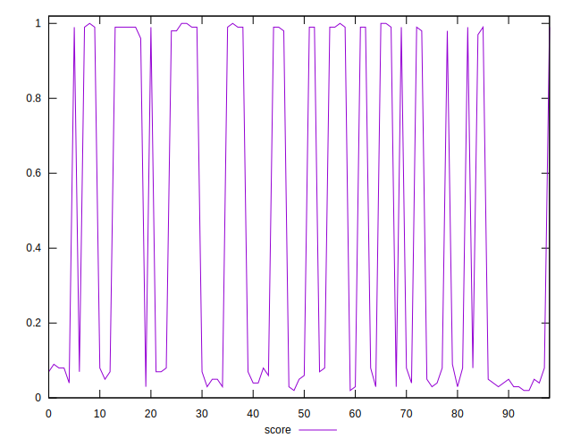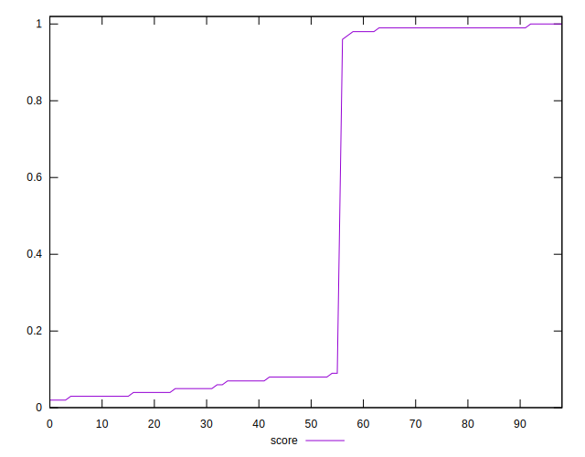
## Raw Estimate

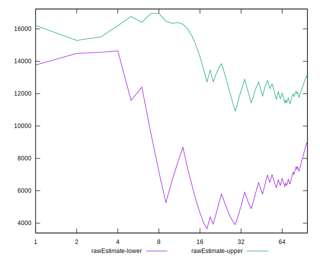
## Score Estimate

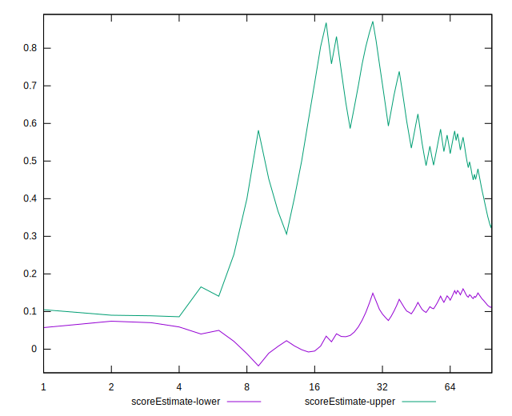
## P Score


```yaml
p90min: 0.02283140884458229
p90max: 0.997491286428593
p90range: 0.9746598775840107
p90mean: 0.45632104740919377
median: 0.08239388655627938
p90stdev: 0.46192830482005126
mad: 0.05478430199840878
stdevBySn: 0.06807357660231574
lfitCenter: 0.42205924346296075
lfitStdev: 0.5509072929391391
mfitCenter: 0.42205924346296075
mfitStdev: 0.6904598992856048
mfitConfidence: 0.06939383087020999
p90skewness: 0.2791470602021866
p90eccentricity: 1.0000000000000002
p90discretization: 1
outlandishness: 1.0140493595393643

```

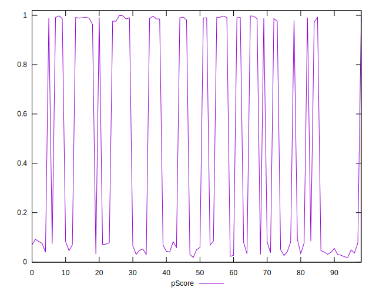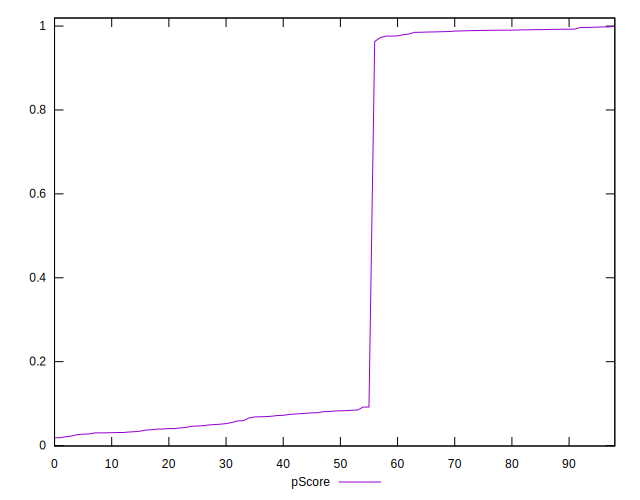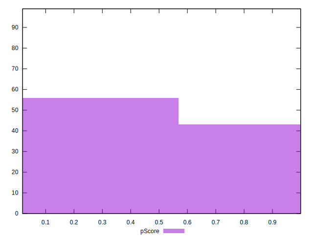
## Score Difference


```yaml
p90min: 0
p90max: 0
p90range: 0
p90mean: 0
median: 0
p90stdev: 0
mad: 0
stdevBySn: 0
lfitCenter: 0
lfitStdev: 0
mfitCenter: 0
mfitStdev: 0
mfitConfidence: 0
p90skewness: .nan
p90eccentricity: .nan
p90discretization: 93
outlandishness: .nan

```

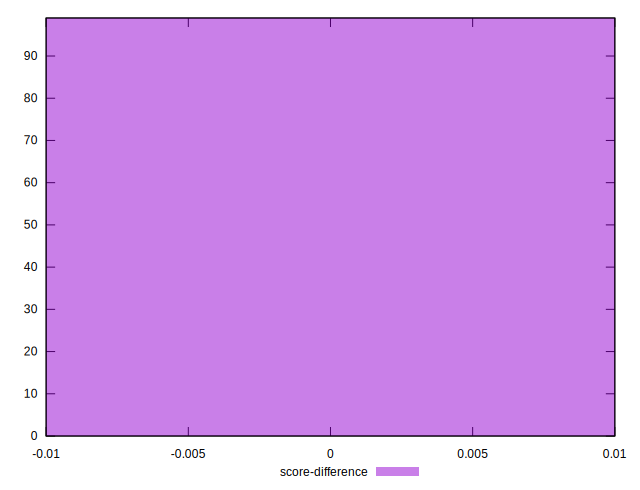
## P Score Difference


```yaml
p90min: -0.004373860421082121
p90max: 0.004157839148942313
p90range: 0.008531699570024434
p90mean: -0.0002950631612220012
median: 0.00004404050816314564
p90stdev: 0.0022732607774909987
mad: 0.00198972053947849
stdevBySn: 0.002742265078723726
lfitCenter: -0.00025483332168763334
lfitStdev: 0.00201610347950462
mfitCenter: -0.00025483332168763334
mfitStdev: 0.0025268109956966957
mfitConfidence: 0.0002539540602687961
p90skewness: -0.07515794558102849
p90eccentricity: 1.0000000000000002
p90discretization: 1
outlandishness: 0.9173295438664375

```

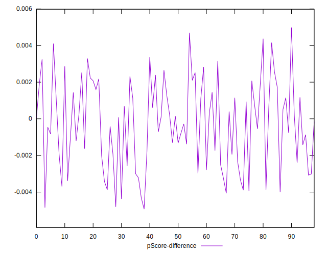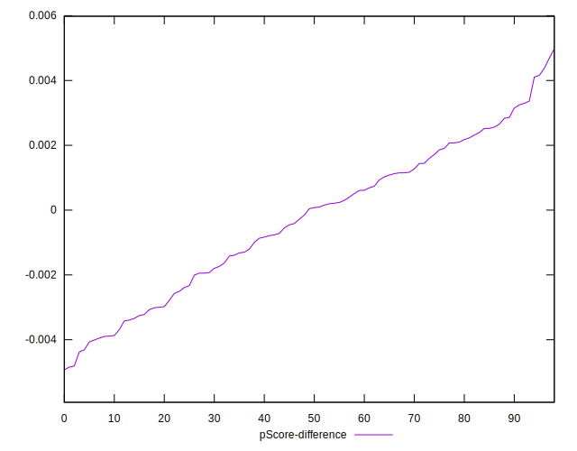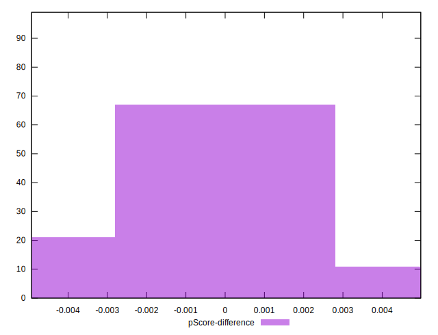